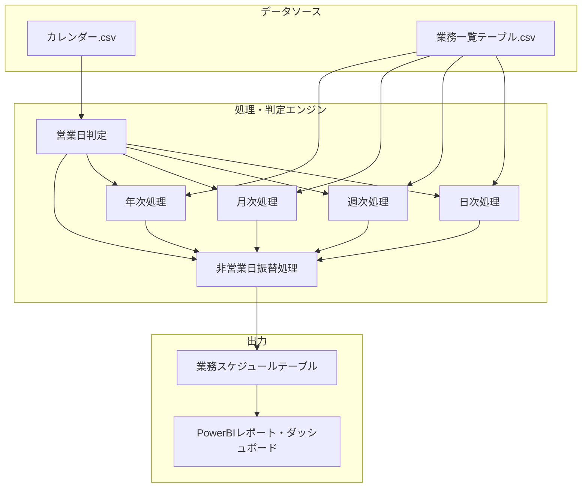

# 業務スケジュール管理システム - 処理フロー

## 概要

このドキュメントでは、Office Scripts for Excel用の業務スケジュール管理システム（scheduler.osts）の処理フローを図解しています。このシステムは、カレンダーと業務一覧のデータを元に、指定日付に実行すべき業務スケジュールを自動生成します。

### システムの目的
このシステムは、日次・週次・月次・年次で発生する様々な業務の実行スケジュールを自動的に生成することで、業務の漏れや遅延を防止し、計画的な業務実行をサポートします。

### 処理の大まかな流れ
1. **データ読み込み**：カレンダー.csvから営業日情報、業務一覧テーブルから業務定義情報を読み込みます
2. **日付判定**：特定の日付が「対象日」となるかを各業務ごとに判定します
3. **条件判定**：業務の周期（日次/週次/月次/年次）と基準（暦日/営業日）に応じたルールで実行対象かを判定します
4. **振替処理**：非営業日の場合、振替規則（直前営業日/直後営業日/振替しない）に従って処理します
5. **スケジュール生成**：判定結果を業務スケジュールテーブルとして出力します

### 詳細な判定ロジック

**1. 日次業務の場合**
- 暦日指定：毎日実行
- 営業日指定：営業日フラグが立っている日のみ実行

**2. 週次業務の場合**
- 暦日(曜日)指定：特定の曜日（月曜、火曜など）に実行

**3. 月次業務の場合**
- 暦日(n日指定)：毎月n日に実行（例：毎月15日）
- 暦日(月末逆算)：月末からn日前に実行（例：月末3日前、n=0なら月末日）
- 営業日(n日指定)：月のn番目の営業日に実行（例：第3営業日）
- 営業日(月末逆算)：月末からn番目の営業日に実行（例：月末から2営業日前）
- 暦日(曜日)：第n週の特定曜日に実行（例：第2月曜日）

**4. 年次業務の場合**
- 特定の月を指定＋月次業務と同様の条件（例：4月の第1営業日）

**5. 非営業日振替処理**
- 直前営業日：非営業日の場合、直前の営業日に振り替える
- 直後営業日：非営業日の場合、直後の営業日に振り替える
- 振替しない：非営業日でも日付を変更しない（実行対象とする）

このシステムでは常に「営業日」の概念が重要になります。営業日はカレンダー.csvで定義され、土日祝日などは通常「非営業日」として扱われます。業務の定義によっては、非営業日に当たる業務を前後の営業日に振り替えることができます。

以下の図表では、これらの処理フローを視覚的に表現し、詳細な判定ロジックを示しています。

## 1. 全体システム構成

## 2. データフロー概要

## 3. メイン処理フロー

## 4. デバッグ・テストユーティリティ

## 5. カレンダー情報読み込みフロー

## 6. 日付・営業日ユーティリティ関数

## 7. 業務判定フロー (isTargetTask関数)

## 8. 月次/年次業務の基準別判定フロー

## 9. 業務判定ユーティリティ関数

## 10. 業務種別と判定条件の関係

## 11. スケジュール生成フロー 

## 12. 日次業務判定フロー

## 13. 週次業務判定フロー

## 14. 月次業務判定フロー

## 15. 年次業務判定フロー

## 16. 業務振替判定フロー (isTargetDateForFurikae関数)

## 17. テスト実行フロー

## 18. 単一日付テスト実行フロー

## 19. 「n日」カラムの使用方法詳細

## 20. PowerBI連携データフロー

## 21. テスト計画

システムの品質を確保するため、以下の観点からテストを実施します：

1. **基本機能テスト**：各周期（日次/週次/月次/年次）、各基準（暦日/営業日）の組み合わせが正しく動作するか
2. **境界値テスト**：月初・月末・年始・年末などの境界条件が正しく処理されるか
3. **振替規則テスト**：非営業日振替規則（直前営業日/直後営業日/振替しない）が正しく適用されるか
4. **特殊日テスト**：祝日や特殊な日（2月29日など）の処理が正しく行われるか
5. **連休テスト**：ゴールデンウィークなど連続した休日がある場合の処理が正しく行われるか

特に以下のテストデータが重要です：

- 通常期間テスト（2025-03-24～2025-03-30）
- 月末月初期間テスト（2025-04-28～2025-05-04）
- 連休期間テスト（2025-05-03～2025-05-09）
- 年末年始期間テスト（2024-12-28～2025-01-04）
- 閾値テスト（閏年、月末日など）

これらのテストデータに対して、期待される業務IDとの一致を確認します。

## 22. テスト実施手順

1. scheduler.ostsを開く
2. isTest変数をtrueに設定
3. スクリプトを実行する
4. テストシートに出力された結果を確認する
5. 全てのテストケースで期待される結果と一致することを確認する

## 23. 実運用手順

1. scheduler.ostsをExcelで開く
2. isTest変数をfalseに設定
3. B1セルに対象日付を入力する
4. スクリプトを実行する
5. 業務スケジュールシートに出力された結果を確認する
6. 必要に応じて、この結果をPower BIで可視化・分析する