# Github CopilotとVibe Codingで作る業務スケジュール管理処理

## はじめに

最近、AI（特に大規模言語モデル）を活用したプログラミング手法が注目されています。
本記事では「Vibe Coding」という手法でAIにプロンプトのみでGithub Copilit(Calude 3.7 Sonnet)にコーディングしてもらった経験と、その成果物について共有します。Vibe Codingとは、AIとの対話の中でプログラムを作り上げていく手法で、従来の開発手法とは異なるアプローチです。

---
運用保守業務では定常業務が決まっていて、それぞれ実施日や時刻などが決まっています。
たとえば、第4営業日とか毎週水曜日などですね。年次・月次・週次・日次などあると思います。
これに基づいて、毎日のスケジュール・当番表を作成していくわけですが、意外とこの作業が面倒だったりします。

---
今回はカレンダーデータ、業務一覧データからスケジュールを作成する処理を、Excelで利用できるOffice Script（TypeScript）で実装し、様々な周期や条件に基づいて業務スケジュールを自動生成しました。
Office Script(.osts)はTypeScriptが前提ですが、Excel専用のライブラリをVS Codeでデバッグできないため、実行はExcelで行うしかありませんでした。
もしかしたら他に方法があるのかもしれませんが、AIにテストや実行をしてもらって動作確認をさせるということはできない環境です。
それでもなおソースコードなどを見てAIがどこまでできるのかが重要ですが、今回はGithub Copilit(Calude 3.7 Sonnet)を使用しました。

この記事を通じて、AIを活用したプログラミングの可能性と限界、そして効果的な活用方法について考えていただければ幸いです。
成果物は後半ですべて掲載しているのでご覧ください。いくつか気になる点は手作業で修正していますが、9割程度はAIが作成したものです。
Vibe Codingを用いた業務スケジュール管理処理の開発は、従来の開発手法とは異なる新しい体験でした。
AIが単なるコード生成のツールではなく、設計やテスト計画、ドキュメント作成まで含めた開発プロセス全体をサポートしてくれましたが、メリット・デメリット、利用にあたってのコツというものがありました。

## Vibe Codingの成果と課題

### Vibe Codingの成果

この開発手法で得られた主な成果は以下の通りです：

1. **迅速な開発**：要件定義から実装までの時間が大幅に短縮されました
2. **詳細なドキュメント作成**：設計書やフローチャートも含めた包括的なドキュメントが作成できました
3. **テスト計画の充実**：多様なケースをカバーするテスト計画とテスト機能が実装できました
4. **柔軟な対応**：複雑な要件にも対応できるコードが実装できました

### 直面した課題とその対処法

一方で、いくつかの課題も経験しました：

1. **バグへの対応難易度**：
   - AIが生成したコードにバグがあった場合、ロジックが複雑で修正が難しいことがありました
   - 修正すればするほどバグが増えることもあり、追加修正は複雑なロジックの場合はしないほうがいいかも
   - 対処法：部分的な修正よりも、該当する機能全体を再生成する方法が効果的

2. **一貫性の維持**：
   - 複数回の修正を繰り返すと、コードの一貫性が失われることがありました
   - 対処法：修正を重ねるよりも、明確な指示で一から再生成する方が良い結果が得られました
   - リファクタリングをたまに依頼するのもあり

3. **テストケースとの整合性**：
   - 実装とテストケースの期待値に齟齬が生じることがありました
   - 特に実装が正しいのに、テストケースが間違っていることが多かった
   - 対処法：なぜテストケースが間違ったのかを考えてもらい、似たようなケースも修正してもらう
   - 今回はやや複雑なロジックだったためテストケースがうまく作成できなかった可能性があります

4. **複雑なロジックの理解**：
   - AIが生成した複雑なロジックを理解するのに時間がかかりました
   - 対処法：コードにコメントを多めに入れるよう指示し、フローチャートを作成してもらいました

## Vibe Codingの推奨活用パターン

私の経験から、以下のようなパターンでVibe Codingを活用するのが効果的だと感じました：

1. **明確なドキュメント先行型開発**：
   - 最初に提案書や設計書をAIに作成してもらい、内容を確認・修正
   - その設計に基づいてコード実装を依頼

2. **テスト計画駆動型開発**：
   - テストケースと期待値を先に定義
   - テストに通るコードの実装を依頼
   - 1と2の間をに何度も行ったり来たり・・・ここをどうやってうまくやるかが重要ですね

3. **モジュール分割型開発**：
   - 大きな機能を小さなモジュールに分割
   - 各モジュールごとに実装・テストを繰り返す
   - たまにおかしな引数やフラグがあるので、気になった時は介入して手作業で修正

4. **視覚的理解促進型開発**：
   - フローチャートやシーケンス図などは後で作成するか、ソースコードを視覚化するために作成してもらう
   - その図に基づいたて質問などを行う


### メリット

- 開発速度の向上
- 包括的なドキュメント作成
- 複雑なロジックの実装支援
- テスト計画の充実

### デメリット

- バグの修正が難しい場合がある
- コードの一貫性維持に注意が必要
- 生成されたコードの理解に時間がかかる

AIを活用したプログラミングは万能ではありませんが、適切な方法で活用することで、効率的かつ高品質な開発が可能になります。特に、明確な要件定義とテスト計画を先に行い、モジュール単位で開発を進めていくアプローチが効果的でした。

今後もAIとの協働開発について探求を続け、さらに効果的な方法を見つけていきたいと思います。

---
# 実際に行った作業

以下のような概要をAIに説明し、それぞれドキュメントやソースコードを作成してもらいました。
作成されたドキュメントは(▶)折り畳みしているので開いて参照してください。全文載せてますのでかなりの量かも。

## プロジェクト概要

### 業務スケジュール管理システムとは？

このシステムは以下の目的で作成しました：

- カレンダー（営業日情報を含む）と業務一覧の定義から、指定日付に実行すべき業務を自動抽出
- 様々な周期（日次/週次/月次/年次）に対応
- 複雑な条件（第n曜日、n営業日、月末からの逆算など）をサポート
- 非営業日の振替ルールを適用可能

### 主な機能

1. **多様な業務パターンのサポート**：
   - 日次（毎日/営業日のみ）
   - 週次（特定曜日）
   - 月次（n日/第n曜日/第n営業日/月末からn日前/月末からn営業日前）
   - 年次（特定月の特定条件）

2. **柔軟な非営業日振替**：
   - 直前営業日振替
   - 直後営業日振替
   - 振替なし

3. **テスト機能**：
   - 多様なテストケースで動作確認
   - 期待値との自動比較

## Vibe Codingによる開発プロセス

### 1. プロジェクト企画・概要設計

最初に「提案.md」としてプロジェクト全体の概要をAIに指示しながら作成しました。このドキュメントでは以下を定義しています：

- テーブル設計（業務一覧、作業者マスター、業務スケジュール）
- データモデルとリレーション
- 運用手順
- Excel・Power Query・Power BIでの利用方法

:::note
<details>
<summary>【提案.md】</summary>

# Excel・Power BIによる業務スケジュール管理システム提案

---

## 1. はじめに
本提案は、ExcelとPower BIを活用して、運用保守業務のスケジュール管理を効率化・標準化するための設計・運用手順を、初心者でも分かるように丁寧にまとめたものです。

---

## 2. テーブル設計

### 2-1. 業務一覧テーブル
**目的：** 各業務（タスク）の定義・ルール・スケジュール条件を一元管理し、予定日自動算出や履歴管理、分析の基礎データとする。

| カラム名             | 入力例・説明                                                                                   |
|----------------------|-----------------------------------------------------------------------------------------------|
| 業務ID               | 1, 2, 3 ...（自動採番。Power Queryで追加可能）                                                |
| 業務名               | 「ログ確認」「バックアップ」など                                                               |
| 業務詳細             | 作業手順や注意点など                                                                          |
| 業務種別             | 「定常」または「依頼」                                                                        |
| 周期・頻度           | 「日次」「週次」「月次」「年次」「不定期」など                                                 |
| 基準                 | 「暦日(n日指定)」「暦日(月末逆算)」「暦日(曜日)」「営業日(n日指定)」「営業日(月末逆算)」    |
| 月                   | 1～12（該当月のみ。四半期・半期・年次は複数レコードで対応）                                   |
| 週番号               | 1～5（第n週指定。空欄可）                                                                     |
| 曜日                 | 月～日（曜日指定。空欄可）                                                                     |
| n日                 | 0～31（基準によって意味が異なる。下記「n日の使い方」参照）                                   |
| 非営業日振替規則     | 「直前営業日」「直後営業日」「振替しない」「手動指定」                                         |
| 優先度               | 「高」「通常」「低」など                                                                       |
| 有効開始日           | レコードの有効開始日                                                                          |
| 有効終了日           | レコードの終了日（現行は空欄）                                                                |
| 備考                 | 補足情報                                                                                      |

**【n日カラムの使い方】**
- 基準が「暦日(n日指定)」「営業日(n日指定)」の場合：1=1日、2=2日、…31=31日
- 基準が「暦日(月末逆算)」「営業日(月末逆算)」の場合：0=末日/最終営業日、1=1日前、2=2日前、…（逆算n日前）

**【複数条件の業務（例：第1・第3金曜など）】**
- 1レコード1条件とし、複数該当する場合はレコードを分割して作成

---

### 2-2. 作業者マスターテーブル
**目的：** 担当者の基本情報・履歴を管理
担当者については業務スケジュールテーブル作成後に手入力で割当を行う

| カラム名         | 入力例・説明                         |
|------------------|--------------------------------------|
| 作業者ID         | 1, 2, 3 ...（自動採番）              |
| 作業者名         | 氏名                                 |
| 所属部署         | 部署やグループ名                     |
| 連絡先情報       | Eメール、内線番号、電話番号等        |
| 状況             | 「通常稼働」「休暇中」「当番中」など  |
| 有効開始日       | 登録開始日                           |
| 有効終了日       | 変更時の終了日（現行は空欄）         |
| 備考             | その他補足情報                       |

---

### 2-3. 業務スケジュールテーブル
**目的：** 業務一覧の条件に基づき、予定日・実施日・担当者・進捗などを記録

| カラム名               | 入力例・説明                                 |
|------------------------|----------------------------------------------|
| スケジュールID         | 1, 2, 3 ...（自動採番）                      |
| 業務ID                 | 業務一覧との連動用キー                       |
| 予定日                 | 作業実施予定日                               |
| 実施日                 | 実際に作業が行われた日（未実施は空欄）       |
| 予定開始時刻           | 予定開始時刻                                 |
| 予定終了時刻           | 予定終了時刻                                 |
| 実績開始時刻           | 実際の作業開始時刻                           |
| 実績終了時刻           | 実績終了時刻                                 |
| 予定担当者             | 担当者ID（作業者マスター参照）               |
| 実施担当者             | 実際に作業を実施した担当者ID                 |
| 当番                   | 当番担当者ID（複数可）                       |
| 作業実施ステータス     | 「未実施」「進行中」「完了」「遅延」など      |
| 結果／コメント         | 作業完了後のフィードバック                   |
| 繰り返し情報           | 年次・月次等の識別（業務一覧と連動）         |
| 備考                   | その他補足事項                               |

---

## 3. テーブルの関係図（Mermaid）


**業務一覧テーブル：**
- 業務ID (PK)
- 業務名
- 業務詳細
- 業務種別
- 周期・頻度
- 基準
- 月
- 週番号
- 曜日
- n日
- 非営業日振替規則
- 優先度
- 有効開始日
- 有効終了日
- 備考

**業務スケジュールテーブル：**
- スケジュールID (PK)
- 業務ID (FK)
- 予定日
- 実施日
- 予定開始時刻
- 予定終了時刻
- 実績開始時刻
- 実績終了時刻
- 予定担当者
- 実施担当者
- 当番
- 作業実施ステータス
- 結果コメント
- 繰り返し情報
- 備考

**作業者マスターテーブル：**
- 作業者ID (PK)
- 作業者名
- 所属部署
- 連絡先情報
- 状況
- 有効開始日
- 有効終了日
- 備考

---

## 4. Excel・Power Query・Power BIでの運用手順（初心者向けステップバイステップ）

### Step 1: Excelでテーブルを作成し、データを入力する
1. Excelを開き、「業務一覧」「作業者マスター」「業務スケジュール」の3つのシートを作成します。
2. それぞれのシートに、上記の表にあるカラム名を1行目に入力します。
3. 2行目以降に、実際の業務データを入力します。
4. 入力規則（リスト）を使いたいカラム（例：業務種別、周期・頻度など）は、Excelの「データ」タブ→「データの入力規則」→「リスト」で、選択肢を設定します。
5. 入力が終わったら、各シートのデータ範囲を選択し、「挿入」タブ→「テーブル」をクリックしてテーブル化します。テーブル名は「業務一覧」「作業者マスター」「業務スケジュール」と分かりやすく設定してください。

#### 【初心者向けポイント】
- 「テーブル」とは、Excelでデータを管理しやすくするための機能です。1行目がカラム名（見出し）です。
- 入力規則（リスト）は、入力ミスを防ぐためのプルダウン選択肢です。

---

### Step 2: Power BIでExcelファイルを読み込む
1. Power BI Desktopを起動します。
2. 「ホーム」タブ→「データの取得」→「Excel」を選択し、作成したExcelファイル（業務.xlsxなど）を開きます。
3. 「ナビゲーター」画面で、「業務一覧」「作業者マスター」「業務スケジュール」の各テーブルにチェックを入れて「読み込み」をクリックします。

#### 【初心者向けポイント】
- 「テーブル」としてExcelで作成した範囲が、Power BIでそのまま「テーブル」として認識されます。
- どのテーブルがどれか分からない場合は、Excelでテーブル名を確認できます（テーブル範囲を選択→「テーブルデザイン」タブ→「テーブル名」）。

---

### Step 3: Power Queryエディターでデータを加工する
1. Power BIの「ホーム」タブ→「データの変換」をクリックすると、Power Queryエディターが開きます。
2. 左側に「業務一覧」「作業者マスター」「業務スケジュール」など、読み込んだテーブルが一覧で表示されます。

#### 【よくある操作例】
- **インデックス列（ID自動採番）の追加方法**
  1. 追加したいテーブルを選択
  2. 「追加列」タブ→「インデックス列の追加」→「0から」または「1から」を選択
- **日付型変換の方法**
  1. 日付にしたいカラムの列見出しをクリック
  2. 「変換」タブ→「データ型」→「日付」を選択
- **Null補正（空欄の補完）**
  1. 空欄を特定の値で埋めたい場合は、「変換」タブ→「値の置換」や「条件付き列」を使う
- **有効期間フィルタ**
  1. 「有効開始日」<=今日 かつ （「有効終了日」が空欄 または >=今日）という条件でフィルタ
  2. 「ホーム」タブ→「行のフィルター」→「カスタムフィルター」で条件を設定

#### 【初心者向けポイント】
- Power Queryエディターは、Excelの「クエリと接続」機能に似ていますが、より強力です。
- 画面左のテーブル名をクリックすると、そのテーブルのデータが中央に表示されます。

---

### Step 4: 予定日自動算出ロジックの組み込み
1. 予定日を自動で計算したい場合は、「業務一覧」の条件（周期・基準・月・週番号・曜日・n日など）と、カレンダーテーブル（全日付・営業日情報を持つテーブル）を組み合わせます。
2. 例えば「毎月末日から2日前」なら、カレンダーテーブルで各月の末日を特定し、2日前の日付を計算します。
3. Power Queryで「マージ（結合）」機能を使い、「業務一覧」と「カレンダーテーブル」を条件で結合します。

#### 【具体的な操作例】
- 「ホーム」タブ→「クエリのマージ」
- 「業務一覧」と「カレンダーテーブル」を選択し、結合条件（例：月・年・基準・n日など）を指定
- 必要に応じて「カスタム列」や「条件付き列」で日付計算ロジックを追加

#### 【関数やロジック例】
- Power Queryの「カスタム列」では、M言語という関数が使えます
- 例：`Date.AddDays([末日], -[n日])` で末日からn日前を計算

---

### Step 5: テーブルのマージ（結合）のやり方
1. Power Queryエディターで「ホーム」タブ→「クエリのマージ」をクリック
2. 例：「業務スケジュール」と「業務一覧」を「業務ID」でマージしたい場合
   - 両方のテーブルで「業務ID」列をクリックして選択
   - 「内部結合」や「左外部結合」など、結合方法を選択
   - 「OK」をクリック
3. マージ後、展開ボタン（列名の右にある「→」マーク）をクリックし、必要なカラムを選択して展開

#### 【初心者向けポイント】
- 「マージ」はExcelのVLOOKUPやXLOOKUPのようなものですが、複数条件や複数列も簡単に扱えます。

---

### Step 6: Power BIでの可視化
1. Power Queryで「閉じて読み込む」をクリックし、Power BIの画面に戻ります。
2. 「モデル」ビューで、テーブル同士のリレーション（線）が自動で引かれているか確認します。
3. 「レポート」ビューで、グラフやカード、ガントチャート、スライサーなどをドラッグ＆ドロップで作成します。
4. 進捗率や遅延件数などの集計は、「新しいメジャー」や「新しい列」でDAX式を使って計算します。

---

### Step 7: レポートの公開・運用
1. 完成したレポートは「ホーム」タブ→「Power BIサービスに発行」でWeb上に公開できます。
2. 「データの更新」や「アクセス権限」もWeb画面から設定できます。

---

#### 【全体の補足・アドバイス】
- 分からない用語や操作は、Power BIの公式ヘルプやYouTubeの初心者向け動画も参考にしてください。
- 1つ1つの操作を丁寧に進めれば、初心者でも必ず実現できます。
- どうしても分からない場合は、画面のスクリーンショットを添えて質問すると、周囲のサポートも受けやすいです。

---

## 5. 運用上の注意・よくある質問
- n日=0の意味（逆算系）は必ず現場マニュアルに明記してください。
- 祝日・独自休日はカレンダーテーブルで管理してください。
- 複雑な条件はレコード分割で対応してください。
- 新たなパターンが発生した場合も、現行設計をベースに拡張可能です。

---

## 6. まとめ
- シンプルな1テーブル運用で現場スタッフも迷わず管理可能です。
- 全パターン網羅・拡張性・保守性も高い設計です。
- 詳細な検証・運用例は「検証.md」も参照してください。

---

ご不明点や追加要望があれば、いつでもご相談ください。
この提案が現場の業務効率化・標準化に役立つことを願っています。

</details>
:::

### 2. 詳細設計・実装計画

次に「業務フロー.md」を作成し、システムの処理フローや判定ロジックを詳細に定義しました。このドキュメントでは、Mermaid記法を用いたフローチャートを多用して視覚的に理解しやすいようにしています。


:::note
<details>
<summary>【業務フロー.md】</summary>

# 業務スケジュール管理システム - 処理フロー

## 概要

このドキュメントでは、Office Scripts for Excel用の業務スケジュール管理システム（scheduler.osts）の処理フローを図解しています。このシステムは、カレンダーと業務一覧のデータを元に、指定日付に実行すべき業務スケジュールを自動生成します。

### システムの目的
このシステムは、日次・週次・月次・年次で発生する様々な業務の実行スケジュールを自動的に生成することで、業務の漏れや遅延を防止し、計画的な業務実行をサポートします。

### 処理の大まかな流れ
1. **データ読み込み**：カレンダー.csvから営業日情報、業務一覧テーブルから業務定義情報を読み込みます
2. **日付判定**：特定の日付が「対象日」となるかを各業務ごとに判定します
3. **条件判定**：業務の周期（日次/週次/月次/年次）と基準（暦日/営業日）に応じたルールで実行対象かを判定します
4. **振替処理**：非営業日の場合、振替規則（直前営業日/直後営業日/振替しない）に従って処理します
5. **スケジュール生成**：判定結果を業務スケジュールテーブルとして出力します

### 詳細な判定ロジック

**1. 日次業務の場合**
- 暦日指定：毎日実行
- 営業日指定：営業日フラグが立っている日のみ実行

**2. 週次業務の場合**
- 暦日(曜日)指定：特定の曜日（月曜、火曜など）に実行

**3. 月次業務の場合**
- 暦日(n日指定)：毎月n日に実行（例：毎月15日）
- 暦日(月末逆算)：月末からn日前に実行（例：月末3日前、n=0なら月末日）
- 営業日(n日指定)：月のn番目の営業日に実行（例：第3営業日）
- 営業日(月末逆算)：月末からn番目の営業日に実行（例：月末から2営業日前）
- 暦日(曜日)：第n週の特定曜日に実行（例：第2月曜日）

**4. 年次業務の場合**
- 特定の月を指定＋月次業務と同様の条件（例：4月の第1営業日）

**5. 非営業日振替処理**
- 直前営業日：非営業日の場合、直前の営業日に振り替える
- 直後営業日：非営業日の場合、直後の営業日に振り替える
- 振替しない：非営業日でも日付を変更しない（実行対象とする）

このシステムでは常に「営業日」の概念が重要になります。営業日はカレンダー.csvで定義され、土日祝日などは通常「非営業日」として扱われます。業務の定義によっては、非営業日に当たる業務を前後の営業日に振り替えることができます。

以下の図表では、これらの処理フローを視覚的に表現し、詳細な判定ロジックを示しています。

## 1. 全体システム構成

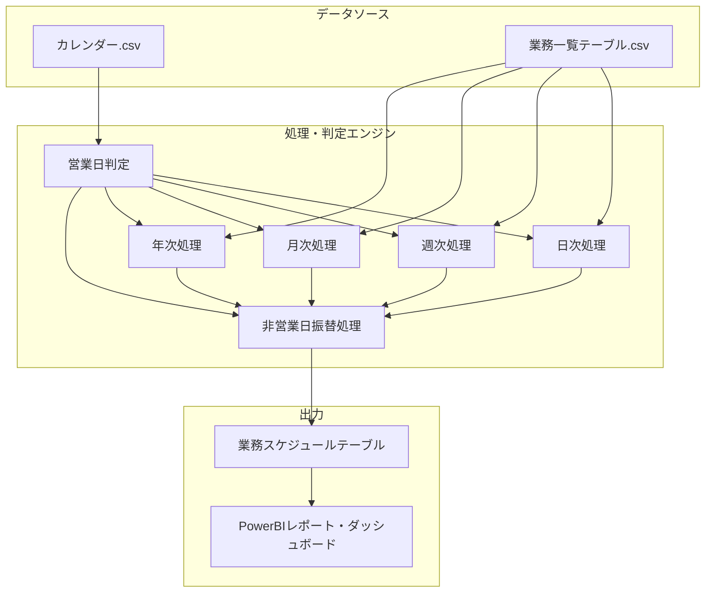

## 2. データフロー概要

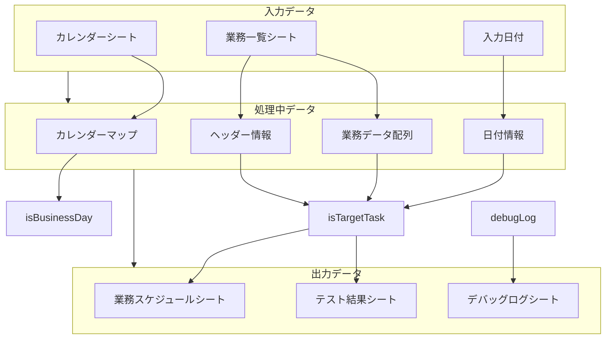

## 3. メイン処理フロー

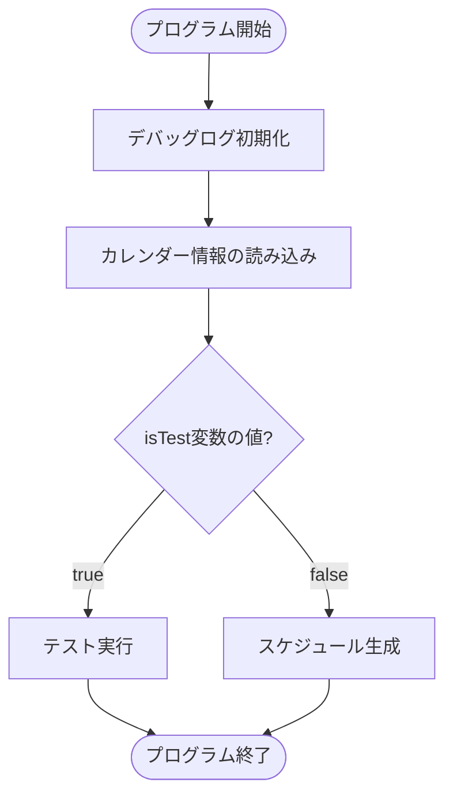

## 4. デバッグ・テストユーティリティ

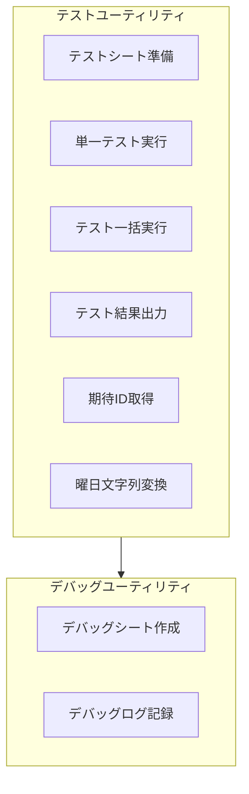

## 5. カレンダー情報読み込みフロー

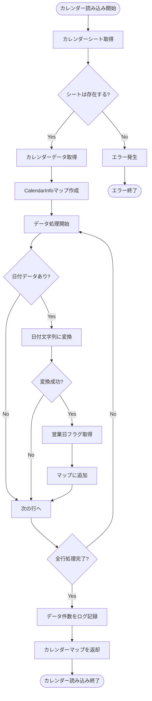

## 6. 日付・営業日ユーティリティ関数

```mermaid
flowchart LR
    subgraph DateUtils[日付ユーティリティ]
        formatDate[日付→YYYY-MM-DD変換]
        formatDateBySlash[日付→YYYY/MM/DD変換]
        excelDateToString[Excel日付→文字列変換]
        getLastDayOfMonth[月末日取得]
        getDateInfo[日付情報取得]
        getNthDayOfWeekInMonth[第n曜日計算]
    end
    
    subgraph BusinessDayUtils[営業日ユーティリティ]
        isBusinessDay[営業日判定]
        getBusinessDayInfo[営業日情報取得]
        getNthBusinessDayOfMonth[第n営業日取得]
        getReverseNthBusinessDayOfMonth[月末からn営業日前取得]
        getPreviousBusinessDay[直前営業日取得]
        getNextBusinessDay[直後営業日取得]
    end
    
    DateUtils -.-> BusinessDayUtils
```

## 7. 業務判定フロー (isTargetTask関数)

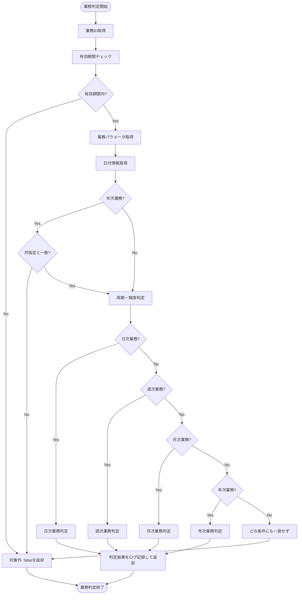

## 8. 月次/年次業務の基準別判定フロー

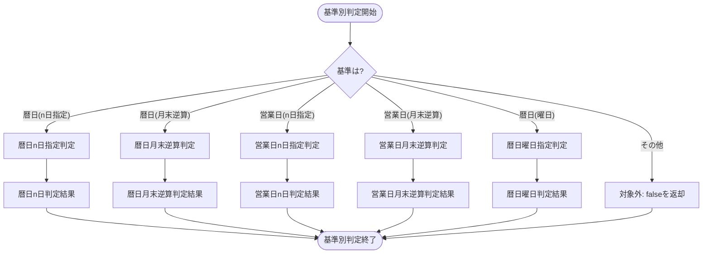

## 9. 業務判定ユーティリティ関数

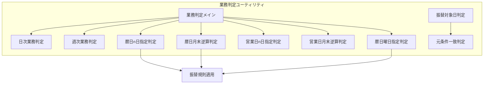

## 10. 業務種別と判定条件の関係

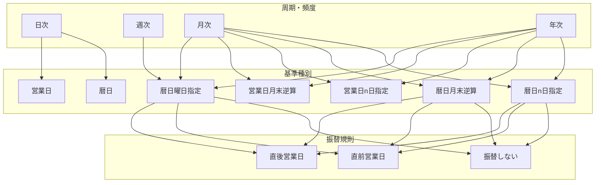

## 11. スケジュール生成フロー 

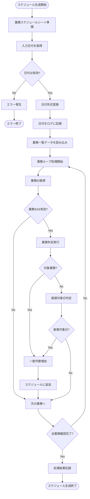

## 12. 日次業務判定フロー

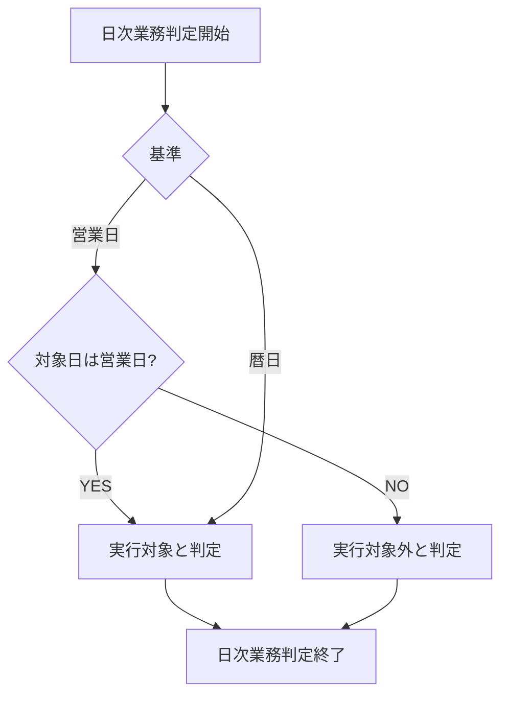

## 13. 週次業務判定フロー

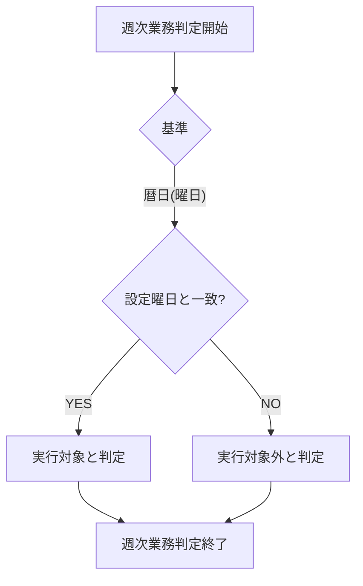

## 14. 月次業務判定フロー

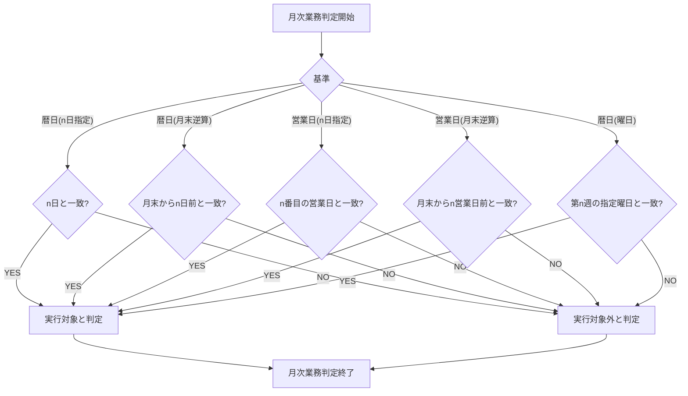

## 15. 年次業務判定フロー

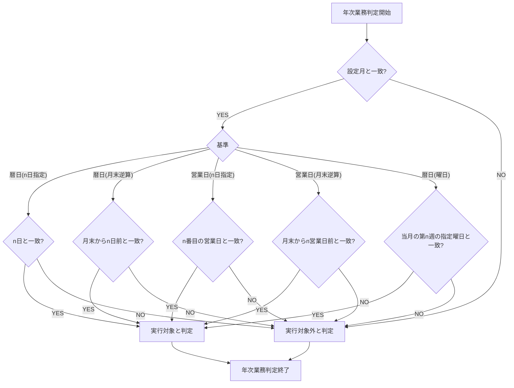

## 16. 業務振替判定フロー (isTargetDateForFurikae関数)

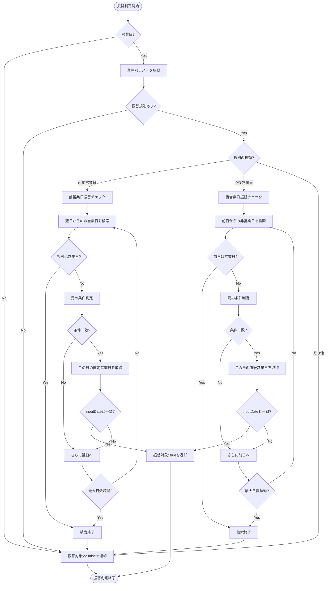

## 17. テスト実行フロー

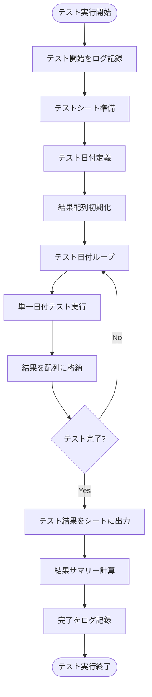

## 18. 単一日付テスト実行フロー

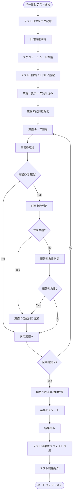

## 19. 「n日」カラムの使用方法詳細

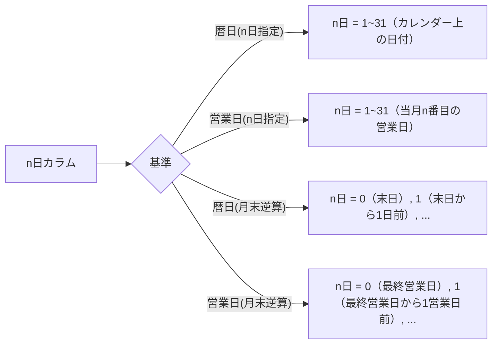

## 20. PowerBI連携データフロー

```mermaid
flowchart TB
    subgraph "入力データ"
        カレンダー["カレンダー.csv
        - 年月日
        - 営業日フラグ
        - 曜日
        - 営業日（当月n日目）
        - 逆算営業日（当月末からn日目）"]
        
        業務一覧["業務一覧テーブル
        - 業務ID
        - 業務名
        - 周期・頻度 (日次/週次/月次/年次)
        - 基準 (暦日/営業日)
        - 月/週番号/曜日/n日
        - 非営業日振替規則
        - 有効期間"]
        
        業務スケジュール["業務スケジュールテーブル
        - スケジュールID
        - 業務ID
        - 予定日"]
    end
    
    subgraph "Power Query変換"
        業務マージ["業務+スケジュールマージ"]
        日付マージ["日付情報マージ"]
        メトリクス計算["遅延・進捗メトリクス計算"]
    end
    
    subgraph "Power BIモデル"
        進捗テーブル["進捗管理テーブル"]
        日付テーブル["日付ディメンション"]
        業務テーブル["業務ディメンション"]
        メジャー["DAXメジャー(KPI)"]
    end
    
    subgraph "Power BIビジュアル"
        ガントチャート["ガントチャート"]
        ダッシュボード["ダッシュボード"]
        進捗表["進捗管理表"]
        カレンダービュー["カレンダービュー"]
    end
    
    カレンダー --> 日付マージ
    業務一覧 --> 業務マージ
    業務スケジュール --> 業務マージ
    
    業務マージ --> 日付マージ
    日付マージ --> メトリクス計算
    
    メトリクス計算 --> 進捗テーブル
    メトリクス計算 --> 日付テーブル
    メトリクス計算 --> 業務テーブル
    
    進捗テーブル --> メジャー
    日付テーブル --> メジャー
    業務テーブル --> メジャー
    
    メジャー --> ガントチャート
    メジャー --> ダッシュボード
    メジャー --> 進捗表
    メジャー --> カレンダービュー
```

## 21. テスト計画

システムの品質を確保するため、以下の観点からテストを実施します：

1. **基本機能テスト**：各周期（日次/週次/月次/年次）、各基準（暦日/営業日）の組み合わせが正しく動作するか
2. **境界値テスト**：月初・月末・年始・年末などの境界条件が正しく処理されるか
3. **振替規則テスト**：非営業日振替規則（直前営業日/直後営業日/振替しない）が正しく適用されるか
4. **特殊日テスト**：祝日や特殊な日（2月29日など）の処理が正しく行われるか
5. **連休テスト**：ゴールデンウィークなど連続した休日がある場合の処理が正しく行われるか

特に以下のテストデータが重要です：

- 通常期間テスト（2025-03-24～2025-03-30）
- 月末月初期間テスト（2025-04-28～2025-05-04）
- 連休期間テスト（2025-05-03～2025-05-09）
- 年末年始期間テスト（2024-12-28～2025-01-04）
- 閾値テスト（閏年、月末日など）

これらのテストデータに対して、期待される業務IDとの一致を確認します。

## 22. テスト実施手順

1. scheduler.ostsを開く
2. isTest変数をtrueに設定
3. スクリプトを実行する
4. テストシートに出力された結果を確認する
5. 全てのテストケースで期待される結果と一致することを確認する

## 23. 実運用手順

1. scheduler.ostsをExcelで開く
2. isTest変数をfalseに設定
3. B1セルに対象日付を入力する
4. スクリプトを実行する
5. 業務スケジュールシートに出力された結果を確認する
6. 必要に応じて、この結果をPower BIで可視化・分析する

</details>
:::

### 3. テスト計画の策定

実装前に「テスト計画.md」を作成し、テストケースと期待値を定義しました。これにより、実装後の検証が効率的に行えるようになりました。

:::note
<details>
<summary>【テスト計画.md】</summary>


# 業務スケジュール管理システム (scheduler.osts) テスト計画

## 1. テスト計画の概要

### 1.1 目的
本テスト計画は、業務スケジュール管理システム（scheduler.osts）の動作を検証するためのテストケースを定義します。様々な条件やパターンにおいて正しく業務が抽出されるかを検証します。

### 1.2 テスト対象
- scheduler.osts（Office Script for Excel）
- 対象機能：業務一覧から対象日の業務スケジュールを自動生成する機能

### 1.3 テスト環境
- 入力データ：業務一覧テーブルテストデータ.csv
- カレンダーデータ：カレンダー.csv
- 現在の日付：2025年4月30日

## 2. テスト観点

以下の観点からテストを実施します：

1. **基本機能テスト**：各周期（日次/週次/月次/年次）、各基準（暦日/営業日）の組み合わせが正しく動作するか
2. **境界値テスト**：月初・月末・年始・年末などの境界条件が正しく処理されるか
3. **振替規則テスト**：非営業日振替規則（直前営業日/直後営業日/振替しない）が正しく適用されるか
4. **特殊日テスト**：祝日や特殊な日（2月29日など）の処理が正しく行われるか
5. **連休テスト**：ゴールデンウィークなど連続した休日がある場合の処理が正しく行われるか

## 3. テスト期間

以下の4つの期間でテストを実施します：

1. **通常期間**：2025-03-24～2025-03-30（平常時の週）
2. **月末月初期間**：2025-04-28～2025-05-04（月末から月初の切り替わり時）
3. **連休期間**：2025-05-03～2025-05-09（ゴールデンウィーク期間）
4. **年末年始期間**：2024-12-28～2025-01-04（年末から年始の切り替わり時）

## 4. テストケース詳細

### 4.1 通常期間テスト（2025-03-24～2025-03-30）

| 日付 | 曜日 | 営業日 | テスト観点 | 期待される抽出業務ID |
|------|------|--------|------------|------------------------|
| 2025-03-24 | 月 | ○ | 平日通常テスト | 1, 2, 3, 32, 94（毎日、営業日、毎週月曜、毎月第4月曜、3月第4月曜） |
| 2025-03-25 | 火 | ○ | 基本機能テスト | 1, 2, 4, 18, 28, 37, 99（毎日、営業日、毎週火曜、毎月25日、毎月最終営業日から4営業日前、毎月第4火曜、3月第4火曜） |
| 2025-03-26 | 水 | ○ | 基本機能テスト | 1, 2, 5, 27, 42, 52（毎日、営業日、毎週水曜、毎月最終営業日から3営業日前、毎月第4水曜、毎週水曜直前営業日） |
| 2025-03-27 | 木 | ○ | 基本機能テスト | 1, 2, 6, 23, 26, 53（毎日、営業日、毎週木曜、毎月末日から4日前、毎月最終営業日から2営業日前、毎週木曜直後営業日） |
| 2025-03-28 | 金 | ○ | 基本機能テスト | 1, 2, 7, 22, 25, 54, 89（毎日、営業日、毎週金曜、毎月末日から3日前、毎月最終営業日から1営業日前、毎週金曜振替なし、3月第4金曜） |
| 2025-03-29 | 土 | × | 休日テスト | 1, 8, 21（毎日、毎週土曜、毎月末日から2日前） |
| 2025-03-30 | 日 | × | 休日テスト | 1, 9, 20（毎日、毎週日曜、毎月末日から1日前） |

### 4.2 月末月初期間テスト（2025-04-28～2025-05-04）

| 日付 | 曜日 | 営業日 | テスト観点 | 期待される抽出業務ID |
|------|------|--------|------------|------------------------|
| 2025-04-28 | 月 | ○ | 月末営業日テスト | 1, 2, 3, 21, 25, 32（毎日、営業日、毎週月曜、毎月末日から2日前、毎月最終営業日から1営業日前、毎月第4月曜） |
| 2025-04-29 | 火 | × | 祝日テスト（昭和の日） | 1, 4, 20, 38（毎日、毎週火曜、毎月末日から1日前、毎月第5火曜） |
| 2025-04-30 | 水 | ○ | 月末営業日テスト | 1, 2, 5, 19, 24, 43, 52, 81（毎日、営業日、毎週水曜、毎月末日、毎月最終営業日、毎月第5水曜、毎週水曜直前営業日、4月最終営業日） |
| 2025-05-01 | 木 | ○ | 月初テスト | 1, 2, 6, 10, 47, 53, 60（毎日、営業日、毎週木曜、毎月1日、毎月第1営業日、毎週木曜直後営業日、5月1日業務） |
| 2025-05-02 | 金 | ○ | 基本機能テスト | 1, 2, 7, 11, 44, 48, 54（毎日、営業日、毎週金曜、毎月2日、毎月第1金曜、毎月第2営業日、毎週金曜振替なし） |
| 2025-05-03 | 土 | × | 祝日テスト（憲法記念日） | 1, 8, 12（毎日、毎週土曜、毎月3日） |
| 2025-05-04 | 日 | × | 祝日テスト（みどりの日） | 1, 9, 13（毎日、毎週日曜、毎月4日） |

### 4.3 連休期間テスト（2025-05-03～2025-05-09）

| 日付 | 曜日 | 営業日 | テスト観点 | 期待される抽出業務ID |
|------|------|--------|------------|------------------------|
| 2025-05-05 | 月 | × | 祝日テスト（こどもの日） | 1, 3, 14, 29（毎日、毎週月曜、毎月5日、毎月第1月曜） |
| 2025-05-06 | 火 | × | 祝日テスト（振替休日） | 1, 4, 34（毎日、毎週火曜、毎月第1火曜） |
| 2025-05-07 | 水 | ○ | 祝日後営業日テスト | 1, 2, 5, 39, 49, 52（毎日、営業日、毎週水曜、毎月第1水曜、毎月第3営業日、毎週水曜直前営業日） |
| 2025-05-08 | 木 | ○ | 基本機能テスト | 1, 2, 6, 50, 53（毎日、営業日、毎週木曜、毎月第4営業日、毎週木曜直後営業日） |
| 2025-05-09 | 金 | ○ | 基本機能テスト | 1, 2, 7, 51, 54（毎日、営業日、毎週金曜、毎月第5営業日、毎週金曜振替なし） |

### 4.4 年末年始期間テスト（2024-12-28～2025-01-04）

| 日付 | 曜日 | 営業日 | テスト観点 | 期待される抽出業務ID |
|------|------|--------|------------|------------------------|
| 2024-12-28 | 土 | × | 休日テスト | 1, 8, 22（毎日、毎週土曜、毎月末日から3日前） |
| 2024-12-29 | 日 | × | 休日テスト | 1, 9, 21（毎日、毎週日曜、毎月末日から2日前） |
| 2024-12-30 | 月 | ○ | 年末営業日テスト | 1, 2, 3, 20, 25, 33（毎日、営業日、毎週月曜、毎月末日から1日前、毎月最終営業日から1営業日前、毎月第5月曜） |
| 2024-12-31 | 火 | ○ | 年末最終日テスト | 1, 2, 4, 19, 24, 38, 52, 75, 82（毎日、営業日、毎週火曜、毎月末日、毎月最終営業日、毎月第5火曜、毎週水曜直前営業日、12月末日、12月最終営業日） |
| 2025-01-01 | 水 | × | 祝日テスト（元日） | 1, 5, 10, 39, 52, 56（毎日、毎週水曜、毎月1日、毎月第1水曜、毎週水曜直前営業日、1月1日業務） |
| 2025-01-02 | 木 | ○ | 年始営業日テスト | 1, 2, 6, 11, 47, 53, 80（毎日、営業日、毎週木曜、毎月2日、毎月第1営業日、毎週木曜直後営業日、1月第1営業日） |
| 2025-01-03 | 金 | ○ | 基本機能テスト | 1, 2, 7, 12, 44, 48, 54（毎日、営業日、毎週金曜、毎月3日、毎月第1金曜、毎月第2営業日、毎週金曜振替なし） |
| 2025-01-04 | 土 | × | 休日テスト | 1, 8, 13（毎日、毎週土曜、毎月4日） |

## 5. 振替規則テスト

特に振替規則（直前営業日/直後営業日/振替しない）の動作を検証する特別なテストケースを以下に定義します。業務ID 52, 53, 54に設定されている振替規則が正しく機能するかを確認します。

### 5.1 振替規則テストケース（2025-05-03～2025-05-08）

| 日付 | 曜日 | 営業日 | テスト対象業務ID | 振替規則 | 期待される結果 |
|------|------|--------|----------------|----------|----------------|
| 2025-05-03 | 土 | × | 52 (毎週水曜日業務) | 直前営業日 | 抽出されない |
| 2025-05-03 | 土 | × | 53 (毎週木曜日業務) | 直後営業日 | 抽出されない |
| 2025-05-03 | 土 | × | 54 (毎週金曜日業務) | 振替しない | 抽出されない |
| 2025-05-07 | 水 | ○ | 52 (毎週水曜日業務) | 直前営業日 | 業務52が抽出される |
| 2025-05-08 | 木 | ○ | 53 (毎週木曜日業務) | 直後営業日 | 業務53が抽出される |
| 2025-04-30 | 水 | ○ | 52 (毎週水曜日業務) | 直前営業日 | 業務52が抽出される |
| 2025-05-02 | 金 | ○ | 54 (毎週金曜日業務) | 振替しない | 業務54が抽出される |

## 6. 閾値テスト

特に境界値や特殊ケースのテストを実施します。

### 6.1 閾値テストケース

| 日付 | 曜日 | 営業日 | テスト観点 | 期待される抽出業務ID |
|------|------|--------|------------|------------------------|
| 2024-02-29 | 木 | ○ | 閏年テスト | 1, 2, 6, 19, 24, 53, 76（毎日、営業日、毎週木曜、毎月末日業務、毎月最終営業日業務、毎週木曜直後営業日、2月29日業務） |
| 2025-01-31 | 金 | ○ | 月末テスト（31日） | 1, 2, 7, 19, 24, 46, 54（毎日、営業日、毎週金曜、毎月末日業務、毎月最終営業日業務、毎月第5金曜、毎週金曜振替なし） |
| 2025-02-28 | 金 | ○ | 月末テスト（28日） | 1, 2, 7, 19, 24, 54（毎日、営業日、毎週金曜、毎月末日業務、毎月最終営業日業務、毎週金曜振替なし） |
| 2025-03-31 | 月 | ○ | 第5週テスト | 1, 2, 3, 19, 24, 33, 72, 83, 95（毎日、営業日、毎週月曜、毎月末日業務、毎月最終営業日業務、毎月第5月曜業務、3月最終営業日業務、3月最終営業日業務、3月第5月曜業務） |

## 7. テスト実施手順

1. scheduler.ostsを開く
2. 入力シートのB1セルに各テスト日付を設定する
3. スクリプトを実行する
4. 出力された業務スケジュールと期待される結果を比較する
5. 特に以下の点を重点的に確認する：
   - 該当日の全ての業務が抽出されていること
   - 非営業日の振替規則が正しく適用されていること
   - 期待されない業務が誤って抽出されていないこと

## 8. 特記事項

1. 「業務一覧テーブルテストデータ.csv」にはID=52,53,54のデータに非営業日振替規則（直前営業日、直後営業日、振替しない）が設定されており、これらの動作確認が特に重要
2. 連休期間（ゴールデンウィーク）の振る舞いとして、5/3～5/6の休日とその前後の営業日での業務抽出が正しく行われるかの確認が重要
3. 月末最終営業日や月初第1営業日などの境界条件での動作確認
4. 閏年（2月29日）における特殊業務の抽出確認

## 9. テスト結果記録

| テスト日 | 実施日 | テスト内容 | 結果 | 備考 |
|---------|--------|------------|------|------|
| 2025-03-24 | | 通常期間テスト | | |
| 2025-03-25 | | 通常期間テスト | | |
| ... | | | | |
| 2025-05-09 | | 連休期間テスト | | |

</details>
:::

### 4. テストデータの作成

テストを効率的に行うために、カレンダーCSVと業務一覧テーブルテストデータを作成しました。カレンダーCSVには営業日フラグを設定し、業務一覧には多様なパターンの業務を定義しています。

:::note
<details>
<summary>【カレンダー.csv】</summary>

```csv
年月日,営業日フラグ,備考,曜日,営業日,逆算営業日
2024-01-01,FALSE,元日,月,,
2024-01-02,TRUE,,火,1,20
2024-01-03,TRUE,,水,2,19
2024-01-04,TRUE,,木,3,18
2024-01-05,TRUE,,金,4,17
2024-01-06,FALSE,,土,,
2024-01-07,FALSE,,日,,
2024-01-08,FALSE,成人の日,月,,
2024-01-09,TRUE,,火,5,16
2024-01-10,TRUE,,水,6,15
2024-01-11,TRUE,,木,7,14
2024-01-12,TRUE,,金,8,13
2024-01-13,FALSE,,土,,
2024-01-14,FALSE,,日,,
2024-01-15,TRUE,,月,9,12
2024-01-16,TRUE,,火,10,11
2024-01-17,TRUE,,水,11,10
2024-01-18,TRUE,,木,12,9
2024-01-19,TRUE,,金,13,8
2024-01-20,FALSE,,土,,
2024-01-21,FALSE,,日,,
2024-01-22,TRUE,,月,14,7
2024-01-23,TRUE,,火,15,6
2024-01-24,TRUE,,水,16,5
2024-01-25,TRUE,,木,17,4
2024-01-26,TRUE,,金,18,3
2024-01-27,FALSE,,土,,
2024-01-28,FALSE,,日,,
2024-01-29,TRUE,,月,19,2
2024-01-30,TRUE,,火,20,1
2024-01-31,TRUE,,水,21,0
2024-02-01,TRUE,,木,1,18
2024-02-02,TRUE,,金,2,17
2024-02-03,FALSE,,土,,
2024-02-04,FALSE,,日,,
2024-02-05,TRUE,,月,3,16
2024-02-06,TRUE,,火,4,15
2024-02-07,TRUE,,水,5,14
2024-02-08,TRUE,,木,6,13
2024-02-09,TRUE,,金,7,12
2024-02-10,FALSE,,土,,
2024-02-11,FALSE,建国記念の日,日,,
2024-02-12,FALSE,振替休日,月,,
2024-02-13,TRUE,,火,8,11
2024-02-14,TRUE,,水,9,10
2024-02-15,TRUE,,木,10,9
2024-02-16,TRUE,,金,11,8
2024-02-17,FALSE,,土,,
2024-02-18,FALSE,,日,,
2024-02-19,TRUE,,月,12,7
2024-02-20,TRUE,,火,13,6
2024-02-21,TRUE,,水,14,5
2024-02-22,TRUE,,木,15,4
2024-02-23,FALSE,天皇誕生日,金,,
2024-02-24,FALSE,,土,,
2024-02-25,FALSE,,日,,
2024-02-26,TRUE,,月,16,3
2024-02-27,TRUE,,火,17,2
2024-02-28,TRUE,,水,18,1
2024-02-29,TRUE,,木,19,0
2024-03-01,TRUE,,金,1,19
2024-03-02,FALSE,,土,,
2024-03-03,FALSE,,日,,
2024-03-04,TRUE,,月,2,18
2024-03-05,TRUE,,火,3,17
2024-03-06,TRUE,,水,4,16
2024-03-07,TRUE,,木,5,15
2024-03-08,TRUE,,金,6,14
2024-03-09,FALSE,,土,,
2024-03-10,FALSE,,日,,
2024-03-11,TRUE,,月,7,13
2024-03-12,TRUE,,火,8,12
2024-03-13,TRUE,,水,9,11
2024-03-14,TRUE,,木,10,10
2024-03-15,TRUE,,金,11,9
2024-03-16,FALSE,,土,,
2024-03-17,FALSE,,日,,
2024-03-18,TRUE,,月,12,8
2024-03-19,TRUE,,火,13,7
2024-03-20,FALSE,春分の日,水,,
2024-03-21,TRUE,,木,14,6
2024-03-22,TRUE,,金,15,5
2024-03-23,FALSE,,土,,
2024-03-24,FALSE,,日,,
2024-03-25,TRUE,,月,16,4
2024-03-26,TRUE,,火,17,3
2024-03-27,TRUE,,水,18,2
2024-03-28,TRUE,,木,19,1
2024-03-29,TRUE,,金,20,0
2024-03-30,FALSE,,土,,
2024-03-31,FALSE,,日,,
2024-04-01,TRUE,,月,1,20
2024-04-02,TRUE,,火,2,19
2024-04-03,TRUE,,水,3,18
2024-04-04,TRUE,,木,4,17
2024-04-05,TRUE,,金,5,16
2024-04-06,FALSE,,土,,
2024-04-07,FALSE,,日,,
2024-04-08,TRUE,,月,6,15
2024-04-09,TRUE,,火,7,14
2024-04-10,TRUE,,水,8,13
2024-04-11,TRUE,,木,9,12
2024-04-12,TRUE,,金,10,11
2024-04-13,FALSE,,土,,
2024-04-14,FALSE,,日,,
2024-04-15,TRUE,,月,11,10
2024-04-16,TRUE,,火,12,9
2024-04-17,TRUE,,水,13,8
2024-04-18,TRUE,,木,14,7
2024-04-19,TRUE,,金,15,6
2024-04-20,FALSE,,土,,
2024-04-21,FALSE,,日,,
2024-04-22,TRUE,,月,16,5
2024-04-23,TRUE,,火,17,4
2024-04-24,TRUE,,水,18,3
2024-04-25,TRUE,,木,19,2
2024-04-26,TRUE,,金,20,1
2024-04-27,FALSE,,土,,
2024-04-28,FALSE,,日,,
2024-04-29,FALSE,昭和の日,月,,
2024-04-30,TRUE,,火,21,0
2024-05-01,TRUE,,水,1,20
2024-05-02,TRUE,,木,2,19
2024-05-03,FALSE,憲法記念日,金,,
2024-05-04,FALSE,みどりの日,土,,
2024-05-05,FALSE,こどもの日,日,,
2024-05-06,FALSE,振替休日,月,,
2024-05-07,TRUE,,火,3,18
2024-05-08,TRUE,,水,4,17
2024-05-09,TRUE,,木,5,16
2024-05-10,TRUE,,金,6,15
2024-05-11,FALSE,,土,,
2024-05-12,FALSE,,日,,
2024-05-13,TRUE,,月,7,14
2024-05-14,TRUE,,火,8,13
2024-05-15,TRUE,,水,9,12
2024-05-16,TRUE,,木,10,11
2024-05-17,TRUE,,金,11,10
2024-05-18,FALSE,,土,,
2024-05-19,FALSE,,日,,
2024-05-20,TRUE,,月,12,9
2024-05-21,TRUE,,火,13,8
2024-05-22,TRUE,,水,14,7
2024-05-23,TRUE,,木,15,6
2024-05-24,TRUE,,金,16,5
2024-05-25,FALSE,,土,,
2024-05-26,FALSE,,日,,
2024-05-27,TRUE,,月,17,4
2024-05-28,TRUE,,火,18,3
2024-05-29,TRUE,,水,19,2
2024-05-30,TRUE,,木,20,1
2024-05-31,TRUE,,金,21,0
2024-06-01,FALSE,,土,,
2024-06-02,FALSE,,日,,
2024-06-03,TRUE,,月,1,19
2024-06-04,TRUE,,火,2,18
2024-06-05,TRUE,,水,3,17
2024-06-06,TRUE,,木,4,16
2024-06-07,TRUE,,金,5,15
2024-06-08,FALSE,,土,,
2024-06-09,FALSE,,日,,
2024-06-10,TRUE,,月,6,14
2024-06-11,TRUE,,火,7,13
2024-06-12,TRUE,,水,8,12
2024-06-13,TRUE,,木,9,11
2024-06-14,TRUE,,金,10,10
2024-06-15,FALSE,,土,,
2024-06-16,FALSE,,日,,
2024-06-17,TRUE,,月,11,9
2024-06-18,TRUE,,火,12,8
2024-06-19,TRUE,,水,13,7
2024-06-20,TRUE,,木,14,6
2024-06-21,TRUE,,金,15,5
2024-06-22,FALSE,,土,,
2024-06-23,FALSE,,日,,
2024-06-24,TRUE,,月,16,4
2024-06-25,TRUE,,火,17,3
2024-06-26,TRUE,,水,18,2
2024-06-27,TRUE,,木,19,1
2024-06-28,TRUE,,金,20,0
2024-06-29,FALSE,,土,,
2024-06-30,FALSE,,日,,
2024-07-01,TRUE,,月,1,21
2024-07-02,TRUE,,火,2,20
2024-07-03,TRUE,,水,3,19
2024-07-04,TRUE,,木,4,18
2024-07-05,TRUE,,金,5,17
2024-07-06,FALSE,,土,,
2024-07-07,FALSE,,日,,
2024-07-08,TRUE,,月,6,16
2024-07-09,TRUE,,火,7,15
2024-07-10,TRUE,,水,8,14
2024-07-11,TRUE,,木,9,13
2024-07-12,TRUE,,金,10,12
2024-07-13,FALSE,,土,,
2024-07-14,FALSE,,日,,
2024-07-15,FALSE,海の日,月,,
2024-07-16,TRUE,,火,11,11
2024-07-17,TRUE,,水,12,10
2024-07-18,TRUE,,木,13,9
2024-07-19,TRUE,,金,14,8
2024-07-20,FALSE,,土,,
2024-07-21,FALSE,,日,,
2024-07-22,TRUE,,月,15,7
2024-07-23,TRUE,,火,16,6
2024-07-24,TRUE,,水,17,5
2024-07-25,TRUE,,木,18,4
2024-07-26,TRUE,,金,19,3
2024-07-27,FALSE,,土,,
2024-07-28,FALSE,,日,,
2024-07-29,TRUE,,月,20,2
2024-07-30,TRUE,,火,21,1
2024-07-31,TRUE,,水,22,0
2024-08-01,TRUE,,木,1,20
2024-08-02,TRUE,,金,2,19
2024-08-03,FALSE,,土,,
2024-08-04,FALSE,,日,,
2024-08-05,TRUE,,月,3,18
2024-08-06,TRUE,,火,4,17
2024-08-07,TRUE,,水,5,16
2024-08-08,TRUE,,木,6,15
2024-08-09,TRUE,,金,7,14
2024-08-10,FALSE,,土,,
2024-08-11,FALSE,山の日,日,,
2024-08-12,FALSE,振替休日,月,,
2024-08-13,TRUE,,火,8,13
2024-08-14,TRUE,,水,9,12
2024-08-15,TRUE,,木,10,11
2024-08-16,TRUE,,金,11,10
2024-08-17,FALSE,,土,,
2024-08-18,FALSE,,日,,
2024-08-19,TRUE,,月,12,9
2024-08-20,TRUE,,火,13,8
2024-08-21,TRUE,,水,14,7
2024-08-22,TRUE,,木,15,6
2024-08-23,TRUE,,金,16,5
2024-08-24,FALSE,,土,,
2024-08-25,FALSE,,日,,
2024-08-26,TRUE,,月,17,4
2024-08-27,TRUE,,火,18,3
2024-08-28,TRUE,,水,19,2
2024-08-29,TRUE,,木,20,1
2024-08-30,TRUE,,金,21,0
2024-08-31,FALSE,,土,,
2024-09-01,FALSE,,日,,
2024-09-02,TRUE,,月,1,18
2024-09-03,TRUE,,火,2,17
2024-09-04,TRUE,,水,3,16
2024-09-05,TRUE,,木,4,15
2024-09-06,TRUE,,金,5,14
2024-09-07,FALSE,,土,,
2024-09-08,FALSE,,日,,
2024-09-09,TRUE,,月,6,13
2024-09-10,TRUE,,火,7,12
2024-09-11,TRUE,,水,8,11
2024-09-12,TRUE,,木,9,10
2024-09-13,TRUE,,金,10,9
2024-09-14,FALSE,,土,,
2024-09-15,FALSE,,日,,
2024-09-16,FALSE,敬老の日,月,,
2024-09-17,TRUE,,火,11,8
2024-09-18,TRUE,,水,12,7
2024-09-19,TRUE,,木,13,6
2024-09-20,TRUE,,金,14,5
2024-09-21,FALSE,,土,,
2024-09-22,FALSE,秋分の日,日,,
2024-09-23,FALSE,振替休日,月,,
2024-09-24,TRUE,,火,15,4
2024-09-25,TRUE,,水,16,3
2024-09-26,TRUE,,木,17,2
2024-09-27,TRUE,,金,18,1
2024-09-28,FALSE,,土,,
2024-09-29,FALSE,,日,,
2024-09-30,TRUE,,月,19,0
2024-10-01,TRUE,,火,1,21
2024-10-02,TRUE,,水,2,20
2024-10-03,TRUE,,木,3,19
2024-10-04,TRUE,,金,4,18
2024-10-05,FALSE,,土,,
2024-10-06,FALSE,,日,,
2024-10-07,TRUE,,月,5,17
2024-10-08,TRUE,,火,6,16
2024-10-09,TRUE,,水,7,15
2024-10-10,TRUE,,木,8,14
2024-10-11,TRUE,,金,9,13
2024-10-12,FALSE,,土,,
2024-10-13,FALSE,,日,,
2024-10-14,FALSE,スポーツの日,月,,
2024-10-15,TRUE,,火,10,12
2024-10-16,TRUE,,水,11,11
2024-10-17,TRUE,,木,12,10
2024-10-18,TRUE,,金,13,9
2024-10-19,FALSE,,土,,
2024-10-20,FALSE,,日,,
2024-10-21,TRUE,,月,14,8
2024-10-22,TRUE,,火,15,7
2024-10-23,TRUE,,水,16,6
2024-10-24,TRUE,,木,17,5
2024-10-25,TRUE,,金,18,4
2024-10-26,FALSE,,土,,
2024-10-27,FALSE,,日,,
2024-10-28,TRUE,,月,19,3
2024-10-29,TRUE,,火,20,2
2024-10-30,TRUE,,水,21,1
2024-10-31,TRUE,,木,22,0
2024-11-01,TRUE,,金,1,19
2024-11-02,FALSE,,土,,
2024-11-03,FALSE,文化の日,日,,
2024-11-04,FALSE,振替休日,月,,
2024-11-05,TRUE,,火,2,18
2024-11-06,TRUE,,水,3,17
2024-11-07,TRUE,,木,4,16
2024-11-08,TRUE,,金,5,15
2024-11-09,FALSE,,土,,
2024-11-10,FALSE,,日,,
2024-11-11,TRUE,,月,6,14
2024-11-12,TRUE,,火,7,13
2024-11-13,TRUE,,水,8,12
2024-11-14,TRUE,,木,9,11
2024-11-15,TRUE,,金,10,10
2024-11-16,FALSE,,土,,
2024-11-17,FALSE,,日,,
2024-11-18,TRUE,,月,11,9
2024-11-19,TRUE,,火,12,8
2024-11-20,TRUE,,水,13,7
2024-11-21,TRUE,,木,14,6
2024-11-22,TRUE,,金,15,5
2024-11-23,FALSE,勤労感謝の日,土,,
2024-11-24,FALSE,,日,,
2024-11-25,TRUE,,月,16,4
2024-11-26,TRUE,,火,17,3
2024-11-27,TRUE,,水,18,2
2024-11-28,TRUE,,木,19,1
2024-11-29,TRUE,,金,20,0
2024-11-30,FALSE,,土,,
2024-12-01,FALSE,,日,,
2024-12-02,TRUE,,月,1,21
2024-12-03,TRUE,,火,2,20
2024-12-04,TRUE,,水,3,19
2024-12-05,TRUE,,木,4,18
2024-12-06,TRUE,,金,5,17
2024-12-07,FALSE,,土,,
2024-12-08,FALSE,,日,,
2024-12-09,TRUE,,月,6,16
2024-12-10,TRUE,,火,7,15
2024-12-11,TRUE,,水,8,14
2024-12-12,TRUE,,木,9,13
2024-12-13,TRUE,,金,10,12
2024-12-14,FALSE,,土,,
2024-12-15,FALSE,,日,,
2024-12-16,TRUE,,月,11,11
2024-12-17,TRUE,,火,12,10
2024-12-18,TRUE,,水,13,9
2024-12-19,TRUE,,木,14,8
2024-12-20,TRUE,,金,15,7
2024-12-21,FALSE,,土,,
2024-12-22,FALSE,,日,,
2024-12-23,TRUE,,月,16,6
2024-12-24,TRUE,,火,17,5
2024-12-25,TRUE,,水,18,4
2024-12-26,TRUE,,木,19,3
2024-12-27,TRUE,,金,20,2
2024-12-28,FALSE,,土,,
2024-12-29,FALSE,,日,,
2024-12-30,TRUE,,月,21,1
2024-12-31,TRUE,,火,22,0
2025-01-01,FALSE,元日,水,,
2025-01-02,TRUE,,木,1,20
2025-01-03,TRUE,,金,2,19
2025-01-04,FALSE,,土,,
2025-01-05,FALSE,,日,,
2025-01-06,TRUE,,月,3,18
2025-01-07,TRUE,,火,4,17
2025-01-08,TRUE,,水,5,16
2025-01-09,TRUE,,木,6,15
2025-01-10,TRUE,,金,7,14
2025-01-11,FALSE,,土,,
2025-01-12,FALSE,,日,,
2025-01-13,FALSE,成人の日,月,,
2025-01-14,TRUE,,火,8,13
2025-01-15,TRUE,,水,9,12
2025-01-16,TRUE,,木,10,11
2025-01-17,TRUE,,金,11,10
2025-01-18,FALSE,,土,,
2025-01-19,FALSE,,日,,
2025-01-20,TRUE,,月,12,9
2025-01-21,TRUE,,火,13,8
2025-01-22,TRUE,,水,14,7
2025-01-23,TRUE,,木,15,6
2025-01-24,TRUE,,金,16,5
2025-01-25,FALSE,,土,,
2025-01-26,FALSE,,日,,
2025-01-27,TRUE,,月,17,4
2025-01-28,TRUE,,火,18,3
2025-01-29,TRUE,,水,19,2
2025-01-30,TRUE,,木,20,1
2025-01-31,TRUE,,金,21,0
2025-02-01,FALSE,,土,,
2025-02-02,FALSE,,日,,
2025-02-03,TRUE,,月,1,17
2025-02-04,TRUE,,火,2,16
2025-02-05,TRUE,,水,3,15
2025-02-06,TRUE,,木,4,14
2025-02-07,TRUE,,金,5,13
2025-02-08,FALSE,,土,,
2025-02-09,FALSE,,日,,
2025-02-10,TRUE,,月,6,12
2025-02-11,FALSE,建国記念の日,火,,
2025-02-12,TRUE,,水,7,11
2025-02-13,TRUE,,木,8,10
2025-02-14,TRUE,,金,9,9
2025-02-15,FALSE,,土,,
2025-02-16,FALSE,,日,,
2025-02-17,TRUE,,月,10,8
2025-02-18,TRUE,,火,11,7
2025-02-19,TRUE,,水,12,6
2025-02-20,TRUE,,木,13,5
2025-02-21,TRUE,,金,14,4
2025-02-22,FALSE,,土,,
2025-02-23,FALSE,天皇誕生日,日,,
2025-02-24,FALSE,振替休日,月,,
2025-02-25,TRUE,,火,15,3
2025-02-26,TRUE,,水,16,2
2025-02-27,TRUE,,木,17,1
2025-02-28,TRUE,,金,18,0
2025-03-01,FALSE,,土,,
2025-03-02,FALSE,,日,,
2025-03-03,TRUE,,月,1,19
2025-03-04,TRUE,,火,2,18
2025-03-05,TRUE,,水,3,17
2025-03-06,TRUE,,木,4,16
2025-03-07,TRUE,,金,5,15
2025-03-08,FALSE,,土,,
2025-03-09,FALSE,,日,,
2025-03-10,TRUE,,月,6,14
2025-03-11,TRUE,,火,7,13
2025-03-12,TRUE,,水,8,12
2025-03-13,TRUE,,木,9,11
2025-03-14,TRUE,,金,10,10
2025-03-15,FALSE,,土,,
2025-03-16,FALSE,,日,,
2025-03-17,TRUE,,月,11,9
2025-03-18,TRUE,,火,12,8
2025-03-19,TRUE,,水,13,7
2025-03-20,TRUE,,木,14,6
2025-03-21,FALSE,春分の日,金,,
2025-03-22,FALSE,,土,,
2025-03-23,FALSE,,日,,
2025-03-24,TRUE,,月,15,5
2025-03-25,TRUE,,火,16,4
2025-03-26,TRUE,,水,17,3
2025-03-27,TRUE,,木,18,2
2025-03-28,TRUE,,金,19,1
2025-03-29,FALSE,,土,,
2025-03-30,FALSE,,日,,
2025-03-31,TRUE,,月,20,0
2025-04-01,TRUE,,火,1,20
2025-04-02,TRUE,,水,2,19
2025-04-03,TRUE,,木,3,18
2025-04-04,TRUE,,金,4,17
2025-04-05,FALSE,,土,,
2025-04-06,FALSE,,日,,
2025-04-07,TRUE,,月,5,16
2025-04-08,TRUE,,火,6,15
2025-04-09,TRUE,,水,7,14
2025-04-10,TRUE,,木,8,13
2025-04-11,TRUE,,金,9,12
2025-04-12,FALSE,,土,,
2025-04-13,FALSE,,日,,
2025-04-14,TRUE,,月,10,11
2025-04-15,TRUE,,火,11,10
2025-04-16,TRUE,,水,12,9
2025-04-17,TRUE,,木,13,8
2025-04-18,TRUE,,金,14,7
2025-04-19,FALSE,,土,,
2025-04-20,FALSE,,日,,
2025-04-21,TRUE,,月,15,6
2025-04-22,TRUE,,火,16,5
2025-04-23,TRUE,,水,17,4
2025-04-24,TRUE,,木,18,3
2025-04-25,TRUE,,金,19,2
2025-04-26,FALSE,,土,,
2025-04-27,FALSE,,日,,
2025-04-28,TRUE,,月,20,1
2025-04-29,FALSE,昭和の日,火,,
2025-04-30,TRUE,,水,21,0
2025-05-01,TRUE,,木,1,19
2025-05-02,TRUE,,金,2,18
2025-05-03,FALSE,憲法記念日,土,,
2025-05-04,FALSE,みどりの日,日,,
2025-05-05,FALSE,こどもの日,月,,
2025-05-06,FALSE,振替休日,火,,
2025-05-07,TRUE,,水,3,17
2025-05-08,TRUE,,木,4,16
2025-05-09,TRUE,,金,5,15
2025-05-10,FALSE,,土,,
2025-05-11,FALSE,,日,,
2025-05-12,TRUE,,月,6,14
2025-05-13,TRUE,,火,7,13
2025-05-14,TRUE,,水,8,12
2025-05-15,TRUE,,木,9,11
2025-05-16,TRUE,,金,10,10
2025-05-17,FALSE,,土,,
2025-05-18,FALSE,,日,,
2025-05-19,TRUE,,月,11,9
2025-05-20,TRUE,,火,12,8
2025-05-21,TRUE,,水,13,7
2025-05-22,TRUE,,木,14,6
2025-05-23,TRUE,,金,15,5
2025-05-24,FALSE,,土,,
2025-05-25,FALSE,,日,,
2025-05-26,TRUE,,月,16,4
2025-05-27,TRUE,,火,17,3
2025-05-28,TRUE,,水,18,2
2025-05-29,TRUE,,木,19,1
2025-05-30,TRUE,,金,20,0
2025-05-31,FALSE,,土,,
2025-06-01,FALSE,,日,,
2025-06-02,TRUE,,月,1,20
2025-06-03,TRUE,,火,2,19
2025-06-04,TRUE,,水,3,18
2025-06-05,TRUE,,木,4,17
2025-06-06,TRUE,,金,5,16
2025-06-07,FALSE,,土,,
2025-06-08,FALSE,,日,,
2025-06-09,TRUE,,月,6,15
2025-06-10,TRUE,,火,7,14
2025-06-11,TRUE,,水,8,13
2025-06-12,TRUE,,木,9,12
2025-06-13,TRUE,,金,10,11
2025-06-14,FALSE,,土,,
2025-06-15,FALSE,,日,,
2025-06-16,TRUE,,月,11,10
2025-06-17,TRUE,,火,12,9
2025-06-18,TRUE,,水,13,8
2025-06-19,TRUE,,木,14,7
2025-06-20,TRUE,,金,15,6
2025-06-21,FALSE,,土,,
2025-06-22,FALSE,,日,,
2025-06-23,TRUE,,月,16,5
2025-06-24,TRUE,,火,17,4
2025-06-25,TRUE,,水,18,3
2025-06-26,TRUE,,木,19,2
2025-06-27,TRUE,,金,20,1
2025-06-28,FALSE,,土,,
2025-06-29,FALSE,,日,,
2025-06-30,TRUE,,月,21,0
2025-07-01,TRUE,,火,1,21
2025-07-02,TRUE,,水,2,20
2025-07-03,TRUE,,木,3,19
2025-07-04,TRUE,,金,4,18
2025-07-05,FALSE,,土,,
2025-07-06,FALSE,,日,,
2025-07-07,TRUE,,月,5,17
2025-07-08,TRUE,,火,6,16
2025-07-09,TRUE,,水,7,15
2025-07-10,TRUE,,木,8,14
2025-07-11,TRUE,,金,9,13
2025-07-12,FALSE,,土,,
2025-07-13,FALSE,,日,,
2025-07-14,TRUE,,月,10,12
2025-07-15,TRUE,,火,11,11
2025-07-16,TRUE,,水,12,10
2025-07-17,TRUE,,木,13,9
2025-07-18,TRUE,,金,14,8
2025-07-19,FALSE,,土,,
2025-07-20,FALSE,,日,,
2025-07-21,FALSE,海の日,月,,
2025-07-22,TRUE,,火,15,7
2025-07-23,TRUE,,水,16,6
2025-07-24,TRUE,,木,17,5
2025-07-25,TRUE,,金,18,4
2025-07-26,FALSE,,土,,
2025-07-27,FALSE,,日,,
2025-07-28,TRUE,,月,19,3
2025-07-29,TRUE,,火,20,2
2025-07-30,TRUE,,水,21,1
2025-07-31,TRUE,,木,22,0
2025-08-01,TRUE,,金,1,19
2025-08-02,FALSE,,土,,
2025-08-03,FALSE,,日,,
2025-08-04,TRUE,,月,2,18
2025-08-05,TRUE,,火,3,17
2025-08-06,TRUE,,水,4,16
2025-08-07,TRUE,,木,5,15
2025-08-08,TRUE,,金,6,14
2025-08-09,FALSE,,土,,
2025-08-10,FALSE,,日,,
2025-08-11,FALSE,山の日,月,,
2025-08-12,TRUE,,火,7,13
2025-08-13,TRUE,,水,8,12
2025-08-14,TRUE,,木,9,11
2025-08-15,TRUE,,金,10,10
2025-08-16,FALSE,,土,,
2025-08-17,FALSE,,日,,
2025-08-18,TRUE,,月,11,9
2025-08-19,TRUE,,火,12,8
2025-08-20,TRUE,,水,13,7
2025-08-21,TRUE,,木,14,6
2025-08-22,TRUE,,金,15,5
2025-08-23,FALSE,,土,,
2025-08-24,FALSE,,日,,
2025-08-25,TRUE,,月,16,4
2025-08-26,TRUE,,火,17,3
2025-08-27,TRUE,,水,18,2
2025-08-28,TRUE,,木,19,1
2025-08-29,TRUE,,金,20,0
2025-08-30,FALSE,,土,,
2025-08-31,FALSE,,日,,
2025-09-01,TRUE,,月,1,19
2025-09-02,TRUE,,火,2,18
2025-09-03,TRUE,,水,3,17
2025-09-04,TRUE,,木,4,16
2025-09-05,TRUE,,金,5,15
2025-09-06,FALSE,,土,,
2025-09-07,FALSE,,日,,
2025-09-08,TRUE,,月,6,14
2025-09-09,TRUE,,火,7,13
2025-09-10,TRUE,,水,8,12
2025-09-11,TRUE,,木,9,11
2025-09-12,TRUE,,金,10,10
2025-09-13,FALSE,,土,,
2025-09-14,FALSE,,日,,
2025-09-15,FALSE,敬老の日,月,,
2025-09-16,TRUE,,火,11,9
2025-09-17,TRUE,,水,12,8
2025-09-18,TRUE,,木,13,7
2025-09-19,TRUE,,金,14,6
2025-09-20,FALSE,,土,,
2025-09-21,FALSE,,日,,
2025-09-22,TRUE,,月,15,5
2025-09-23,FALSE,秋分の日,火,,
2025-09-24,TRUE,,水,16,4
2025-09-25,TRUE,,木,17,3
2025-09-26,TRUE,,金,18,2
2025-09-27,FALSE,,土,,
2025-09-28,FALSE,,日,,
2025-09-29,TRUE,,月,19,1
2025-09-30,TRUE,,火,20,0
2025-10-01,TRUE,,水,1,21
2025-10-02,TRUE,,木,2,20
2025-10-03,TRUE,,金,3,19
2025-10-04,FALSE,,土,,
2025-10-05,FALSE,,日,,
2025-10-06,TRUE,,月,4,18
2025-10-07,TRUE,,火,5,17
2025-10-08,TRUE,,水,6,16
2025-10-09,TRUE,,木,7,15
2025-10-10,TRUE,,金,8,14
2025-10-11,FALSE,,土,,
2025-10-12,FALSE,,日,,
2025-10-13,FALSE,スポーツの日,月,,
2025-10-14,TRUE,,火,9,13
2025-10-15,TRUE,,水,10,12
2025-10-16,TRUE,,木,11,11
2025-10-17,TRUE,,金,12,10
2025-10-18,FALSE,,土,,
2025-10-19,FALSE,,日,,
2025-10-20,TRUE,,月,13,9
2025-10-21,TRUE,,火,14,8
2025-10-22,TRUE,,水,15,7
2025-10-23,TRUE,,木,16,6
2025-10-24,TRUE,,金,17,5
2025-10-25,FALSE,,土,,
2025-10-26,FALSE,,日,,
2025-10-27,TRUE,,月,18,4
2025-10-28,TRUE,,火,19,3
2025-10-29,TRUE,,水,20,2
2025-10-30,TRUE,,木,21,1
2025-10-31,TRUE,,金,22,0
2025-11-01,FALSE,,土,,
2025-11-02,FALSE,,日,,
2025-11-03,FALSE,文化の日,月,,
2025-11-04,TRUE,,火,1,17
2025-11-05,TRUE,,水,2,16
2025-11-06,TRUE,,木,3,15
2025-11-07,TRUE,,金,4,14
2025-11-08,FALSE,,土,,
2025-11-09,FALSE,,日,,
2025-11-10,TRUE,,月,5,13
2025-11-11,TRUE,,火,6,12
2025-11-12,TRUE,,水,7,11
2025-11-13,TRUE,,木,8,10
2025-11-14,TRUE,,金,9,9
2025-11-15,FALSE,,土,,
2025-11-16,FALSE,,日,,
2025-11-17,TRUE,,月,10,8
2025-11-18,TRUE,,火,11,7
2025-11-19,TRUE,,水,12,6
2025-11-20,TRUE,,木,13,5
2025-11-21,TRUE,,金,14,4
2025-11-22,FALSE,,土,,
2025-11-23,FALSE,勤労感謝の日,日,,
2025-11-24,FALSE,振替休日,月,,
2025-11-25,TRUE,,火,15,3
2025-11-26,TRUE,,水,16,2
2025-11-27,TRUE,,木,17,1
2025-11-28,TRUE,,金,18,0
2025-11-29,FALSE,,土,,
2025-11-30,FALSE,,日,,
2025-12-01,TRUE,,月,1,22
2025-12-02,TRUE,,火,2,21
2025-12-03,TRUE,,水,3,20
2025-12-04,TRUE,,木,4,19
2025-12-05,TRUE,,金,5,18
2025-12-06,FALSE,,土,,
2025-12-07,FALSE,,日,,
2025-12-08,TRUE,,月,6,17
2025-12-09,TRUE,,火,7,16
2025-12-10,TRUE,,水,8,15
2025-12-11,TRUE,,木,9,14
2025-12-12,TRUE,,金,10,13
2025-12-13,FALSE,,土,,
2025-12-14,FALSE,,日,,
2025-12-15,TRUE,,月,11,12
2025-12-16,TRUE,,火,12,11
2025-12-17,TRUE,,水,13,10
2025-12-18,TRUE,,木,14,9
2025-12-19,TRUE,,金,15,8
2025-12-20,FALSE,,土,,
2025-12-21,FALSE,,日,,
2025-12-22,TRUE,,月,16,7
2025-12-23,TRUE,,火,17,6
2025-12-24,TRUE,,水,18,5
2025-12-25,TRUE,,木,19,4
2025-12-26,TRUE,,金,20,3
2025-12-27,FALSE,,土,,
2025-12-28,FALSE,,日,,
2025-12-29,TRUE,,月,21,2
2025-12-30,TRUE,,火,22,1
2025-12-31,TRUE,,水,23,0
```
</details>
:::


:::note
<details>
<summary>【業務一覧テーブルテストデータ.csv】</summary>

```csv
業務ID,業務名,業務詳細,業務種別,周期・頻度,基準,月,週番号,曜日,n日,非営業日振替規則,優先度,有効開始日,有効終了日,備考
1,毎日業務,,定常,日次,暦日,,,,,,通常,2024-01-01,,
2,毎営業日業務,,定常,日次,営業日,,,,,,通常,2024-01-01,,
3,毎週月曜業務,,定常,週次,暦日(曜日),,,月,,,通常,2024-01-01,,
4,毎週火曜業務,,定常,週次,暦日(曜日),,,火,,,通常,2024-01-01,,
5,毎週水曜業務,,定常,週次,暦日(曜日),,,水,,,通常,2024-01-01,,
6,毎週木曜業務,,定常,週次,暦日(曜日),,,木,,,通常,2024-01-01,,
7,毎週金曜業務,,定常,週次,暦日(曜日),,,金,,,通常,2024-01-01,,
8,毎週土曜業務,,定常,週次,暦日(曜日),,,土,,,通常,2024-01-01,,
9,毎週日曜業務,,定常,週次,暦日(曜日),,,日,,,通常,2024-01-01,,
10,毎月1日業務,,定常,月次,暦日(n日指定),,,,1,,通常,2024-01-01,,
11,毎月2日業務,,定常,月次,暦日(n日指定),,,,2,,通常,2024-01-01,,
12,毎月3日業務,,定常,月次,暦日(n日指定),,,,3,,通常,2024-01-01,,
13,毎月4日業務,,定常,月次,暦日(n日指定),,,,4,,通常,2024-01-01,,
14,毎月5日業務,,定常,月次,暦日(n日指定),,,,5,,通常,2024-01-01,,
15,毎月10日業務,,定常,月次,暦日(n日指定),,,,10,,通常,2024-01-01,,
16,毎月15日業務,,定常,月次,暦日(n日指定),,,,15,,通常,2024-01-01,,
17,毎月20日業務,,定常,月次,暦日(n日指定),,,,20,,通常,2024-01-01,,
18,毎月25日業務,,定常,月次,暦日(n日指定),,,,25,,通常,2024-01-01,,
19,毎月末日業務,,定常,月次,暦日(月末逆算),,,,0,,通常,2024-01-01,,
20,毎月末日から1日前業務,,定常,月次,暦日(月末逆算),,,,1,,通常,2024-01-01,,
21,毎月末日から2日前業務,,定常,月次,暦日(月末逆算),,,,2,,通常,2024-01-01,,
22,毎月末日から3日前業務,,定常,月次,暦日(月末逆算),,,,3,,通常,2024-01-01,,
23,毎月末日から4日前業務,,定常,月次,暦日(月末逆算),,,,4,,通常,2024-01-01,,
24,毎月最終営業日業務,,定常,月次,営業日(月末逆算),,,,0,,通常,2024-01-01,,
25,毎月最終営業日から1営業日前業務,,定常,月次,営業日(月末逆算),,,,1,,通常,2024-01-01,,
26,毎月最終営業日から2営業日前業務,,定常,月次,営業日(月末逆算),,,,2,,通常,2024-01-01,,
27,毎月最終営業日から3営業日前業務,,定常,月次,営業日(月末逆算),,,,3,,通常,2024-01-01,,
28,毎月最終営業日から4営業日前業務,,定常,月次,営業日(月末逆算),,,,4,,通常,2024-01-01,,
29,毎月第1月曜業務,,定常,月次,暦日(曜日),,1,月,,,通常,2024-01-01,,
30,毎月第2月曜業務,,定常,月次,暦日(曜日),,2,月,,,通常,2024-01-01,,
31,毎月第3月曜業務,,定常,月次,暦日(曜日),,3,月,,,通常,2024-01-01,,
32,毎月第4月曜業務,,定常,月次,暦日(曜日),,4,月,,,通常,2024-01-01,,
33,毎月第5月曜業務,,定常,月次,暦日(曜日),,5,月,,,通常,2024-01-01,,
34,毎月第1火曜業務,,定常,月次,暦日(曜日),,1,火,,,通常,2024-01-01,,
35,毎月第2火曜業務,,定常,月次,暦日(曜日),,2,火,,,通常,2024-01-01,,
36,毎月第3火曜業務,,定常,月次,暦日(曜日),,3,火,,,通常,2024-01-01,,
37,毎月第4火曜業務,,定常,月次,暦日(曜日),,4,火,,,通常,2024-01-01,,
38,毎月第5火曜業務,,定常,月次,暦日(曜日),,5,火,,,通常,2024-01-01,,
39,毎月第1水曜業務,,定常,月次,暦日(曜日),,1,水,,,通常,2024-01-01,,
40,毎月第2水曜業務,,定常,月次,暦日(曜日),,2,水,,,通常,2024-01-01,,
41,毎月第3水曜業務,,定常,月次,暦日(曜日),,3,水,,,通常,2024-01-01,,
42,毎月第4水曜業務,,定常,月次,暦日(曜日),,4,水,,,通常,2024-01-01,,
43,毎月第5水曜業務,,定常,月次,暦日(曜日),,5,水,,,通常,2024-01-01,,
44,毎月第1金曜業務,,定常,月次,暦日(曜日),,1,金,,,通常,2024-01-01,,
45,毎月第3金曜業務,,定常,月次,暦日(曜日),,3,金,,,通常,2024-01-01,,
46,毎月第5金曜業務,,定常,月次,暦日(曜日),,5,金,,,通常,2024-01-01,,
47,毎月第1営業日業務,,定常,月次,営業日(n日指定),,,,1,,通常,2024-01-01,,
48,毎月第2営業日業務,,定常,月次,営業日(n日指定),,,,2,,通常,2024-01-01,,
49,毎月第3営業日業務,,定常,月次,営業日(n日指定),,,,3,,通常,2024-01-01,,
50,毎月第4営業日業務,,定常,月次,営業日(n日指定),,,,4,,通常,2024-01-01,,
51,毎月第5営業日業務,,定常,月次,営業日(n日指定),,,,5,,通常,2024-01-01,,
52,毎週水曜日業務,,定常,週次,暦日(曜日),,,水,,直前営業日,通常,2024-01-01,,
53,毎週木曜日業務,,定常,週次,暦日(曜日),,,木,,直後営業日,通常,2024-01-01,,
54,毎週金曜日業務,,定常,週次,暦日(曜日),,,金,,振替しない,通常,2024-01-01,,
56,1月1日業務,,定常,年次,暦日(n日指定),1,,,1,,通常,2024-01-01,,
57,2月1日業務,,定常,年次,暦日(n日指定),2,,,1,,通常,2024-01-01,,
58,3月1日業務,,定常,年次,暦日(n日指定),3,,,1,,通常,2024-01-01,,
59,4月1日業務,,定常,年次,暦日(n日指定),4,,,1,,通常,2024-01-01,,
60,5月1日業務,,定常,年次,暦日(n日指定),5,,,1,,通常,2024-01-01,,
61,6月1日業務,,定常,年次,暦日(n日指定),6,,,1,,通常,2024-01-01,,
62,7月1日業務,,定常,年次,暦日(n日指定),7,,,1,,通常,2024-01-01,,
63,8月1日業務,,定常,年次,暦日(n日指定),8,,,1,,通常,2024-01-01,,
64,9月1日業務,,定常,年次,暦日(n日指定),9,,,1,,通常,2024-01-01,,
65,10月1日業務,,定常,年次,暦日(n日指定),10,,,1,,通常,2024-01-01,,
66,11月1日業務,,定常,年次,暦日(n日指定),11,,,1,,通常,2024-01-01,,
67,12月1日業務,,定常,年次,暦日(n日指定),12,,,1,,通常,2024-01-01,,
68,3月1日四半期業務,,定常,年次,暦日(n日指定),3,,,1,,通常,2024-01-01,,
69,6月1日四半期業務,,定常,年次,暦日(n日指定),6,,,1,,通常,2024-01-01,,
70,9月1日四半期業務,,定常,年次,暦日(n日指定),9,,,1,,通常,2024-01-01,,
71,12月1日四半期業務,,定常,年次,暦日(n日指定),12,,,1,,通常,2024-01-01,,
72,3月最終営業日業務,,定常,年次,営業日(月末逆算),3,,,0,,通常,2024-01-01,,
73,6月最終営業日業務,,定常,年次,営業日(月末逆算),6,,,0,,通常,2024-01-01,,
74,9月最終営業日業務,,定常,年次,営業日(月末逆算),9,,,0,,通常,2024-01-01,,
75,12月最終営業日業務,,定常,年次,営業日(月末逆算),12,,,0,,通常,2024-01-01,,
76,2月29日業務,,定常,年次,暦日(n日指定),2,,,29,,通常,2024-01-01,,
77,12月25日業務,,定常,年次,暦日(n日指定),12,,,25,,通常,2024-01-01,,
78,3月第5金曜業務,,定常,年次,暦日(曜日),3,5,金,,,通常,2024-01-01,,
79,4月第2土曜業務,,定常,年次,暦日(曜日),4,2,土,,,通常,2024-01-01,,
80,1月第1営業日業務,,定常,年次,営業日(n日指定),1,,,1,,通常,2024-01-01,,
81,4月最終営業日業務,,定常,年次,営業日(月末逆算),4,,,0,,通常,2024-01-01,,
82,12月最終営業日業務,,定常,年次,営業日(月末逆算),12,,,0,,通常,2024-01-01,,
83,3月最終営業日業務,,定常,年次,営業日(月末逆算),3,,,0,,通常,2024-01-01,,
84,6月最終営業日業務,,定常,年次,営業日(月末逆算),6,,,0,,通常,2024-01-01,,
85,9月最終営業日業務,,定常,年次,営業日(月末逆算),9,,,0,,通常,2024-01-01,,
86,3月第1金曜業務,,定常,年次,暦日(曜日),3,1,金,,,通常,2024-01-01,,
87,3月第2金曜業務,,定常,年次,暦日(曜日),3,2,金,,,通常,2024-01-01,,
88,3月第3金曜業務,,定常,年次,暦日(曜日),3,3,金,,,通常,2024-01-01,,
89,3月第4金曜業務,,定常,年次,暦日(曜日),3,4,金,,,通常,2024-01-01,,
90,3月第5金曜業務,,定常,年次,暦日(曜日),3,5,金,,,通常,2024-01-01,,
91,3月第1月曜業務,,定常,年次,暦日(曜日),3,1,月,,,通常,2024-01-01,,
92,3月第2月曜業務,,定常,年次,暦日(曜日),3,2,月,,,通常,2024-01-01,,
93,3月第3月曜業務,,定常,年次,暦日(曜日),3,3,月,,,通常,2024-01-01,,
94,3月第4月曜業務,,定常,年次,暦日(曜日),3,4,月,,,通常,2024-01-01,,
95,3月第5月曜業務,,定常,年次,暦日(曜日),3,5,月,,,通常,2024-01-01,,
96,3月第1火曜業務,,定常,年次,暦日(曜日),3,1,火,,,通常,2024-01-01,,
97,3月第2火曜業務,,定常,年次,暦日(曜日),3,2,火,,,通常,2024-01-01,,
98,3月第3火曜業務,,定常,年次,暦日(曜日),3,3,火,,,通常,2024-01-01,,
99,3月第4火曜業務,,定常,年次,暦日(曜日),3,4,火,,,通常,2024-01-01,,
100,3月第5火曜業務,,定常,年次,暦日(曜日),3,5,火,,,通常,2024-01-01,,
```
</details>
:::

### 5. コードの実装

AIに指示を出してscheduler.ostsファイルを作成していきました。実装は大きく分けて以下の要素に分かれています：

- 型定義と基本的なユーティリティ関数
- カレンダー情報の読み込み処理
- 業務判定ロジック（日次/週次/月次/年次、各種条件）
- 非営業日振替処理
- スケジュール生成処理
- テスト機能

:::note
<details>
<summary>【scheduler.osts】</summary>

```typescript
// Office Scripts for Excel
// 業務スケジュール管理システム

// 型定義
/**
 * カレンダー情報を保持する型
 */
type CalendarInfo = { [date: string]: boolean };

/**
 * 営業日情報を表す型
 */
type BusinessDayInfo = {
  nth: number;      // 月内での営業日番号（1始まり）
  total: number;    // 月内の営業日総数
  reverse: number;  // 月末から数えた営業日番号（最終営業日=0）
};

/**
 * 日付情報を表す型
 */
type DateInfo = {
  year: number;     // 年
  month: number;    // 月（1-12）
  day: number;      // 日
  dayOfWeek: number; // 曜日（0:日, 1:月, ..., 6:土）
  isBusinessDay: boolean; // 営業日かどうか
};

/**
 * テスト結果を表す型
 */
type TestResult = {
  date: string;           // テスト日付
  dayOfWeek: string;      // 曜日
  isBusinessDay: boolean; // 営業日かどうか
  expectedTaskIds: string; // 期待される業務ID（カンマ区切り）
  actualTaskIds: string;   // 実際の業務ID（カンマ区切り）
  isMatch: boolean;        // 一致したかどうか
  testCase: string;        // テストケース名
};

// ユーティリティ関数
/**
 * 指定日が営業日かどうかを判定する関数
 * @param inputDate - 判定する日付（YYYY-MM-DD形式の文字列）
 * @param calendar - カレンダー情報を格納したオブジェクト
 * @returns boolean - 営業日の場合true、それ以外はfalse
 */
function isBusinessDay(inputDate: string, calendar: CalendarInfo): boolean {
  if (!inputDate || !calendar) return false;
  return calendar[inputDate] === true;
}

/**
 * 日付文字列から日付情報を取得する関数
 * @param dateStr - YYYY-MM-DD形式の日付文字列
 * @param calendar - カレンダー情報
 * @returns DateInfo - 日付情報
 */
function getDateInfo(dateStr: string, calendar: CalendarInfo): DateInfo {
  const date = new Date(dateStr);
  return {
    year: date.getFullYear(),
    month: date.getMonth() + 1,
    day: date.getDate(),
    dayOfWeek: date.getDay(),
    isBusinessDay: isBusinessDay(dateStr, calendar)
  };
}

/**
 * 指定日付の営業日情報を取得する関数
 * @param inputDate - 対象の日付（YYYY-MM-DD形式の文字列）
 * @param calendar - カレンダー情報を格納したオブジェクト
 * @returns BusinessDayInfo - 営業日情報
 */
function getBusinessDayInfo(inputDate: string, calendar: CalendarInfo): BusinessDayInfo {
  // inputDateの年月を取得
  const dateObj = new Date(inputDate);
  const y = dateObj.getFullYear();
  const m = dateObj.getMonth() + 1;

  // その月の営業日リストを取得
  const monthStr = y + "-" + (m < 10 ? "0" : "") + m;
  const businessDays = Object.keys(calendar)
    .filter(d => d.startsWith(monthStr) && calendar[d]) // 当月かつ営業日のものをフィルタリング
    .sort(); // 日付順にソート

  // 月内営業日番号と月末からの逆算番号を計算
  const nth = businessDays.indexOf(inputDate) + 1; // 0から始まるインデックスを1から始まる番号に変換
  const total = businessDays.length;
  const reverse = total - nth; // 最終営業日=0になるように逆算

  return { nth, total, reverse };
}

/**
 * 指定月の末日を取得する関数
 * @param year - 年
 * @param month - 月（1-12）
 * @returns number - その月の末日
 */
function getLastDayOfMonth(year: number, month: number): number {
  return new Date(year, month, 0).getDate();
}

/**
 * 日付をフォーマットする関数（YYYY-MM-DD形式に変換）
 * @param date - 日付オブジェクト
 * @returns string - YYYY-MM-DD形式の日付文字列
 */
function formatDate(date: Date): string {
  const y = date.getFullYear();
  const m = date.getMonth() + 1;
  const d = date.getDate();
  return `${y}-${m < 10 ? '0' + m : m}-${d < 10 ? '0' + d : d}`;
}

/**
 * 日付をフォーマットする関数（YYYY/MM/DD形式に変換）
 * @param date - 日付オブジェクト
 * @returns string - YYYY/MM/DD形式の日付文字列
 */
function formatDateBySlash(date: Date): string {
  const y = date.getFullYear();
  const m = date.getMonth() + 1;
  const d = date.getDate();
  return `${y}/${m < 10 ? '0' + m : m}/${d < 10 ? '0' + d : d}`;
}

/**
 * Excelの日付値をYYYY-MM-DD形式の文字列に変換する関数
 * @param excelDate - Excel形式の日付（文字列、数値、Dateオブジェクト）
 * @returns string - YYYY-MM-DD形式の日付文字列、エラーの場合はエラーメッセージ
 */
function excelDateToString(excelDate: string | number | Date): string {
  try {
    let dateObj: Date;

    if (typeof excelDate === 'number') {
      // エクセルのシリアル値をJavaScriptのDateに変換
      const millisecondsPerDay = 24 * 60 * 60 * 1000;
      dateObj = new Date((excelDate - 25569) * millisecondsPerDay); // 25569は1900/1/1から1970/1/1までの日数
    } else if (typeof excelDate === 'string') {
      // 文字列がシリアル値の場合とISO日付文字列の場合を考慮
      const parsedNumber = parseInt(excelDate, 10);
      if (!isNaN(parsedNumber)) {
        const millisecondsPerDay = 24 * 60 * 60 * 1000;
        dateObj = new Date((parsedNumber - 25569) * millisecondsPerDay);
      } else {
        dateObj = new Date(excelDate); // ISO日付文字列として解析
      }
    } else if (excelDate instanceof Date) {
      dateObj = excelDate;
    } else {
      throw new Error("不明な日付形式");
    }

    // 無効な日付の場合
    if (isNaN(dateObj.getTime())) {
      throw new Error("無効な日付");
    }

    return formatDate(dateObj);
  } catch (e) {
    return `error:${String(e)}`;
  }
}

/**
 * 月の第n曜日を計算する関数
 * @param year - 年
 * @param month - 月（1-12）
 * @param dayOfWeek - 曜日（0:日, 1:月, ... 6:土）
 * @param occurance - 何番目か（1-5）
 * @returns number - 日付（該当しない場合は0）
 */
function getNthDayOfWeekInMonth(year: number, month: number, dayOfWeek: number, occurance: number): number {
  if (dayOfWeek < 0 || dayOfWeek > 6 || occurance < 1 || occurance > 5) return 0;

  // 月の最初の日の曜日を取得
  const firstDay = new Date(year, month - 1, 1);
  const firstDayOfWeek = firstDay.getDay();

  // 最初の指定曜日の日付を計算
  let firstOccurance = 1 + (dayOfWeek - firstDayOfWeek + 7) % 7;

  // 何番目かに応じて日付を計算
  const day = firstOccurance + (occurance - 1) * 7;

  // 月末を超えないか確認
  if (day > getLastDayOfMonth(year, month)) {
    return 0; // 該当する日付がない場合は0を返す
  }

  return day;
}

/**
 * 指定月のn営業日目を取得する関数
 * @param year - 年
 * @param month - 月（1-12）
 * @param n - 何番目の営業日か
 * @param calendar - カレンダー情報
 * @param workbook - ExcelScript.Workbook
 * @returns string - n営業日目の日付（YYYY-MM-DD形式）
 */
function getNthBusinessDayOfMonth(year: number, month: number, n: number, calendar: CalendarInfo, workbook: ExcelScript.Workbook): string {
  try {
    if (n <= 0) return "";

    // 月の初日と末日
    const firstDay = new Date(year, month - 1, 1);
    const lastDay = new Date(year, month, 0);

    let businessDayCount = 0;
    const currentDate = new Date(firstDay);

    // 月内を順に検索
    while (currentDate <= lastDay) {
      const dateStr = formatDate(currentDate);

      // 営業日であれば加算
      if (calendar[dateStr] === true) {
        businessDayCount++;

        // 目的のn営業日に到達したら
        if (businessDayCount === n) {
          return dateStr;
        }
      }

      // 次の日へ
      currentDate.setDate(currentDate.getDate() + 1);
    }

    return "";
  } catch (e) {
    debugLog(workbook, `第n営業日計算エラー: ${String(e)}`, "error");
    return "";
  }
}

/**
 * 指定月の末日からn営業日前の日付を取得する関数
 * @param year - 年
 * @param month - 月（1-12）
 * @param n - 月末から何営業日前か（0=最終営業日）
 * @param calendar - カレンダー情報
 * @param workbook - ExcelScript.Workbook
 * @returns string - 月末からn営業日前の日付（YYYY-MM-DD形式）
 */
function getReverseNthBusinessDayOfMonth(year: number, month: number, n: number, calendar: CalendarInfo, workbook: ExcelScript.Workbook): string {
  try {
    if (n < 0) return "";

    // 月の初日と末日
    const firstDay = new Date(year, month - 1, 1);
    const lastDay = new Date(year, month, 0);

    let businessDayCount = 0;
    const currentDate = new Date(lastDay);

    // 月内を逆順に検索
    while (currentDate >= firstDay) {
      const dateStr = formatDate(currentDate);

      // 営業日であれば加算
      if (calendar[dateStr] === true) {
        // 目的のn営業日に到達したら
        if (businessDayCount === n) {
          return dateStr;
        }
        businessDayCount++;
      }

      // 前の日へ
      currentDate.setDate(currentDate.getDate() - 1);
    }

    return "";
  } catch (e) {
    debugLog(workbook, `月末からn営業日計算エラー: ${String(e)}`, "error");
    return "";
  }
}

/**
 * 振替規則を適用して日付を計算する関数
 * @param inputDate - 基準となる日付（YYYY-MM-DD形式）
 * @param rule - 振替規則（"直前営業日"、"直後営業日"、"振替しない"）
 * @param calendar - カレンダー情報
 * @param workbook - ExcelScript.Workbook
 * @returns string - 振替後の日付（YYYY-MM-DD形式）
 */
function applyFurikaeRule(inputDate: string, rule: string, calendar: CalendarInfo, workbook: ExcelScript.Workbook): string {
  // 既に営業日の場合や振替しない場合は元の日付
  if (isBusinessDay(inputDate, calendar) || !rule || rule === "振替しない") {
    return inputDate;
  }

  // 直前営業日
  if (rule === "直前営業日") {
    const prevBusinessDay = getPreviousBusinessDay(inputDate, calendar, workbook);
    return prevBusinessDay || inputDate;
  }

  // 直後営業日
  if (rule === "直後営業日") {
    const nextBusinessDay = getNextBusinessDay(inputDate, calendar, workbook);
    return nextBusinessDay || inputDate;
  }

  // その他の場合は元の日付
  return inputDate;
}

/**
 * デバッグログを記録するシートを作成する
 */
function create_debug_sheet(workbook: ExcelScript.Workbook, isClear = false) {
  let debugSheet = workbook.getWorksheet("デバッグログ");
  if (!debugSheet) {
    debugSheet = workbook.addWorksheet("デバッグログ");
    debugSheet.getRange("A1:C1").setValues([["タイムスタンプ", "レベル", "ログメッセージ"]]);
  }

  if (isClear) {
    // 既存のデータをクリア
    const existingRange = debugSheet.getUsedRange();
    if (existingRange && existingRange.getRowCount() > 1) {
      // ヘッダー行以外をクリア
      const dataRange = debugSheet.getRange(`A2:C${existingRange.getRowCount()}`);
      dataRange.clear();
    }
  }
}

/**
 * デバッグログを記録する関数
 * @param workbook - Excelワークブックオブジェクト
 * @param message - ログメッセージ
 * @param level - ログレベル（"info", "warning", "error"のいずれか）
 */
function debugLog(workbook: ExcelScript.Workbook, message: string, level: "info" | "warning" | "error" = "info"): void {
  // デバッグシートを準備
  let debugSheet = workbook.getWorksheet("デバッグログ");
  if (!debugSheet) {
    create_debug_sheet(workbook, false);
  }

  // 最終行を取得してログを追加
  const lastRow = debugSheet.getUsedRange()?.getRowCount() || 1;
  const timestamp = new Date().toLocaleTimeString();
  debugSheet.getRange(`A${lastRow + 1}:C${lastRow + 1}`).setValues([[timestamp, level, message]]);
}

/**
 * カレンダーデータを準備する関数
 * @param workbook - Excelワークブックオブジェクト
 * @returns CalendarInfo - 日付をキー、営業日フラグを値とするマップ
 */
function prepareCalendarMap(workbook: ExcelScript.Workbook): CalendarInfo {
  // カレンダーシートを取得
  const calSheet = workbook.getWorksheet("カレンダー");
  if (!calSheet) {
    throw new Error("カレンダーシートが見つかりません。");
  }

  // カレンダーデータを取得
  const calRange = calSheet.getUsedRange();
  if (!calRange) {
    throw new Error("カレンダーシートにデータがありません。");
  }

  // カレンダーデータの配列を取得
  const calValues = calRange.getValues();
  const calMap: CalendarInfo = {};

  debugLog(workbook, `カレンダーデータ行数: ${calValues.length}`);

  try {
    // ヘッダー行をスキップして2行目からデータを処理
    for (let i = 1; i < calValues.length; i++) {
      // 日付データがない行はスキップ
      if (!calValues[i][0]) continue;

      // 日付文字列に変換（明示的に型変換を行う）
      let dateValue: string | number | boolean | Date = calValues[i][0];
      let convertedValue: string | number | Date;

      if (typeof dateValue === 'boolean') {
        // booleanの場合は文字列に変換
        convertedValue = String(dateValue);
      } else {
        convertedValue = dateValue as string | number | Date;
      }

      let dateStr: string = excelDateToString(convertedValue);
      if (dateStr.startsWith("error:")) continue;

      // 営業日フラグを取得（TRUE/true/1を営業日とみなす）
      const isBusinessDay = calValues[i][1] === true ||
        calValues[i][1] === "TRUE" ||
        calValues[i][1] === 1;
      calMap[dateStr] = isBusinessDay;
    }
  } catch (e) {
    debugLog(workbook, `カレンダーデータ処理エラー: ${String(e)}`, "error");
  }

  debugLog(workbook, `カレンダーデータ件数: ${Object.keys(calMap).length}`);
  return calMap;
}

/**
 * 指定日の直前営業日を取得する関数
 * @param inputDate - 基準となる日付（YYYY-MM-DD形式）
 * @param calendar - カレンダー情報
 * @param workbook - ExcelScript.Workbook
 * @returns string - 直前営業日の日付（YYYY-MM-DD形式）
 */
function getPreviousBusinessDay(inputDate: string, calendar: CalendarInfo, workbook: ExcelScript.Workbook): string {
  try {
    // 日付オブジェクトに変換
    const baseDate = new Date(inputDate);
    if (isNaN(baseDate.getTime())) {
      debugLog(workbook, `直前営業日計算エラー: 無効な日付形式 ${inputDate}`, "error");
      return "";
    }

    // 基準日の前日から検索開始
    const prevDate = new Date(baseDate);
    prevDate.setDate(prevDate.getDate() - 1);

    // 最大100日前まで遡って検索
    for (let i = 0; i < 100; i++) {
      const dateStr = formatDate(prevDate);

      // 営業日の場合
      if (calendar[dateStr] === true) {
        return dateStr;
      }

      // 1日前にする
      prevDate.setDate(prevDate.getDate() - 1);
    }

    // 見つからない場合
    return "";
  } catch (e) {
    debugLog(workbook, `直前営業日計算エラー: ${String(e)}`, "error");
    return "";
  }
}

/**
 * 指定日の直後営業日を取得する関数
 * @param inputDate - 基準となる日付（YYYY-MM-DD形式）
 * @param calendar - カレンダー情報
 * @param workbook - ExcelScript.Workbook
 * @returns string - 直後営業日の日付（YYYY-MM-DD形式）
 */
function getNextBusinessDay(inputDate: string, calendar: CalendarInfo, workbook: ExcelScript.Workbook): string {
  try {
    // 日付オブジェクトに変換
    const baseDate = new Date(inputDate);
    if (isNaN(baseDate.getTime())) {
      debugLog(workbook, `直後営業日計算エラー: 無効な日付形式 ${inputDate}`, "error");
      return "";
    }

    // 基準日の翌日から検索開始
    const nextDate = new Date(baseDate);
    nextDate.setDate(nextDate.getDate() + 1);

    // 最大100日後まで検索
    for (let i = 0; i < 100; i++) {
      const dateStr = formatDate(nextDate);

      // 営業日の場合
      if (calendar[dateStr] === true) {
        return dateStr;
      }

      // 1日後にする
      nextDate.setDate(nextDate.getDate() + 1);
    }

    // 見つからない場合
    return "";
  } catch (e) {
    debugLog(workbook, `直後営業日計算エラー: ${String(e)}`, "error");
    return "";
  }
}

/**
 * 日次業務判定関数
 * @param inputDate - 対象日付（YYYY-MM-DD形式）
 * @param base - 基準（"暦日"/"営業日"）
 * @param calendar - カレンダー情報
 * @returns boolean - 実行対象の場合true
 */
function isDailyTask(inputDate: string, base: string, calendar: CalendarInfo): boolean {
  // 暦日の場合は毎日実行
  if (!base || base === "" || base === "暦日") {
    return true;
  }

  // 営業日指定の場合は営業日かどうかを確認
  // 「営業日」という文字列を含むすべての基準を営業日判定する
  if (base.includes("営業日")) {
    return isBusinessDay(inputDate, calendar);
  }

  return false;
}

/**
 * 週次業務判定関数
 * @param inputDate - 対象日付（YYYY-MM-DD形式）
 * @param base - 基準（"暦日(曜日)"）
 * @param youbi - 曜日指定（"月"/"火"など）
 * @returns boolean - 実行対象の場合true
 */
function isWeeklyTask(inputDate: string, base: string, youbi: string): boolean {
  if (base !== "暦日(曜日)" || !youbi) return false;

  const date = new Date(inputDate);
  const dayOfWeek = ["日", "月", "火", "水", "木", "金", "土"][date.getDay()];

  return dayOfWeek === youbi;
}

/**
 * 月次/年次業務の暦日(n日指定)判定関数
 * @param inputDate - 対象日付（YYYY-MM-DD形式）
 * @param n - n日
 * @param furikae - 振替規則
 * @param calendar - カレンダー情報
 * @param workbook - ExcelScript.Workbook
 * @returns boolean - 実行対象の場合true
 */
function isCalendarDayNthTask(inputDate: string, n: number, furikae: string, calendar: CalendarInfo, workbook: ExcelScript.Workbook): boolean {
  const dateInfo = getDateInfo(inputDate, calendar);

  // 当日が指定された日と一致するか確認
  // 日だけではなく、「当月の指定された日」であることを確認
  if (dateInfo.day === n) {
    debugLog(workbook, `日付${inputDate}は${dateInfo.month}月${n}日に一致`);
    return true;
  }

  // 振替規則がある場合の処理
  if (furikae && (furikae === "直前営業日" || furikae === "直後営業日")) {
    // 本来の日付を生成（当月のn日）
    const targetDate = formatDate(new Date(dateInfo.year, dateInfo.month - 1, n));

    // 本来の日付が非営業日で、かつ振替後が対象日と一致
    if (!isBusinessDay(targetDate, calendar)) {
      const shiftedDate = applyFurikaeRule(targetDate, furikae, calendar, workbook);
      if (shiftedDate === inputDate) {
        debugLog(workbook, `日付${inputDate}は${dateInfo.month}月${n}日の振替日に一致`);
        return true;
      }
    }
  }

  return false;
}

/**
 * 月次/年次業務の暦日(月末逆算)判定関数
 * @param inputDate - 対象日付（YYYY-MM-DD形式）
 * @param n - 月末からn日前（0=末日）
 * @param furikae - 振替規則
 * @param calendar - カレンダー情報
 * @param workbook - ExcelScript.Workbook
 * @returns boolean - 実行対象の場合true
 */
function isCalendarDayEndOfMonthTask(inputDate: string, n: number, furikae: string, calendar: CalendarInfo, workbook: ExcelScript.Workbook): boolean {
  const dateInfo = getDateInfo(inputDate, calendar);

  // 月末日
  const lastDay = getLastDayOfMonth(dateInfo.year, dateInfo.month);

  // 月末からn日前
  const targetDay = n === 0 ? lastDay : lastDay - n;

  // 指定日と一致
  if (dateInfo.day === targetDay) return true;

  // 振替規則がある場合の処理
  if (furikae && (furikae === "直前営業日" || furikae === "直後営業日")) {
    // 本来の日付
    const targetDate = formatDate(new Date(dateInfo.year, dateInfo.month - 1, targetDay));

    // 本来の日付が非営業日で、かつ振替後が対象日と一致
    if (!isBusinessDay(targetDate, calendar)) {
      const shiftedDate = applyFurikaeRule(targetDate, furikae, calendar, workbook);
      if (shiftedDate === inputDate) return true;
    }
  }

  return false;
}

/**
 * 月次/年次業務の営業日(n日指定)判定関数
 * @param inputDate - 対象日付（YYYY-MM-DD形式）
 * @param n - 何営業日目か
 * @param calendar - カレンダー情報
 * @param workbook - ExcelScript.Workbook
 * @returns boolean - 実行対象の場合true
 */
function isBusinessDayNthTask(inputDate: string, n: number, calendar: CalendarInfo, workbook: ExcelScript.Workbook): boolean {
  // 非営業日は対象外
  if (!isBusinessDay(inputDate, calendar)) return false;

  // 営業日情報を取得
  const businessDayInfo = getBusinessDayInfo(inputDate, calendar);

  // n営業日目と一致するか
  const isMatch = (businessDayInfo.nth === n);
  if (isMatch) {
    const dateInfo = getDateInfo(inputDate, calendar);
    debugLog(workbook, `日付${inputDate}は${dateInfo.month}月の第${n}営業日です`);
  }
  return isMatch;
}

/**
 * 月次/年次業務の営業日(月末逆算)判定関数
 * @param inputDate - 対象日付（YYYY-MM-DD形式）
 * @param n - 月末から何営業日前か（0=最終営業日）
 * @param calendar - カレンダー情報
 * @param workbook - ExcelScript.Workbook
 * @returns boolean - 実行対象の場合true
 */
function isBusinessDayEndOfMonthTask(inputDate: string, n: number, calendar: CalendarInfo, workbook: ExcelScript.Workbook): boolean {
  // 非営業日は対象外
  if (!isBusinessDay(inputDate, calendar)) return false;

  // 営業日情報を取得
  const businessDayInfo = getBusinessDayInfo(inputDate, calendar);

  // 月末からのn営業日と一致するか
  const isMatch = (businessDayInfo.reverse === n);
  if (isMatch) {
    const dateInfo = getDateInfo(inputDate, calendar);
    debugLog(workbook, `日付${inputDate}は${dateInfo.month}月の最終営業日から${n}営業日前です`);
  }
  return isMatch;
}

/**
 * 月次/年次業務の暦日(曜日)判定関数
 * @param inputDate - 対象日付（YYYY-MM-DD形式）
 * @param youbi - 曜日（"月"/"火"など）
 * @param weekNum - 週番号（1-5）
 * @param furikae - 振替規則
 * @param calendar - カレンダー情報
 * @param workbook - ExcelScript.Workbook
 * @returns boolean - 実行対象の場合true
 */
function isCalendarDayWeekDayTask(inputDate: string, youbi: string, weekNum: number, furikae: string, calendar: CalendarInfo, workbook: ExcelScript.Workbook): boolean {
  if (!youbi || !weekNum) return false;

  const dateInfo = getDateInfo(inputDate, calendar);

  // 曜日を数値に変換
  const youbiIndex = ["日", "月", "火", "水", "木", "金", "土"].indexOf(youbi);
  if (youbiIndex === -1) return false;

  // 第n曜日の日付を計算
  const targetDay = getNthDayOfWeekInMonth(dateInfo.year, dateInfo.month, youbiIndex, weekNum);
  if (targetDay === 0) return false;

  // 指定日と一致
  if (dateInfo.day === targetDay) return true;

  // 振替規則がある場合の処理
  if (furikae && (furikae === "直前営業日" || furikae === "直後営業日")) {
    // 本来の日付
    const targetDate = formatDate(new Date(dateInfo.year, dateInfo.month - 1, targetDay));

    // 本来の日付が非営業日で、かつ振替後が対象日と一致
    if (!isBusinessDay(targetDate, calendar)) {
      const shiftedDate = applyFurikaeRule(targetDate, furikae, calendar, workbook);
      if (shiftedDate === inputDate) return true;
    }
  }

  return false;
}

/**
 * 業務スケジュール判定の中核関数
 * @param inputDate - 対象日付（YYYY-MM-DD形式）
 * @param taskData - 業務データ
 * @param headers - ヘッダー情報
 * @param calendar - カレンダー情報
 * @param workbook - Excelワークブック
 * @returns boolean - 実行対象の場合true
 */
function isTargetTask(
  inputDate: string,
  taskData: (string | number | boolean)[],
  headers: string[],
  calendar: CalendarInfo,
  workbook: ExcelScript.Workbook
): boolean {
  try {
    // 業務ID
    const idIdx = headers.indexOf("業務ID");
    const id = idIdx >= 0 ? String(taskData[idIdx] || "") : "未定義";

    // 有効期間チェック
    const startDateIdx = headers.indexOf("有効開始日");
    const endDateIdx = headers.indexOf("有効終了日");

    if (startDateIdx !== -1) {
      const startDate = String(taskData[startDateIdx] || "");
      if (startDate) {
        const startDateStr = excelDateToString(startDate);
        if (!startDateStr.startsWith("error:") && inputDate < startDateStr) {
          debugLog(workbook, `業務ID=${id}: 有効開始日(${startDateStr})前のため対象外`, "info");
          return false;
        }
      }
    }

    if (endDateIdx !== -1) {
      const endDate = String(taskData[endDateIdx] || "");
      if (endDate) {
        const endDateStr = excelDateToString(endDate);
        if (!endDateStr.startsWith("error:") && inputDate > endDateStr) {
          debugLog(workbook, `業務ID=${id}: 有効終了日(${endDateStr})後のため対象外`, "info");
          return false;
        }
      }
    }

    // 周期・頻度
    const freqIdx = headers.indexOf("周期・頻度");
    const freq = freqIdx >= 0 ? String(taskData[freqIdx] || "") : "";

    // 基準
    const baseIdx = headers.indexOf("基準");
    const base = baseIdx >= 0 ? String(taskData[baseIdx] || "") : "";

    // 月
    const monthIdx = headers.indexOf("月");
    const monthValue = monthIdx >= 0 ? (taskData[monthIdx] !== undefined ? taskData[monthIdx] : "") : "";
    const month = monthValue !== "" ? Number(monthValue) : null;

    // 週番号
    const weekNumIdx = headers.indexOf("週番号");
    const weekNumValue = weekNumIdx >= 0 ? (taskData[weekNumIdx] !== undefined ? taskData[weekNumIdx] : "") : "";
    const weekNum = weekNumValue !== "" ? Number(weekNumValue) : null;

    // 曜日
    const youbiIdx = headers.indexOf("曜日");
    const youbi = youbiIdx >= 0 ? String(taskData[youbiIdx] || "") : "";

    // n日
    const nDayIdx = headers.indexOf("n日");
    const nDayValue = nDayIdx >= 0 ? (taskData[nDayIdx] !== undefined ? taskData[nDayIdx] : "") : "";
    const nDay = nDayValue !== "" ? Number(nDayValue) : null;

    // 非営業日振替規則
    const furikaeIdx = headers.indexOf("非営業日振替規則");
    const furikae = furikaeIdx >= 0 ? String(taskData[furikaeIdx] || "") : "";

    // デバッグ出力
    debugLog(workbook, `業務ID=${id} 判定: 日付=${inputDate}, 周期=${freq}, 基準=${base}, 月=${month}, 週=${weekNum}, 曜日=${youbi}, n日=${nDay}, 振替=${furikae}`);

    // 対象日の情報
    const dateInfo = getDateInfo(inputDate, calendar);

    // 年次業務の場合は月指定が必須
    if (freq === "年次") {
      if (month === null || month !== dateInfo.month) {
        debugLog(workbook, `業務ID=${id}: 月不一致のため対象外 (設定月=${month}, 当月=${dateInfo.month})`, "info");
        return false;
      }
    }

    // ======== 日次業務 ========
    if (freq === "日次") {
      const result = isDailyTask(inputDate, base, calendar);
      debugLog(workbook, `業務ID=${id}: 日次判定結果=${result}`);
      return result;
    }

    // ======== 週次業務 ========
    if (freq === "週次") {
      const result = isWeeklyTask(inputDate, base, youbi);
      debugLog(workbook, `業務ID=${id}: 週次判定結果=${result}`);
      return result;
    }

    // ======== 月次業務 ========
    if (freq === "月次") {
      // 1. 暦日(n日指定)
      if ((base === "暦日(n日指定)" || base === "暦日(〇日指定)" || base === "暦日(○日指定)") && nDay !== null) {
        const result = isCalendarDayNthTask(inputDate, nDay, furikae, calendar, workbook);
        debugLog(workbook, `業務ID=${id}: 月次・暦日(n日指定)判定結果=${result}`);
        return result;
      }

      // 2. 暦日(月末逆算)
      if (base === "暦日(月末逆算)" && (nDay !== null || nDay === 0)) {
        const result = isCalendarDayEndOfMonthTask(inputDate, nDay, furikae, calendar, workbook);
        debugLog(workbook, `業務ID=${id}: 月次・暦日(月末逆算)判定結果=${result}`);
        return result;
      }

      // 3. 営業日(n日指定)
      if ((base === "営業日(n日指定)" || base === "営業日(〇日指定)" || base === "営業日(○日指定)") && nDay !== null) {
        const result = isBusinessDayNthTask(inputDate, nDay, calendar, workbook);
        debugLog(workbook, `業務ID=${id}: 月次・営業日(n日指定)判定結果=${result}`);
        return result;
      }

      // 4. 営業日(月末逆算)
      if (base === "営業日(月末逆算)" && (nDay !== null || nDay === 0)) {
        const result = isBusinessDayEndOfMonthTask(inputDate, nDay, calendar, workbook);
        debugLog(workbook, `業務ID=${id}: 月次・営業日(月末逆算)判定結果=${result}`);
        return result;
      }

      // 5. 暦日(曜日)
      if (base === "暦日(曜日)" && youbi && weekNum !== null) {
        const result = isCalendarDayWeekDayTask(inputDate, youbi, weekNum, furikae, calendar, workbook);
        debugLog(workbook, `業務ID=${id}: 月次・暦日(曜日)判定結果=${result}`);
        return result;
      }
    }

    // ======== 年次業務 ========
    if (freq === "年次") {
      // 月チェックは既に行っているのでここでは条件判定のみ

      // 1. 暦日(n日指定)
      if ((base === "暦日(n日指定)" || base === "暦日(〇日指定)" || base === "暦日(○日指定)") && nDay !== null) {
        const result = isCalendarDayNthTask(inputDate, nDay, furikae, calendar, workbook);
        debugLog(workbook, `業務ID=${id}: 年次・暦日(n日指定)判定結果=${result}`);
        return result;
      }

      // 2. 暦日(月末逆算)
      if (base === "暦日(月末逆算)" && (nDay !== null || nDay === 0)) {
        const result = isCalendarDayEndOfMonthTask(inputDate, nDay, furikae, calendar, workbook);
        debugLog(workbook, `業務ID=${id}: 年次・暦日(月末逆算)判定結果=${result}`);
        return result;
      }

      // 3. 営業日(n日指定)
      if ((base === "営業日(n日指定)" || base === "営業日(〇日指定)" || base === "営業日(○日指定)") && nDay !== null) {
        const result = isBusinessDayNthTask(inputDate, nDay, calendar, workbook);
        debugLog(workbook, `業務ID=${id}: 年次・営業日(n日指定)判定結果=${result}`);
        return result;
      }

      // 4. 営業日(月末逆算)
      if (base === "営業日(月末逆算)" && (nDay !== null || nDay === 0)) {
        const result = isBusinessDayEndOfMonthTask(inputDate, nDay, calendar, workbook);
        debugLog(workbook, `業務ID=${id}: 年次・営業日(月末逆算)判定結果=${result}`);
        return result;
      }

      // 5. 暦日(曜日)
      if (base === "暦日(曜日)" && youbi && weekNum !== null) {
        const result = isCalendarDayWeekDayTask(inputDate, youbi, weekNum, furikae, calendar, workbook);
        debugLog(workbook, `業務ID=${id}: 年次・暦日(曜日)判定結果=${result}`);
        return result;
      }
    }

    debugLog(workbook, `業務ID=${id}: どの条件にも一致せず対象外`);
    return false;
  } catch (e) {
    debugLog(workbook, `業務判定エラー: ${String(e)}`, "error");
    return false;
  }
}

/**
 * 業務スケジュールシートの準備
 * 入力日付もこのスケジュールシートに作成します
 */
function getScheduleSheet(workbook: ExcelScript.Workbook) {
  // 業務スケジュールシートの準備
  let scheduleSheet = workbook.getWorksheet("業務スケジュール");
  if (!scheduleSheet) {
    debugLog(workbook, "業務スケジュールシートを新規作成");
    scheduleSheet = workbook.addWorksheet("業務スケジュール");

    // 日付入力用
    scheduleSheet.getRange("A1:C1").setValues([["日付", formatDateBySlash(new Date), "曜日"]]);

    // スケジュールのヘッダー行を設定（新規作成時のみ） 
    scheduleSheet.getRange("A3:C3").setValues([["スケジュールID", "業務ID", "予定日"]]);

    // フォーマット設定
    scheduleSheet.getRange("A3:C3").getFormat().getFill().setColor("#4472C4");
    scheduleSheet.getRange("A3:C3").getFormat().getFont().setColor("white");
    scheduleSheet.getRange("A3:C3").getFormat().getFont().setBold(true);
  } else {
    // たまになぜか消えるのでヘッダーは作成するようにしてます
    // スケジュールのヘッダー行を設定 
    scheduleSheet.getRange("A3:C3").setValues([["スケジュールID", "業務ID", "予定日"]]);
    // フォーマット設定
    scheduleSheet.getRange("A3:C3").getFormat().getFill().setColor("#4472C4");
    scheduleSheet.getRange("A3:C3").getFormat().getFont().setColor("white");
    scheduleSheet.getRange("A3:C3").getFormat().getFont().setBold(true);


    // 既存のデータをクリア
    const existingRange = scheduleSheet.getUsedRange();
    if (existingRange && existingRange.getRowCount() > 1) {
      // ヘッダー行以外をクリア
      const dataRange = scheduleSheet.getRange(`A4:C${existingRange.getRowCount()}`);
      dataRange.clear();
    }
  }

  return scheduleSheet;
}

/**
 * 業務の基本条件が特定の日付に一致するかをチェックする共通関数
 * @param dateStr - 対象日付（YYYY-MM-DD形式）
 * @param freq - 周期・頻度（"日次"/"週次"/"月次"/"年次"）
 * @param base - 基準（"暦日(n日指定)"など）
 * @param month - 月（年次業務の場合のみ使用）
 * @param weekNum - 週番号（暦日(曜日)の場合のみ使用）
 * @param youbi - 曜日（週次または暦日(曜日)の場合のみ使用）
 * @param nDay - n日（暦日(n日指定)などの場合のみ使用）
 * @param calendar - カレンダー情報
 * @returns boolean - 条件に一致する場合true
 */
function isMatchingOriginalCondition(
  dateStr: string,
  freq: string,
  base: string,
  month: number | null,
  weekNum: number | null,
  youbi: string,
  nDay: number | null,
  calendar: CalendarInfo
): boolean {
  const dateInfo = getDateInfo(dateStr, calendar);

  // 年次業務の場合は月が一致するかチェック
  if (freq === "年次" && month !== null && month !== dateInfo.month) {
    return false;
  }

  // 日次業務
  if (freq === "日次") {
    return !base || base === "" || base === "暦日" || (base.includes("営業日") && isBusinessDay(dateStr, calendar));
  }

  // 週次業務
  if (freq === "週次" && base === "暦日(曜日)" && youbi) {
    const dayOfWeek = ["日", "月", "火", "水", "木", "金", "土"][dateInfo.dayOfWeek];
    return dayOfWeek === youbi;
  }

  // 月次・年次業務の各基準
  // 1. 暦日(n日指定)
  if ((base === "暦日(n日指定)" || base === "暦日(〇日指定)" || base === "暦日(○日指定)") && nDay !== null) {
    return dateInfo.day === nDay;
  }

  // 2. 暦日(月末逆算)
  if (base === "暦日(月末逆算)" && (nDay !== null || nDay === 0)) {
    const lastDay = getLastDayOfMonth(dateInfo.year, dateInfo.month);
    const targetDay = nDay === 0 ? lastDay : lastDay - nDay;
    return dateInfo.day === targetDay;
  }

  // 3. 営業日(n日指定)
  if ((base === "営業日(n日指定)" || base === "営業日(〇日指定)" || base === "営業日(○日指定)") && nDay !== null) {
    // 非営業日は対象外
    if (!isBusinessDay(dateStr, calendar)) return false;

    // 営業日情報を取得
    const businessDayInfo = getBusinessDayInfo(dateStr, calendar);
    return businessDayInfo.nth === nDay;
  }

  // 4. 営業日(月末逆算)
  if (base === "営業日(月末逆算)" && (nDay !== null || nDay === 0)) {
    // 非営業日は対象外
    if (!isBusinessDay(dateStr, calendar)) return false;

    // 営業日情報を取得
    const businessDayInfo = getBusinessDayInfo(dateStr, calendar);
    return businessDayInfo.reverse === nDay;
  }

  // 5. 暦日(曜日)
  if (base === "暦日(曜日)" && youbi && weekNum !== null) {
    // 曜日を数値に変換
    const youbiIndex = ["日", "月", "火", "水", "木", "金", "土"].indexOf(youbi);
    if (youbiIndex === -1) return false;

    // 第n曜日の日付を計算
    const targetDay = getNthDayOfWeekInMonth(dateInfo.year, dateInfo.month, youbiIndex, weekNum);
    if (targetDay === 0) return false;

    return dateInfo.day === targetDay;
  }

  return false;
}

/**
 * 指定日が他の日付の振替先になっているかをチェックする関数
 * @param inputDate - 対象日付（YYYY-MM-DD形式）
 * @param taskData - 業務データ
 * @param headers - ヘッダー情報
 * @param calendar - カレンダー情報
 * @param workbook - ExcelScript.Workbook
 * @returns boolean - 振替先として一致する場合true
 */
function isTargetDateForFurikae(
  inputDate: string,
  taskData: (string | number | boolean)[],
  headers: string[],
  calendar: CalendarInfo,
  workbook: ExcelScript.Workbook
): boolean {
  try {
    // 対象日が営業日でなければ振替先にはならない
    if (!isBusinessDay(inputDate, calendar)) {
      return false;
    }

    // 業務ID取得（デバッグ用）
    const idIdx = headers.indexOf("業務ID");
    const id = idIdx >= 0 ? String(taskData[idIdx] || "") : "未定義";

    // 基準
    const baseIdx = headers.indexOf("基準");
    const base = baseIdx >= 0 ? String(taskData[baseIdx] || "") : "";

    // n日
    const nDayIdx = headers.indexOf("n日");
    const nDayValue = nDayIdx >= 0 ? (taskData[nDayIdx] !== undefined ? taskData[nDayIdx] : "") : "";
    const nDay = nDayValue !== "" ? Number(nDayValue) : null;

    // 月
    const monthIdx = headers.indexOf("月");
    const monthValue = monthIdx >= 0 ? (taskData[monthIdx] !== undefined ? taskData[monthIdx] : "") : "";
    const month = monthValue !== "" ? Number(monthValue) : null;

    // 非営業日振替規則
    const furikaeIdx = headers.indexOf("非営業日振替規則");
    const furikae = furikaeIdx >= 0 ? String(taskData[furikaeIdx] || "") : "";

    // 振替規則がない場合や振替しない場合はチェック不要
    if (!furikae || furikae === "振替しない") {
      return false;
    }

    // 周期・頻度
    const freqIdx = headers.indexOf("周期・頻度");
    const freq = freqIdx >= 0 ? String(taskData[freqIdx] || "") : "";

    // 曜日
    const youbiIdx = headers.indexOf("曜日");
    const youbi = youbiIdx >= 0 ? String(taskData[youbiIdx] || "") : "";

    // 週番号
    const weekNumIdx = headers.indexOf("週番号");
    const weekNumValue = weekNumIdx >= 0 ? (taskData[weekNumIdx] !== undefined ? taskData[weekNumIdx] : "") : "";
    const weekNum = weekNumValue !== "" ? Number(weekNumValue) : null;

    // 直前営業日の振替ロジック
    if (furikae === "直前営業日") {
      debugLog(workbook, `業務ID=${id}: 振替対象日判定(直前営業日)を行います`);
      // 翌日から順に確認し、営業日または100日を超えるまでループ
      let nextDateObj = new Date(inputDate);
      let dayCount = 0;
      const maxDays = 100; // 最大日数

      while (dayCount < maxDays) {
        dayCount++;
        // 翌日に移動
        nextDateObj.setDate(nextDateObj.getDate() + 1);
        const nextDateStr = formatDate(nextDateObj);

        // 営業日なら終了（連続した非営業日ではない）
        if (isBusinessDay(nextDateStr, calendar)) {
          break;
        }

        // この非営業日が業務条件に一致するか確認
        const isOriginalTargetDate = isMatchingOriginalCondition(
          nextDateStr, freq, base, month, weekNum, youbi, nDay, calendar
        );

        // 元の日付が業務条件に一致し、その直前営業日がinputDateであれば振替対象
        if (isOriginalTargetDate) {
          const prevBusinessDay = getPreviousBusinessDay(nextDateStr, calendar, workbook);
          if (prevBusinessDay === inputDate) {
            debugLog(workbook, `業務ID=${id}: 日付${inputDate}は${nextDateStr}の直前営業日振替として対象`);
            return true;
          }
        }
      }
    }
    // 直後営業日の振替ロジック
    else if (furikae === "直後営業日") {
      debugLog(workbook, `業務ID=${id}: 振替対象日判定(直後営業日)を行います`);
      // 前日から順に確認し、営業日または100日を超えるまでループ
      let prevDateObj = new Date(inputDate);
      let dayCount = 0;
      const maxDays = 100; // 最大日数

      while (dayCount < maxDays) {
        dayCount++;
        // 前日に移動
        prevDateObj.setDate(prevDateObj.getDate() - 1);
        const prevDateStr = formatDate(prevDateObj);

        // 営業日なら終了（連続した非営業日ではない）
        if (isBusinessDay(prevDateStr, calendar)) {
          break;
        }

        // この非営業日が業務条件に一致するか確認
        const isOriginalTargetDate = isMatchingOriginalCondition(
          prevDateStr, freq, base, month, weekNum, youbi, nDay, calendar
        );

        // 元の日付が業務条件に一致し、その直後営業日がinputDateであれば振替対象
        if (isOriginalTargetDate) {
          const nextBusinessDay = getNextBusinessDay(prevDateStr, calendar, workbook);
          if (nextBusinessDay === inputDate) {
            debugLog(workbook, `業務ID=${id}: 日付${inputDate}は${prevDateStr}の直後営業日振替として対象`);
            return true;
          }
        }
      }
    }

    return false;
  } catch (e) {
    debugLog(workbook, `振替先確認エラー: ${String(e)}`, "error");
    return false;
  }
}


// ***************************** TEST *****************************
/**
 * 曜日を文字列に変換する関数
 * @param dayOfWeek - 曜日の数値（0:日, 1:月, ..., 6:土）
 * @returns string - 曜日の文字列
 */
function getDayOfWeekString(dayOfWeek: number): string {
  const days = ["日", "月", "火", "水", "木", "金", "土"];
  return days[dayOfWeek];
}

/**
 * テストシートの準備と初期化
 * @param workbook - Excelワークブック
 * @returns ExcelScript.Worksheet - テストシート
 */
function prepareTestSheet(workbook: ExcelScript.Workbook): ExcelScript.Worksheet {
  // テストシートの準備
  let testSheet = workbook.getWorksheet("テスト");
  if (!testSheet) {
    debugLog(workbook, "テストシートを新規作成");
    testSheet = workbook.addWorksheet("テスト");
  }

  // 既存のデータをクリア
  const existingRange = testSheet.getUsedRange();
  if (existingRange) {
    existingRange.clear();
  }

  // ヘッダー行を設定
  testSheet.getRange("A1:G1").setValues([["日付", "曜日", "営業日", "期待される業務ID", "実際の業務ID", "結果", "テストケース"]]);

  // フォーマット設定
  testSheet.getRange("A1:G1").getFormat().getFill().setColor("#4472C4");
  testSheet.getRange("A1:G1").getFormat().getFont().setColor("white");
  testSheet.getRange("A1:G1").getFormat().getFont().setBold(true);

  // 列幅の調整
  testSheet.getRange("A:A").getFormat().setColumnWidth(120);
  testSheet.getRange("B:B").getFormat().setColumnWidth(60);
  testSheet.getRange("C:C").getFormat().setColumnWidth(80);
  testSheet.getRange("D:D").getFormat().setColumnWidth(250);
  testSheet.getRange("E:E").getFormat().setColumnWidth(250);
  testSheet.getRange("F:F").getFormat().setColumnWidth(80);
  testSheet.getRange("G:G").getFormat().setColumnWidth(200);

  return testSheet;
}

/**
 * テスト計画から期待される業務IDを取得する関数
 * @param testDate - テスト対象日
 * @returns {expectedTaskIds: string, testCase: string} - 期待される業務IDとテストケース名
 */
function getExpectedTaskIds(testDate: string): { expectedTaskIds: string, testCase: string } {
  // 日付を Date オブジェクトに変換
  const dateObj = new Date(testDate);
  const year = dateObj.getFullYear();
  const month = dateObj.getMonth() + 1;
  const day = dateObj.getDate();
  const formattedDate = `${year}-${month.toString().padStart(2, '0')}-${day.toString().padStart(2, '0')}`;

  // テスト計画に基づく期待値マッピング
  const testPlan: { [date: string]: { expectedTaskIds: string, testCase: string } } = {
    // 通常期間テスト（2025-03-24～2025-03-30）
    "2025-03-24": { expectedTaskIds: "1, 2, 3, 32, 94", testCase: "平日通常テスト" },
    "2025-03-25": { expectedTaskIds: "1, 2, 4, 18, 28, 37, 99", testCase: "基本機能テスト" },
    "2025-03-26": { expectedTaskIds: "1, 2, 5, 27, 42, 52", testCase: "基本機能テスト" },
    "2025-03-27": { expectedTaskIds: "1, 2, 6, 23, 26, 53", testCase: "基本機能テスト" },
    "2025-03-28": { expectedTaskIds: "1, 2, 7, 22, 25, 54, 89", testCase: "基本機能テスト" },
    "2025-03-29": { expectedTaskIds: "1, 8, 21", testCase: "休日テスト" },
    "2025-03-30": { expectedTaskIds: "1, 9, 20", testCase: "休日テスト" },

    // 月末月初期間テスト（2025-04-28～2025-05-04）
    "2025-04-28": { expectedTaskIds: "1, 2, 3, 21, 25, 32", testCase: "月末営業日テスト" },
    "2025-04-29": { expectedTaskIds: "1, 4, 20, 38", testCase: "祝日テスト（昭和の日）" },
    "2025-04-30": { expectedTaskIds: "1, 2, 5, 19, 24, 43, 52, 81", testCase: "月末営業日テスト" },
    "2025-05-01": { expectedTaskIds: "1, 2, 6, 10, 47, 53, 60", testCase: "月初テスト" },
    "2025-05-02": { expectedTaskIds: "1, 2, 7, 11, 44, 48, 54", testCase: "基本機能テスト" },
    "2025-05-03": { expectedTaskIds: "1, 8, 12", testCase: "祝日テスト（憲法記念日）" },
    "2025-05-04": { expectedTaskIds: "1, 9, 13", testCase: "祝日テスト（みどりの日）" },

    // 連休期間テスト（2025-05-03～2025-05-09）
    "2025-05-05": { expectedTaskIds: "1, 3, 14, 29", testCase: "祝日テスト（こどもの日）" },
    "2025-05-06": { expectedTaskIds: "1, 4, 34", testCase: "祝日テスト（振替休日）" },
    "2025-05-07": { expectedTaskIds: "1, 2, 5, 39, 49, 52", testCase: "祝日後営業日テスト" },
    "2025-05-08": { expectedTaskIds: "1, 2, 6, 50, 53", testCase: "基本機能テスト" },
    "2025-05-09": { expectedTaskIds: "1, 2, 7, 51, 54", testCase: "基本機能テスト" },

    // 年末年始期間テスト（2024-12-28～2025-01-04）
    "2024-12-28": { expectedTaskIds: "1, 8, 22", testCase: "休日テスト" },
    "2024-12-29": { expectedTaskIds: "1, 9, 21", testCase: "休日テスト" },
    "2024-12-30": { expectedTaskIds: "1, 2, 3, 20, 25, 33", testCase: "年末営業日テスト" },
    "2024-12-31": { expectedTaskIds: "1, 2, 4, 19, 24, 38, 52, 75, 82", testCase: "年末最終日テスト" },
    "2025-01-01": { expectedTaskIds: "1, 5, 10, 39, 52, 56", testCase: "祝日テスト（元日）" },
    "2025-01-02": { expectedTaskIds: "1, 2, 6, 11, 47, 53, 80", testCase: "年始営業日テスト" },
    "2025-01-03": { expectedTaskIds: "1, 2, 7, 12, 44, 48, 54", testCase: "基本機能テスト" },
    "2025-01-04": { expectedTaskIds: "1, 8, 13", testCase: "休日テスト" },

    // 閾値テスト
    "2024-02-29": { expectedTaskIds: "1, 2, 6, 19, 24, 53, 76", testCase: "閏年テスト" },
    "2025-01-31": { expectedTaskIds: "1, 2, 7, 19, 24, 46, 54", testCase: "月末テスト（31日）" },
    "2025-02-28": { expectedTaskIds: "1, 2, 7, 19, 24, 54", testCase: "月末テスト（28日）" },
    "2025-03-31": { expectedTaskIds: "1, 2, 3, 19, 24, 33, 72, 83, 95", testCase: "第5週テスト" },
  };

  // テスト計画に該当日付がある場合はそれを返す
  if (testPlan[formattedDate]) {
    return testPlan[formattedDate];
  }

  // 該当がない場合は空文字列を返す
  return { expectedTaskIds: "", testCase: "未定義のテストケース" };
}

/**
 * 単一日付のテストを実行する関数
 * @param testDate - テスト対象日（YYYY-MM-DD形式）
 * @param workbook - Excelワークブック
 * @param calendar - カレンダー情報
 * @returns TestResult - テスト結果
 */
function runSingleTest(testDate: string, workbook: ExcelScript.Workbook, calendar: CalendarInfo): TestResult {
  debugLog(workbook, `テスト実行: ${testDate}`);

  // 日付情報の取得
  const dateObj = new Date(testDate);
  const dayOfWeek = dateObj.getDay();
  const dayOfWeekStr = getDayOfWeekString(dayOfWeek);
  const isBusinessDayValue = isBusinessDay(testDate, calendar);

  // 業務スケジュールシートの準備
  let scheduleSheet = getScheduleSheet(workbook);

  // 実行用の日付をB1セルに設定
  scheduleSheet.getRange("B1").setValue(testDate);

  // 該当する業務を判定して抽出
  const taskSheet = workbook.getWorksheet("業務一覧");
  if (!taskSheet) {
    throw new Error("「業務一覧」シートが見つかりません。");
  }

  // テーブルデータの取得
  let taskData: (string | number | boolean)[][] = [];
  let headers: string[] = [];

  // テーブルを検索
  const tables = taskSheet.getTables();
  if (tables.length > 0) {
    // テーブルからデータを取得
    const table = tables[0];
    try {
      taskData = table.getRangeBetweenHeaderAndTotal().getValues();
      headers = table.getHeaderRowRange().getValues()[0].map(v => String(v));
    } catch (e) {
      // エラー時はシートから直接取得
      const range = taskSheet.getUsedRange();
      const values = range.getValues();
      headers = values[0].map(v => String(v));
      taskData = values.slice(1);
    }
  } else {
    // テーブルがない場合はシートから直接取得
    const range = taskSheet.getUsedRange();
    const values = range.getValues();
    headers = values[0].map(v => String(v));
    taskData = values.slice(1);
  }

  // 抽出された業務IDのリスト
  let extractedTaskIds: string[] = [];

  // 該当する業務を判定して抽出
  for (let i = 0; i < taskData.length; i++) {
    const row = taskData[i];

    // 業務IDを取得
    const idIndex = headers.indexOf("業務ID");
    const id = idIndex >= 0 ? String(row[idIndex] || "") : "未定義";

    // 無効な業務IDはスキップ
    if (!id || id === "undefined" || id === "null") {
      continue;
    }

    // 業務判定
    if (isTargetTask(testDate, row, headers, calendar, workbook)) {
      extractedTaskIds.push(id);
    }

    // 振替対象日かどうか判定
    if (isTargetDateForFurikae(testDate, row, headers, calendar, workbook)) {
      extractedTaskIds.push(id);
    }
  }

  // 期待される業務IDを取得
  const { expectedTaskIds, testCase } = getExpectedTaskIds(testDate);

  // 実際の業務IDをソートしてカンマ区切りの文字列に変換
  const actualTaskIds = extractedTaskIds.sort((a, b) => Number(a) - Number(b)).join(", ");

  // 期待値と実際値が一致しているか確認
  // スペースを削除して正規化してから比較
  const normalizedExpected = expectedTaskIds.replace(/\s+/g, "");
  const normalizedActual = actualTaskIds.replace(/\s+/g, "");
  const isMatch = normalizedExpected === normalizedActual;

  return {
    date: testDate,
    dayOfWeek: dayOfWeekStr,
    isBusinessDay: isBusinessDayValue,
    expectedTaskIds: expectedTaskIds,
    actualTaskIds: actualTaskIds,
    isMatch: isMatch,
    testCase: testCase
  };
}

/**
 * テスト一括実行関数
 * @param workbook - Excelワークブック
 * @param calendar - カレンダー情報
 * @returns TestResult[] - テスト結果の配列
 */
function runTestSuite(workbook: ExcelScript.Workbook, calendar: CalendarInfo): TestResult[] {
  const testResults: TestResult[] = [];

  // テストケースの定義（テスト計画から）
  const testDates = [
    // 通常期間テスト（2025-03-24～2025-03-30）
    "2025-03-24", "2025-03-25", "2025-03-26", "2025-03-27", "2025-03-28", "2025-03-29", "2025-03-30",

    // 月末月初期間テスト（2025-04-28～2025-05-04）
    "2025-04-28", "2025-04-29", "2025-04-30", "2025-05-01", "2025-05-02", "2025-05-03", "2025-05-04",

    // 連休期間テスト（2025-05-03～2025-05-09）
    "2025-05-05", "2025-05-06", "2025-05-07", "2025-05-08", "2025-05-09",

    // 年末年始期間テスト（2024-12-28～2025-01-04）
    "2024-12-28", "2024-12-29", "2024-12-30", "2024-12-31", "2025-01-01", "2025-01-02", "2025-01-03", "2025-01-04",

    // 閾値テスト
    "2024-02-29", "2025-01-31", "2025-02-28", "2025-03-31"
  ];

  // 各日付でテスト実行
  for (const testDate of testDates) {
    const result = runSingleTest(testDate, workbook, calendar);
    testResults.push(result);
  }

  return testResults;
}

/**
 * テスト結果をシートに出力する関数
 * @param workbook - Excelワークブック
 * @param testResults - テスト結果の配列
 */
function outputTestResults(workbook: ExcelScript.Workbook, testResults: TestResult[]) {
  // テストシートの準備
  const testSheet = prepareTestSheet(workbook);

  // 各テスト結果を出力
  for (let i = 0; i < testResults.length; i++) {
    const result = testResults[i];
    const rowIndex = i + 2; // ヘッダー行の次から開始

    // 結果を出力
    testSheet.getRange(`A${rowIndex}:G${rowIndex}`).setValues([
      [
        result.date,
        result.dayOfWeek,
        result.isBusinessDay ? "○" : "×",
        result.expectedTaskIds,
        result.actualTaskIds,
        result.isMatch ? "一致" : "不一致",
        result.testCase
      ]
    ]);

    // 結果によって色を変える
    if (result.isMatch) {
      testSheet.getRange(`F${rowIndex}`).getFormat().getFill().setColor("#C6EFCE"); // 緑
    } else {
      testSheet.getRange(`F${rowIndex}`).getFormat().getFill().setColor("#FFC7CE"); // 赤
    }
  }

  // 結果のサマリーを出力
  const totalTests = testResults.length;
  const passedTests = testResults.filter(r => r.isMatch).length;
  const failedTests = totalTests - passedTests;
  const passRate = (passedTests / totalTests) * 100;

  const summaryRow = testResults.length + 3;
  testSheet.getRange(`A${summaryRow}:B${summaryRow}`).setValues([["テスト結果サマリー", ""]]);
  testSheet.getRange(`A${summaryRow + 1}:B${summaryRow + 1}`).setValues([["総テスト数", totalTests.toString()]]);
  testSheet.getRange(`A${summaryRow + 2}:B${summaryRow + 2}`).setValues([["成功", passedTests.toString()]]);
  testSheet.getRange(`A${summaryRow + 3}:B${summaryRow + 3}`).setValues([["失敗", failedTests.toString()]]);
  testSheet.getRange(`A${summaryRow + 4}:B${summaryRow + 4}`).setValues([["成功率", `${passRate.toFixed(2)}%`]]);

  testSheet.getRange(`A${summaryRow}:B${summaryRow}`).getFormat().getFill().setColor("#4472C4");
  testSheet.getRange(`A${summaryRow}:B${summaryRow}`).getFormat().getFont().setColor("white");
  testSheet.getRange(`A${summaryRow}:B${summaryRow}`).getFormat().getFont().setBold(true);
}
// ***************************** TEST *****************************

/**
 * テストフラグ
 */
let isTest: boolean = true;

/**
 * メイン処理: スケジュール生成
 * @param workbook - Excelワークブック
 */
function main(workbook: ExcelScript.Workbook) {
  try {
    create_debug_sheet(workbook, true);
    debugLog(workbook, isTest ? "処理開始: テスト実行" : "処理開始: 業務スケジュール生成");

    // カレンダー情報の準備
    const calendar = prepareCalendarMap(workbook);

    if (isTest) {
      // テスト実行モード
      debugLog(workbook, "テストモードで実行します");
      const testResults = runTestSuite(workbook, calendar);
      outputTestResults(workbook, testResults);
      debugLog(workbook, "テスト実行完了");
      return;
    }

    // 通常の業務スケジュール生成モード
    // 業務スケジュールシートの準備
    let scheduleSheet = getScheduleSheet(workbook);

    // 入力日付を取得
    const inputDateCell = scheduleSheet.getRange("B1");
    const inputDateValue = inputDateCell.getValue();
    if (!inputDateValue) {
      throw new Error("B1セルに日付が入力されていません。");
    }

    // 日付変換
    let inputDate: string;
    if (typeof inputDateValue === 'string' || typeof inputDateValue === 'number') {
      inputDate = excelDateToString(inputDateValue);
    } else {
      throw new Error(`日付の型が不正です: ${typeof inputDateValue}`);
    }

    if (inputDate.startsWith("error:")) {
      throw new Error(`日付変換エラー: ${inputDate}`);
    }

    debugLog(workbook, `入力日付: ${inputDate}`);

    // 業務一覧テーブルの取得
    const taskSheet = workbook.getWorksheet("業務一覧");
    if (!taskSheet) {
      throw new Error("「業務一覧」シートが見つかりません。");
    }

    // テーブルデータの取得
    let taskData: (string | number | boolean)[][] = [];
    let headers: string[] = [];

    // テーブルを検索
    const tables = taskSheet.getTables();
    if (tables.length > 0) {
      // テーブルからデータを取得
      const table = tables[0];
      debugLog(workbook, `テーブル名: ${table.getName()}`);

      try {
        taskData = table.getRangeBetweenHeaderAndTotal().getValues();
        headers = table.getHeaderRowRange().getValues()[0].map(v => String(v));
        debugLog(workbook, `テーブル行数: ${taskData.length}`);
      } catch (e) {
        debugLog(workbook, `テーブル取得エラー: ${String(e)}`, "error");

        // エラー時はシートから直接取得
        const range = taskSheet.getUsedRange();
        const values = range.getValues();
        headers = values[0].map(v => String(v));
        taskData = values.slice(1);
      }
    } else {
      // テーブルがない場合はシートから直接取得
      debugLog(workbook, "テーブルが見つからないため使用範囲からデータを取得");
      const range = taskSheet.getUsedRange();
      const values = range.getValues();
      headers = values[0].map(v => String(v));
      taskData = values.slice(1);
    }

    debugLog(workbook, `ヘッダー: ${headers.join(', ')}`);
    debugLog(workbook, `データ行数: ${taskData.length}`);

    // 抽出データの出力開始行
    const currentRow = 4; // ヘッダー行の次から
    let scheduleId = 1;   // スケジュールIDは1から開始

    debugLog(workbook, `出力開始行: ${currentRow}`);

    // 該当する業務を判定して抽出
    let matchCount = 0;
    let extractedTasks: { id: string, date: string }[] = [];

    for (let i = 0; i < taskData.length; i++) {
      const row = taskData[i];

      // 業務IDを取得
      const idIndex = headers.indexOf("業務ID");
      const id = idIndex >= 0 ? String(row[idIndex] || "") : "未定義";

      // 無効な業務IDはスキップ
      if (!id || id === "undefined" || id === "null") {
        debugLog(workbook, `警告: 業務IDなし (行 ${i + 2})`, "warning");
        continue;
      }

      // 業務判定
      if (isTargetTask(inputDate, row, headers, calendar, workbook)) {
        matchCount++;
        extractedTasks.push({ id, date: inputDate });

        // スケジュールシートに出力
        scheduleSheet.getRange(`A${currentRow + matchCount - 1}:C${currentRow + matchCount - 1}`).setValues([
          [scheduleId, id, inputDate]
        ]);

        scheduleId++;
      }

      // 振替対象日かどうか判定
      if (isTargetDateForFurikae(inputDate, row, headers, calendar, workbook)) {
        matchCount++;
        extractedTasks.push({ id, date: inputDate });
        debugLog(workbook, `業務ID=${id}: 振替対象日判定で対象になりました`);
        // スケジュールシートに出力
        scheduleSheet.getRange(`A${currentRow + matchCount - 1}:C${currentRow + matchCount - 1}`).setValues([
          [scheduleId, id, inputDate]
        ]);

        scheduleId++;
      }
    }

    // 処理結果メッセージ
    debugLog(workbook, `処理完了: ${matchCount}件の業務を抽出`);
    debugLog(workbook, `抽出業務ID: ${extractedTasks.map(t => t.id).join(', ')}`);

    return;
  } catch (error) {
    // エラー情報を記録

    const errorMessage = String(error);
    const errorType = error instanceof Error ? error.name : "Unknown";

    // エラー処理
    debugLog(workbook, `エラー発生: ${String(error)}`, "error");
  }
}
```
</details>
:::

### 6. デバッグとテスト

実装したコードにはデバッグ機能とテスト機能が組み込まれており、テスト計画に基づいたテストを自動的に実行できます。テスト結果はExcelシートに出力され、期待値との比較結果も確認できるようになっています。

### 7. 補助ツールの作成

カレンダーCSVファイルの営業日情報を自動計算するためのPythonスクリプト（起算日cmdで実行.cmd）も作成しました。これにより、営業日カウンターや逆算営業日カウンターが自動的に設定されます。

