# 業務スケジュール管理システム - スケジュールパターン解説

## はじめに

このドキュメントでは、業務スケジュール管理システムで使用される様々なスケジュールパターンについて詳しく説明します。システムは、業務の発生日を柔軟に定義するために、複数のパラメータを組み合わせた「パターン」を使用します。このパターンがどのように機能し、どのような業務スケジュールが表現できるかを理解することで、効率的に業務計画を立てることができます。

## 基本パラメータ

業務スケジュールを定義するための基本パラメータは以下の通りです：

| パラメータ | 説明 | 例 |
|----------|------|------|
| **業務種別** | 業務の種類を示す | 定常、特別、緊急など |
| **周期・頻度** | 業務の実行頻度 | 日次、週次、月次、年次 |
| **基準** | 日付の基準となる考え方 | 暦日、営業日、暦日(曜日)など |
| **月** | 年次業務で指定する対象月 | 1～12の数値 |
| **週番号** | 月内の第何週かを指定 | 1～5の数値 |
| **曜日** | 対象となる曜日 | 月、火、水、木、金、土、日 |
| **n日** | 日付や営業日の指定 | 1～31の数値、または0（末日） |
| **非営業日振替規則** | 非営業日の場合の処理方法 | 直前営業日、直後営業日、振替しない |

これらのパラメータを組み合わせることで、あらゆる業務パターンを表現できます。

## 周期・頻度の種類

業務の周期・頻度は、スケジュールの基本的な繰り返しパターンを定義します：

### 1. 日次業務

毎日または営業日ごとに発生する業務です。

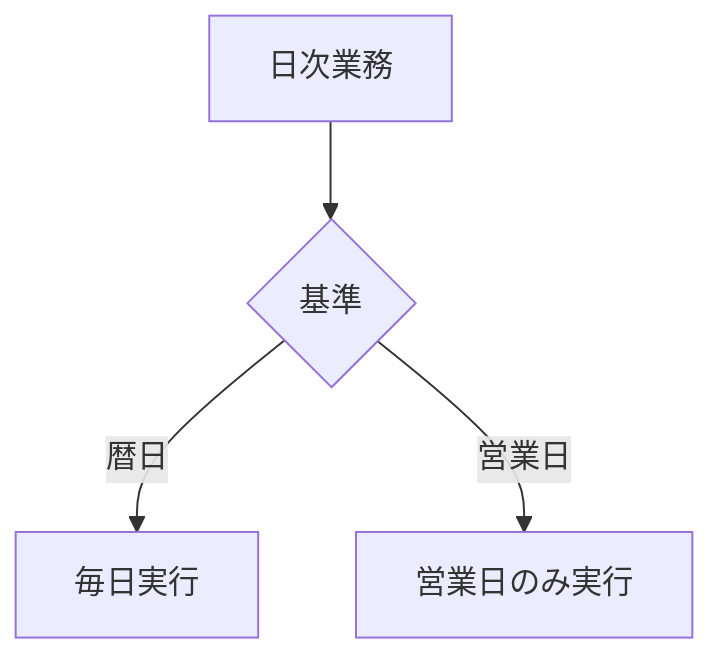

#### 例：
- **毎日業務**: 365日毎日実行される業務（基準=暦日）
- **毎営業日業務**: 営業日のみ実行される業務（基準=営業日）

### 2. 週次業務

特定の曜日に発生する業務です。

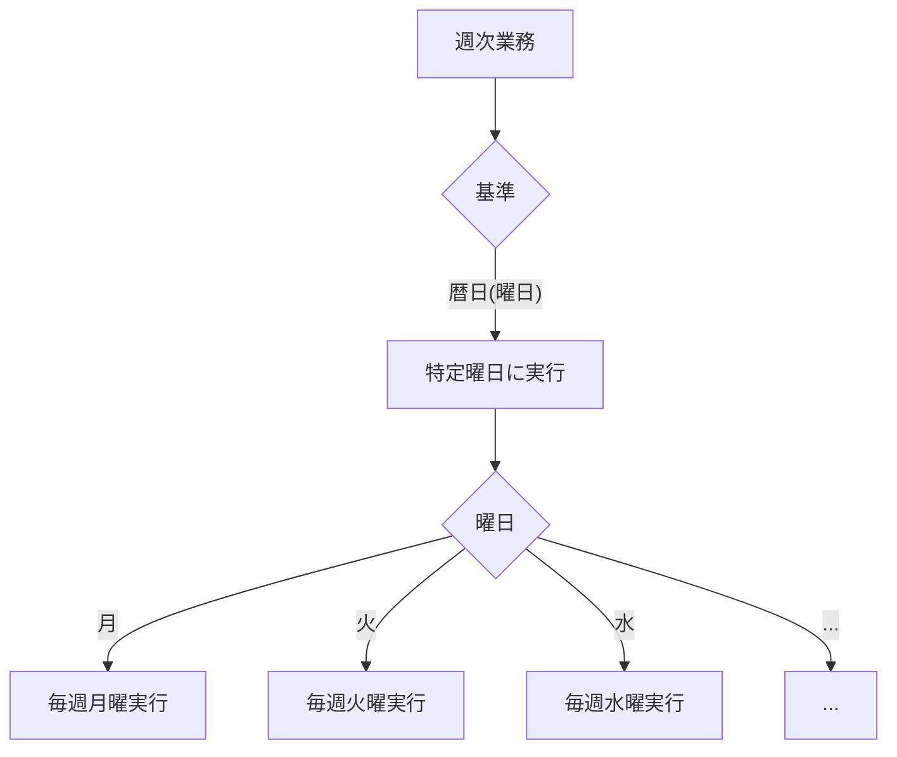

#### 例：
- **毎週月曜業務**: 毎週月曜日に実行される業務
- **毎週金曜業務**: 毎週金曜日に実行される業務

### 3. 月次業務

毎月特定の日または条件で発生する業務です。

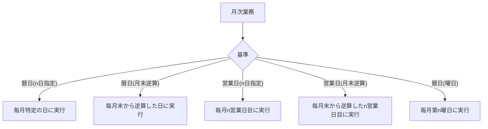

#### 例：
- **毎月1日業務**: 毎月1日に実行される業務（基準=暦日(n日指定), n日=1）
- **毎月末日業務**: 毎月末日に実行される業務（基準=暦日(月末逆算), n日=0）
- **毎月第1営業日業務**: 毎月1営業日目に実行される業務（基準=営業日(n日指定), n日=1）
- **毎月最終営業日業務**: 毎月最終営業日に実行される業務（基準=営業日(月末逆算), n日=0）
- **毎月第2月曜業務**: 毎月第2月曜日に実行される業務（基準=暦日(曜日), 週番号=2, 曜日=月）

### 4. 年次業務

年に1回、特定の月日または条件で発生する業務です。

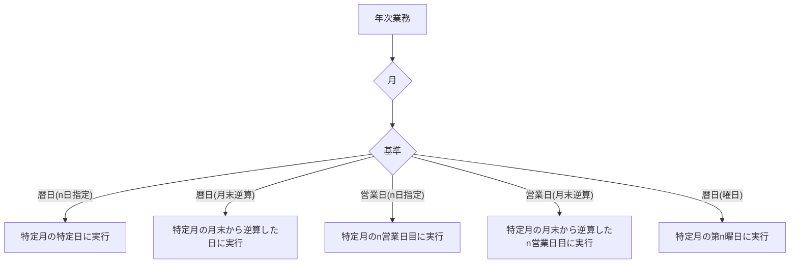

#### 例：
- **1月1日業務**: 毎年1月1日に実行される業務（月=1, 基準=暦日(n日指定), n日=1）
- **3月最終営業日業務**: 毎年3月の最終営業日に実行される業務（月=3, 基準=営業日(月末逆算), n日=0）
- **12月第3金曜業務**: 毎年12月の第3金曜日に実行される業務（月=12, 基準=暦日(曜日), 週番号=3, 曜日=金）
- **2月29日業務**: 閏年の2月29日に実行される業務（月=2, 基準=暦日(n日指定), n日=29）

## 基準の種類とその適用方法

### 1. 暦日（カレンダー日）

カレンダー上の日付に基づいて業務を実行します。営業日・非営業日を区別しません。

#### バリエーション：
- **暦日**: 単純に毎日（日次業務の場合）
- **暦日(n日指定)**: 毎月n日（例：毎月15日）
- **暦日(月末逆算)**: 月末から逆算したn日目（例：月末から3日前）
- **暦日(曜日)**: 特定の曜日または第n週の特定曜日（例：毎週水曜日、毎月第2火曜日）

### 2. 営業日

営業日（カレンダーで営業日として定義された日）のみに業務を実行します。

#### バリエーション：
- **営業日**: 単純に営業日のみ（日次業務の場合）
- **営業日(n日指定)**: 月内のn営業日目（例：毎月3営業日目）
- **営業日(月末逆算)**: 月末から逆算したn営業日目（例：毎月最終営業日から2営業日前）

### 営業日と暦日の組み合わせ例

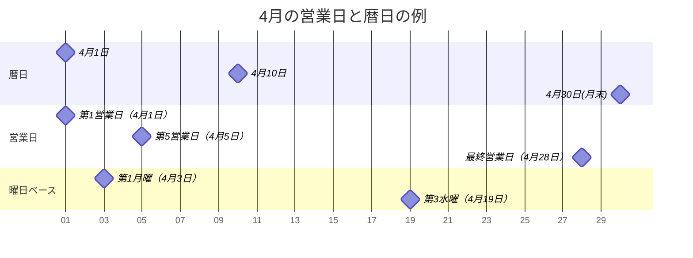

## 非営業日振替規則

非営業日（休日・祝日など）に業務が該当した場合の処理方法を定義します：

### 1. 直前営業日

対象日が非営業日の場合、その直前の営業日に業務を振り替えます。

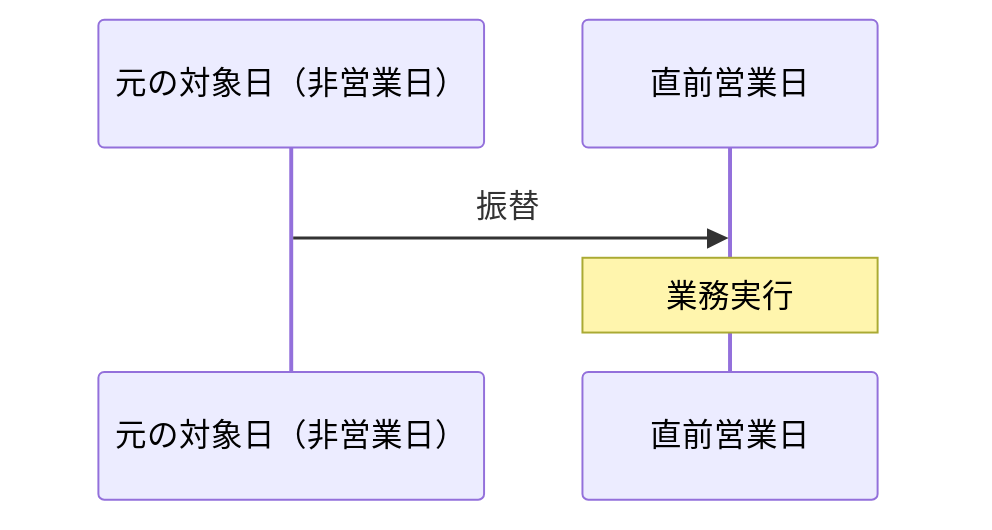

#### 例：
- 5月3日（祝日）の業務が5月2日（営業日）に振り替えられる

### 2. 直後営業日

対象日が非営業日の場合、その直後の営業日に業務を振り替えます。


#### 例：
- 1月1日（祝日）の業務が1月4日（営業日、1月2-3日が休日の場合）に振り替えられる

### 3. 振替しない

対象日が非営業日でも振り替えを行わず、そのまま該当日に業務を設定します。

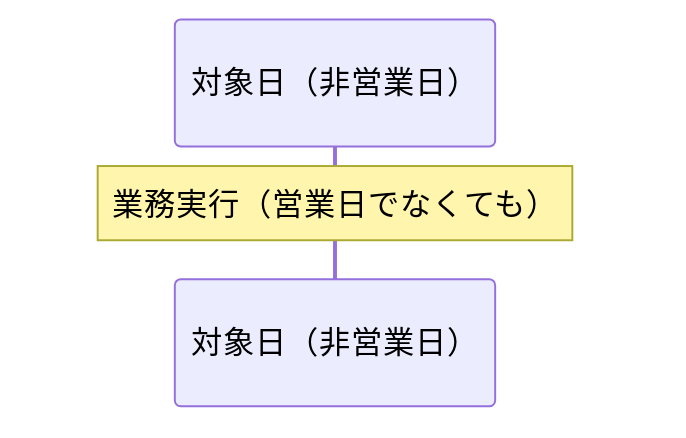

#### 例：
- 日曜日のバッチ処理など、非営業日に実施すべき業務

## 複雑なパターン例

### 1. 四半期決算業務

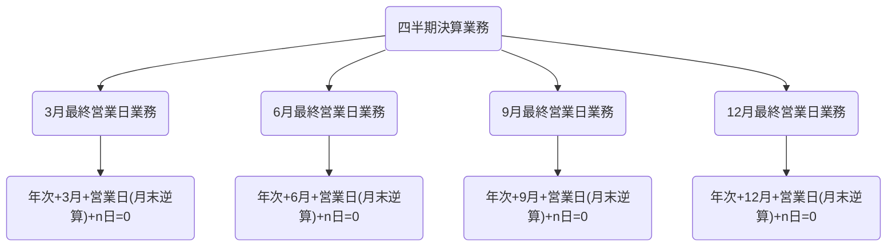

### 2. 月初および月末のレポート作成

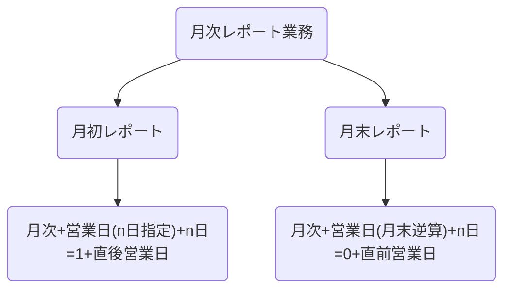

### 3. 給与計算関連業務

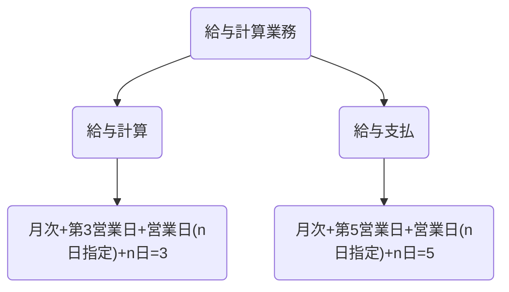

## パターンの網羅性証明

このスケジュールシステムは、ビジネスで必要となる全ての定期的なスケジュールパターンを表現できるように設計されています。以下に、その網羅性を示します：

### 1. 時間軸の網羅性

- **日次**: 毎日または毎営業日
- **週次**: 毎週特定曜日
- **月次**: 毎月特定条件
- **年次**: 毎年特定月の特定条件

これにより、あらゆる周期性のある業務をカバーできます。

### 2. 日付指定方法の網羅性

- **絶対日付**: n日指定（例：毎月10日）
- **相対日付**: 月末から逆算（例：月末から3日前）
- **曜日ベース**: 第n曜日（例：第2水曜日）
- **営業日ベース**: n営業日目（例：第3営業日）
- **営業日相対**: 月末から逆算したn営業日目（例：最終営業日から2営業日前）

これらの組み合わせにより、ビジネスで必要となるあらゆる日付パターンを表現できます。

### 3. 非営業日対応の網羅性

- **直前営業日**: 非営業日の場合、前営業日に実施
- **直後営業日**: 非営業日の場合、次営業日に実施
- **振替なし**: 非営業日でも予定通り実施

これにより、非営業日への対応についてもあらゆるケースをカバーできます。

## 特殊ケースの処理

### 1. 第5週の処理

月によっては第5週の特定曜日が存在しない場合があります。このシステムでは、該当する日付が月内に存在しない場合、その業務は対象外となります。

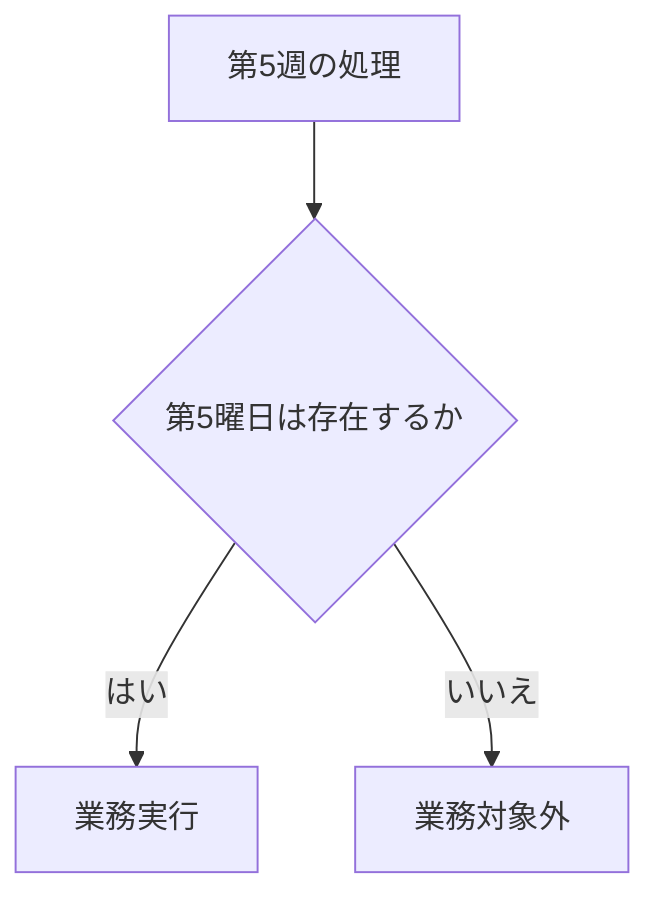

### 2. 閏年（2月29日）の処理

閏年の2月29日に指定された業務は、閏年の場合のみ実行されます。非閏年の場合、その業務は対象外となります。

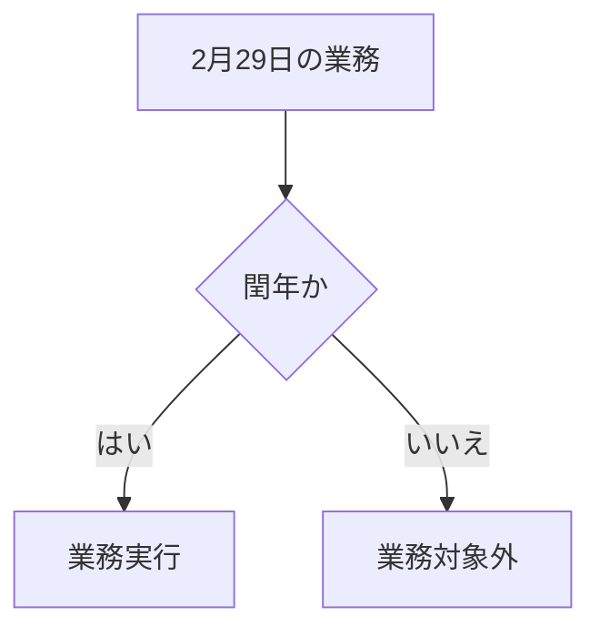

### 3. 連続した非営業日の処理

連休などの連続した非営業日の場合、振替規則は以下のように適用されます：

- **直前営業日**: 連休前の最終営業日に複数の業務が集中する可能性がある
- **直後営業日**: 連休後の最初の営業日に複数の業務が集中する可能性がある
- **振替なし**: 連休中の業務は各日に予定通り設定される

## 実装例

以下は、様々な業務パターンの実装例です：

### 日次業務の例

| 業務ID | 業務名 | 業務詳細 | 業務種別 | 周期・頻度 | 基準 | 月 | 週番号 | 曜日 | n日 | 非営業日振替規則 | 優先度 | 有効開始日 | 有効終了日 | 備考 |
|--------|--------|----------|----------|------------|------|-----|--------|------|-----|------------------|--------|------------|------------|------|
| 1 | 毎日業務 | | 定常 | 日次 | 暦日 | | | | | 振替しない | 通常 | 2024/1/1 | | |
| 2 | 毎営業日業務 | | 定常 | 日次 | 営業日 | | | | | | 通常 | 2024/1/1 | | |

### 週次業務の例

| 業務ID | 業務名 | 業務詳細 | 業務種別 | 周期・頻度 | 基準 | 月 | 週番号 | 曜日 | n日 | 非営業日振替規則 | 優先度 | 有効開始日 | 有効終了日 | 備考 |
|--------|--------|----------|----------|------------|------|-----|--------|------|-----|------------------|--------|------------|------------|------|
| 3 | 毎週月曜業務 | | 定常 | 週次 | 暦日(曜日) | | | 月 | | 振替しない | 通常 | 2024/1/1 | | |
| 6 | 毎週木曜業務 | | 定常 | 週次 | 暦日(曜日) | | | 木 | | 振替しない | 通常 | 2024/1/1 | | |
| 52 | 毎週水曜日業務 | | 定常 | 週次 | 暦日(曜日) | | | 水 | | 直前営業日 | 通常 | 2024/1/1 | | |

### 月次業務の例

| 業務ID | 業務名 | 業務詳細 | 業務種別 | 周期・頻度 | 基準 | 月 | 週番号 | 曜日 | n日 | 非営業日振替規則 | 優先度 | 有効開始日 | 有効終了日 | 備考 |
|--------|--------|----------|----------|------------|------|-----|--------|------|-----|------------------|--------|------------|------------|------|
| 10 | 毎月1日業務 | | 定常 | 月次 | 暦日(n日指定) | | | | 1 | 直後営業日 | 通常 | 2024/1/1 | | |
| 19 | 毎月末日業務 | | 定常 | 月次 | 暦日(月末逆算) | | | | 0 | 直前営業日 | 通常 | 2024/1/1 | | |
| 24 | 毎月最終営業日業務 | | 定常 | 月次 | 営業日(月末逆算) | | | | 0 | | 通常 | 2024/1/1 | | |
| 32 | 毎月第4月曜業務 | | 定常 | 月次 | 暦日(曜日) | | 4 | 月 | | 直後営業日 | 通常 | 2024/1/1 | | |

### 年次業務の例

| 業務ID | 業務名 | 業務詳細 | 業務種別 | 周期・頻度 | 基準 | 月 | 週番号 | 曜日 | n日 | 非営業日振替規則 | 優先度 | 有効開始日 | 有効終了日 | 備考 |
|--------|--------|----------|----------|------------|------|-----|--------|------|-----|------------------|--------|------------|------------|------|
| 56 | 1月1日業務 | | 定常 | 年次 | 暦日(n日指定) | 1 | | | 1 | 振替しない | 通常 | 2024/1/1 | | |
| 72 | 3月最終営業日業務 | | 定常 | 年次 | 営業日(月末逆算) | 3 | | | 0 | | 通常 | 2024/1/1 | | |
| 78 | 3月第5金曜業務 | | 定常 | 年次 | 暦日(曜日) | 3 | 5 | 金 | | | 通常 | 2024/1/1 | | |

## 結論

この業務スケジュール管理システムのパターン設計は、以下の特徴を持っています：

1. **柔軟性**: 様々なパラメータの組み合わせにより、あらゆるビジネスシーンに対応
2. **網羅性**: 日次・週次・月次・年次の全ての周期をカバー
3. **正確性**: 営業日・非営業日を適切に考慮した日付計算
4. **対応力**: 非営業日の振替規則により、様々な業務ポリシーに対応
5. **拡張性**: 必要に応じて新しいパラメータや規則を追加可能

これらの特徴により、当スケジュール管理システムは効率的かつ正確な業務計画立案をサポートします。

---

## 付録: 実際の使用例

### ケース1: 経理部門の月次決算業務

```
業務名: 月次決算処理
周期・頻度: 月次
基準: 営業日(月末逆算)
n日: 3
非営業日振替規則: 直前営業日
```

この設定により、毎月最終営業日から3営業日前に月次決算処理が実行されます。

### ケース2: 四半期報告書の作成

```
業務名: 四半期報告書作成
周期・頻度: 年次
月: 3, 6, 9, 12
基準: 暦日(n日指定)
n日: 15
非営業日振替規則: 直後営業日
```

この設定により、3月15日、6月15日、9月15日、12月15日に四半期報告書の作成業務が設定されます。これらの日が非営業日の場合は、直後の営業日に振り替えられます。

### ケース3: 週次進捗報告会

```
業務名: 週次進捗報告会
周期・頻度: 週次
基準: 暦日(曜日)
曜日: 金
非営業日振替規則: 直前営業日
```

この設定により、毎週金曜日に進捗報告会が設定されます。金曜日が祝日などの非営業日の場合は、その前の営業日に振り替えられます。
