# 業務スケジュール管理システム - 処理フロー

## 概要

このドキュメントでは、業務スケジュール管理システムの処理フローを図解しています。このシステムは、カレンダーと業務一覧のデータを元に、指定日付に実行すべき業務スケジュールを自動生成します。

### システムの目的
このシステムは、日次・週次・月次・年次で発生する様々な業務の実行スケジュールを自動的に生成することで、業務の漏れや遅延を防止し、計画的な業務実行をサポートします。

### 処理の大まかな流れ
1. **データ読み込み**：カレンダー.csvから営業日情報、業務一覧テーブルから業務定義情報を読み込みます
2. **日付判定**：特定の日付が「対象日」となるかを各業務ごとに判定します
3. **条件判定**：業務の周期（日次/週次/月次/年次）と基準（暦日/営業日）に応じたルールで実行対象かを判定します
4. **振替処理**：非営業日の場合、振替規則（直前営業日/直後営業日/振替しない）に従って処理します
5. **スケジュール生成**：判定結果を業務スケジュールテーブルとして出力します

### 詳細な判定ロジック

**1. 日次業務の場合**
- 暦日指定：毎日実行
- 営業日指定：営業日フラグが立っている日のみ実行

**2. 週次業務の場合**
- 暦日(曜日)指定：特定の曜日（月曜、火曜など）に実行

**3. 月次業務の場合**
- 暦日(n日指定)：毎月n日に実行（例：毎月15日）
- 暦日(月末逆算)：月末からn日前に実行（例：月末3日前、n=0なら月末日）
- 営業日(n日指定)：月のn番目の営業日に実行（例：第3営業日）
- 営業日(月末逆算)：月末からn番目の営業日に実行（例：月末から2営業日前）
- 暦日(曜日)：第n週の特定曜日に実行（例：第2月曜日）

**4. 年次業務の場合**
- 特定の月を指定＋月次業務と同様の条件（例：4月の第1営業日）

**5. 非営業日振替処理**
- 直前営業日：非営業日の場合、直前の営業日に振り替える
- 直後営業日：非営業日の場合、直後の営業日に振り替える
- 振替しない：非営業日でも日付を変更しない（実行対象とする）

このシステムでは常に「営業日」の概念が重要になります。営業日はカレンダー.csvで定義され、土日祝日などは通常「非営業日」として扱われます。業務の定義によっては、非営業日に当たる業務を前後の営業日に振り替えることができます。

以下の図表では、これらの処理フローを視覚的に表現し、詳細な判定ロジックを示しています。

## 1. 全体システム構成

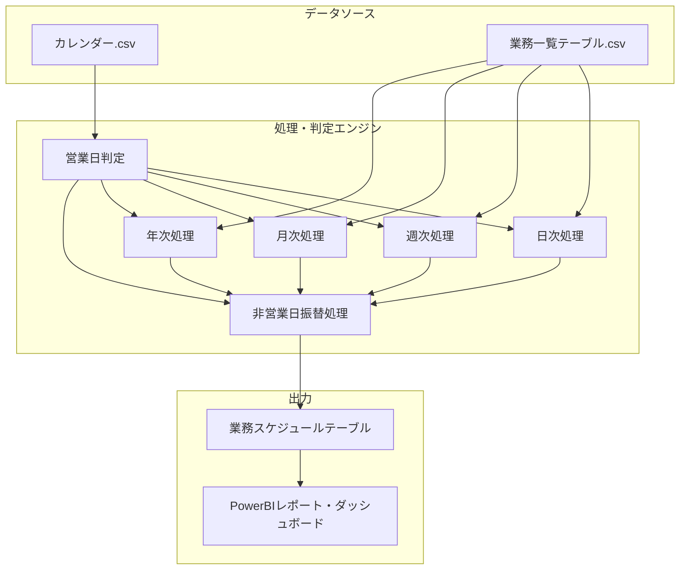

## 2. メイン処理フロー

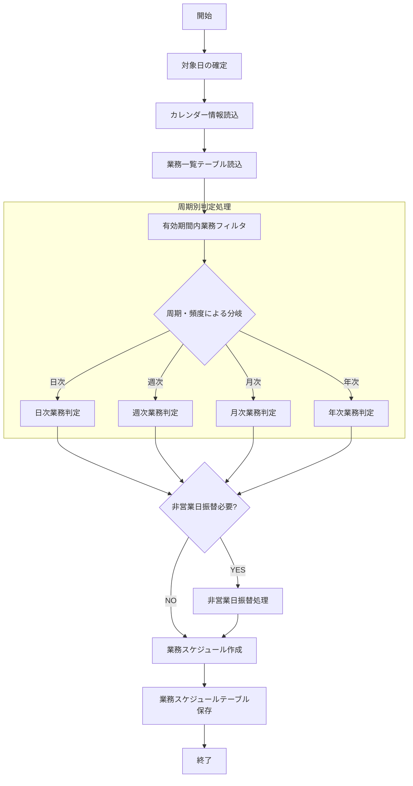

## 3. 日次業務判定フロー

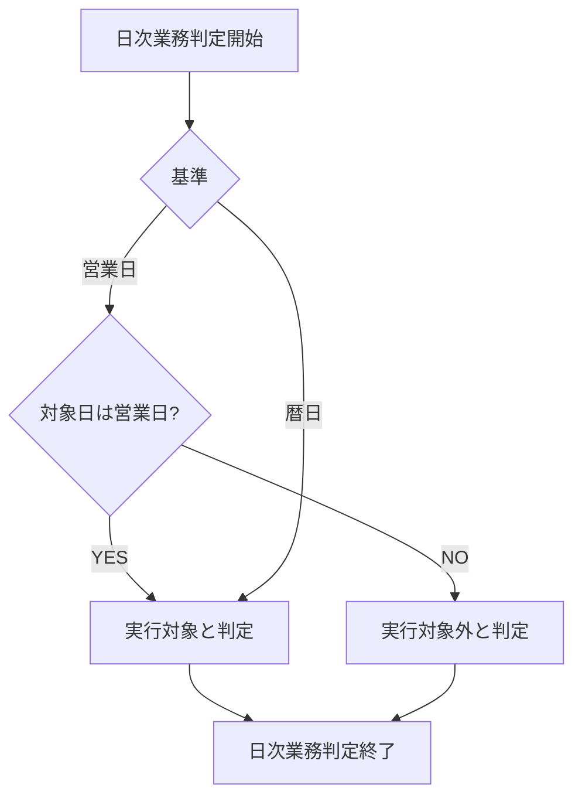

## 4. 週次業務判定フロー

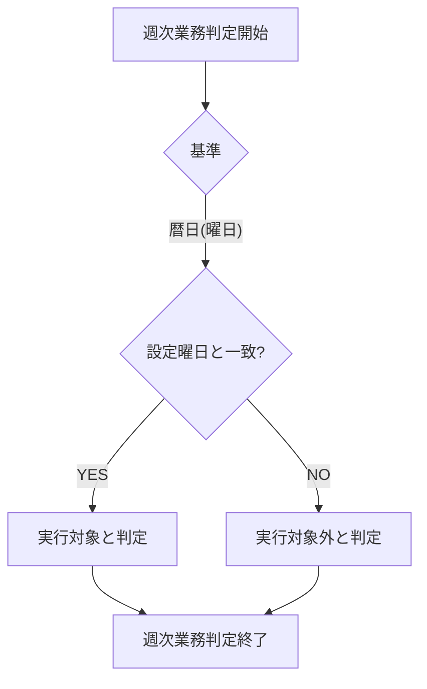

## 5. 月次業務判定フロー

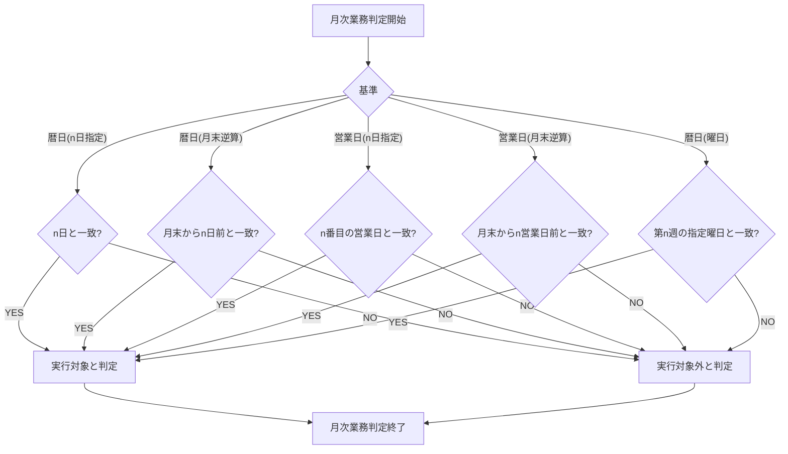

## 6. 年次業務判定フロー

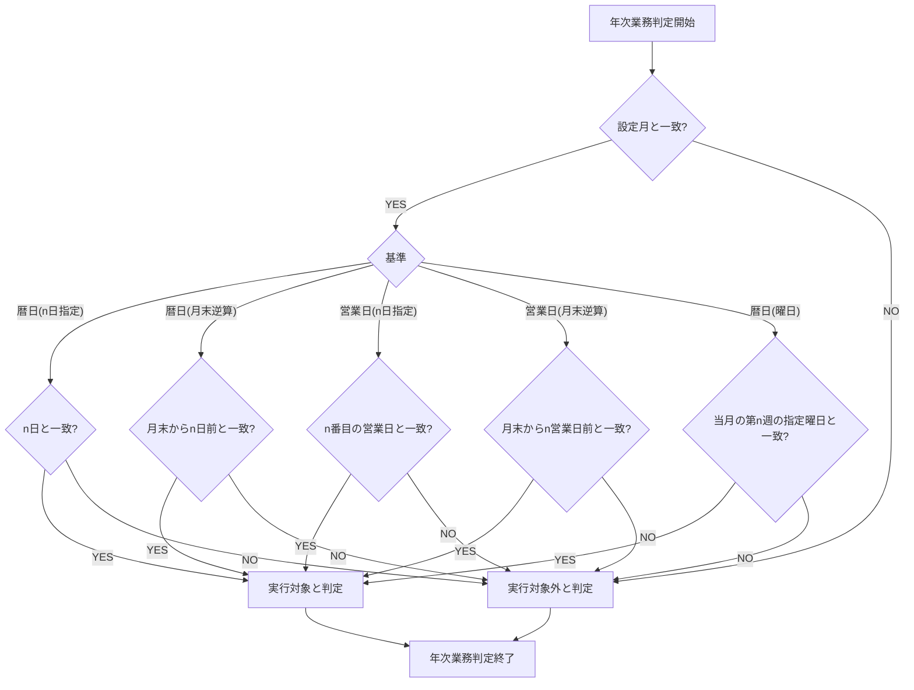

## 7. 非営業日振替処理フロー（更新版）

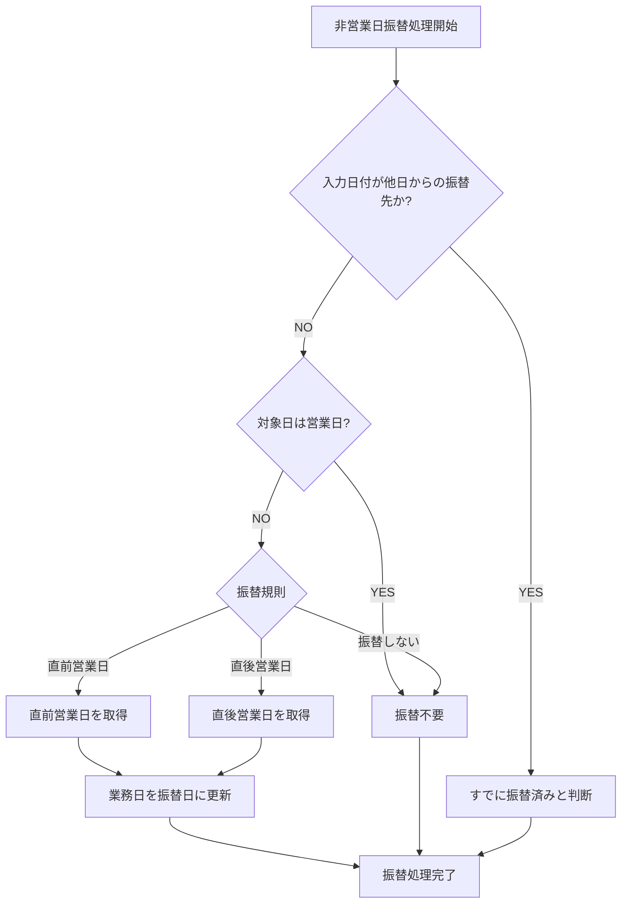

## 7-1. 振替対象日の判定プロセス

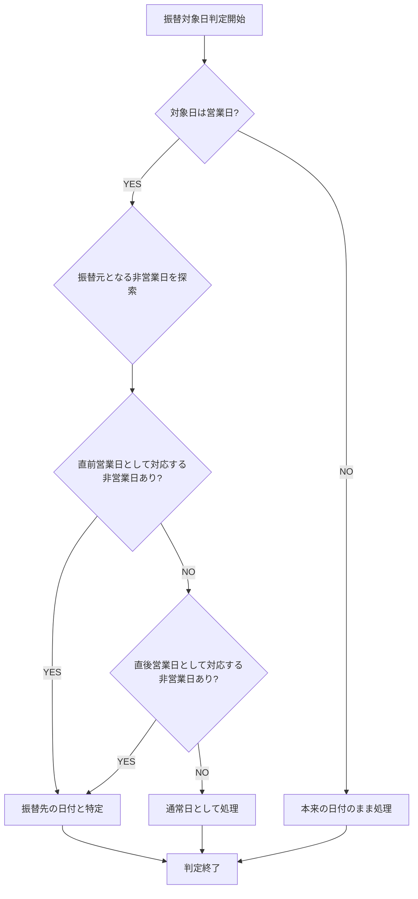

## 9. 「n日」カラムの使用方法詳細

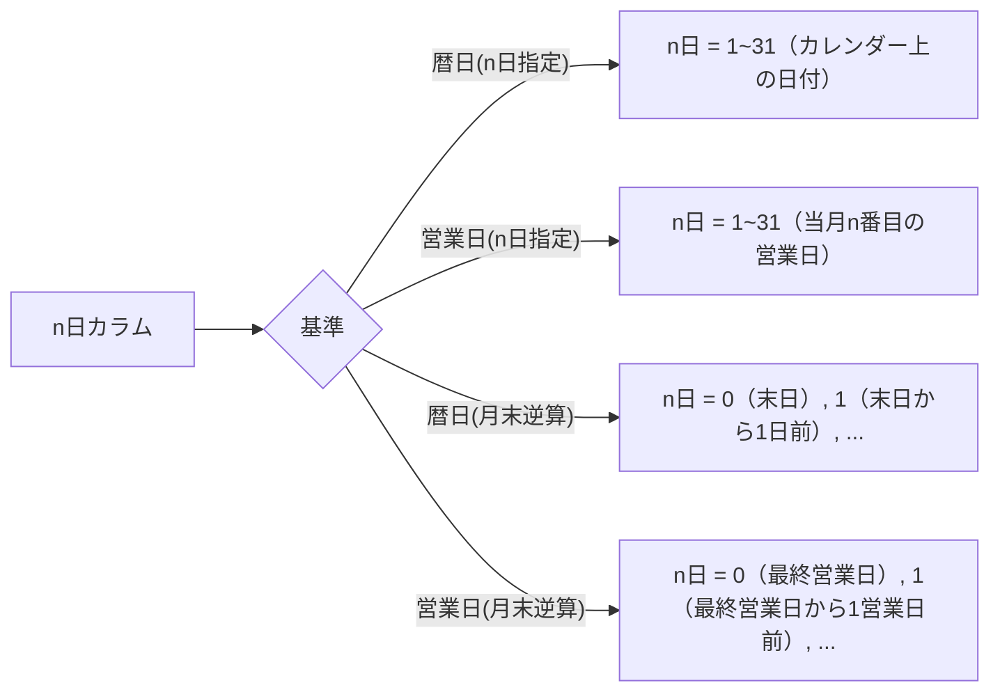

## 10. データフロー詳細

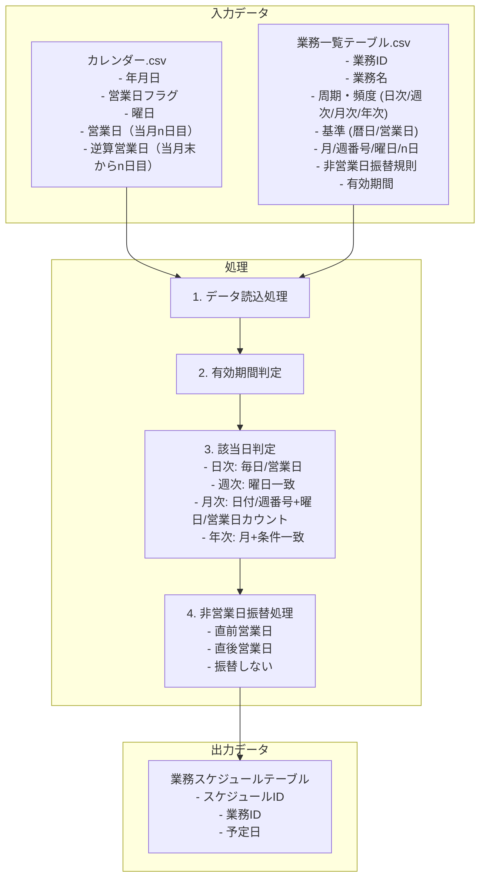

## 11. 全体条件判定一覧

以下は、システム内での条件判定の全体図です。

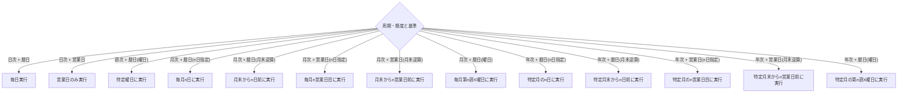

## 12. エラーハンドリングと例外処理

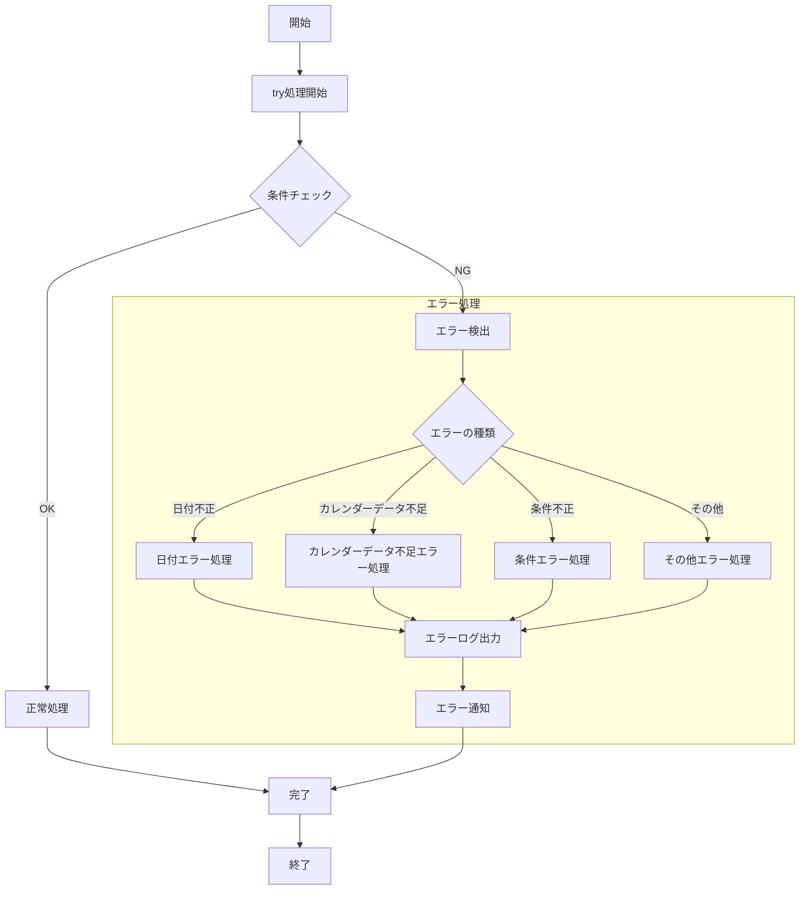

## 13. Power BIデータフロー

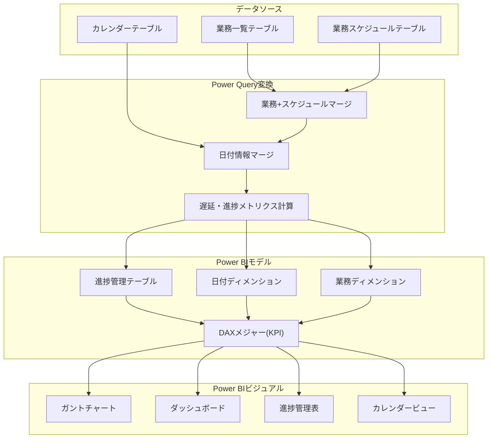