# 業務スケジュール管理システム 処理フロー

このドキュメントでは、Office Scripts for Excel向け業務スケジュール管理システム「scheduler.osts」の処理フローを図示します。

## 全体概要

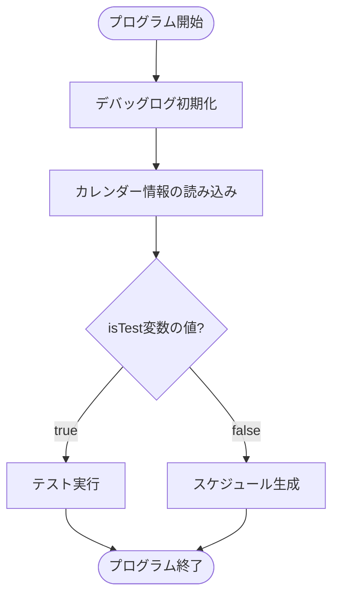

## カレンダー情報読み込みフロー

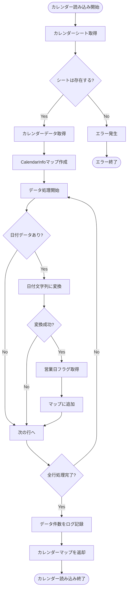

## スケジュール生成フロー

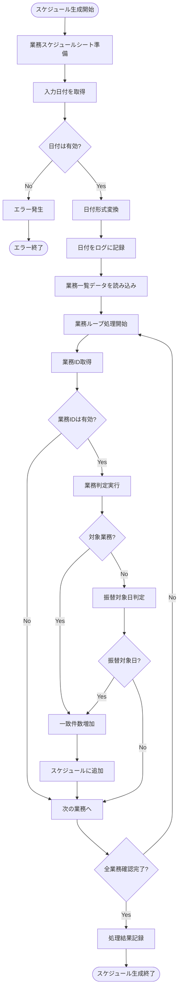

## テスト実行フロー

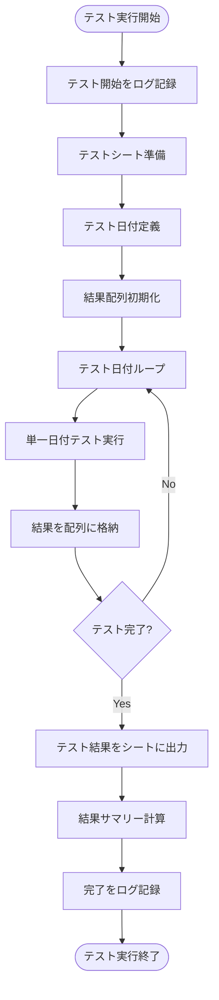

## 単一日付テスト実行フロー

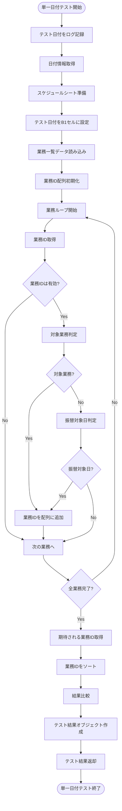

## 業務判定フロー (isTargetTask関数)

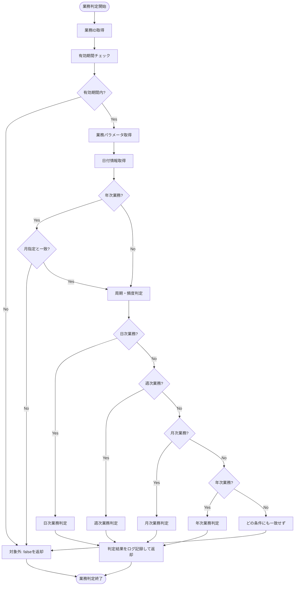

## 月次/年次業務の基準別判定フロー

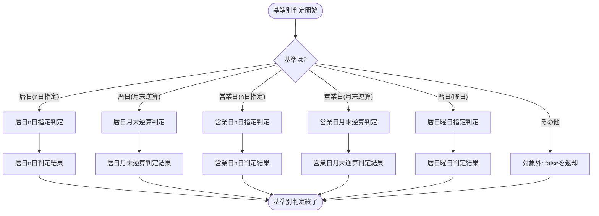

## 業務振替判定フロー (isTargetDateForFurikae関数)

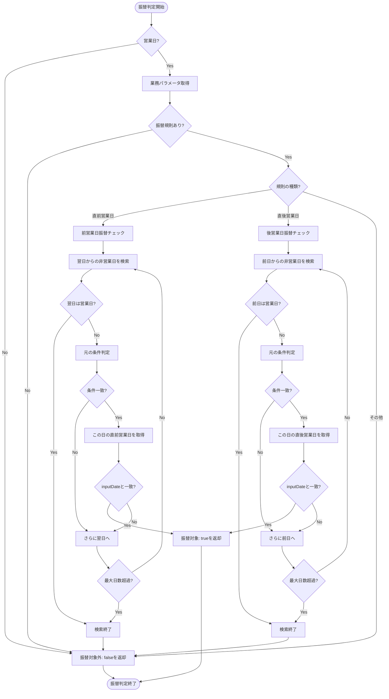

## 日付・営業日ユーティリティ関数

```mermaid
flowchart LR
    subgraph DateUtils[日付ユーティリティ]
        formatDate[日付→YYYY-MM-DD変換]
        formatDateBySlash[日付→YYYY/MM/DD変換]
        excelDateToString[Excel日付→文字列変換]
        getLastDayOfMonth[月末日取得]
        getDateInfo[日付情報取得]
        getNthDayOfWeekInMonth[第n曜日計算]
    end
    
    subgraph BusinessDayUtils[営業日ユーティリティ]
        isBusinessDay[営業日判定]
        getBusinessDayInfo[営業日情報取得]
        getNthBusinessDayOfMonth[第n営業日取得]
        getReverseNthBusinessDayOfMonth[月末からn営業日前取得]
        getPreviousBusinessDay[直前営業日取得]
        getNextBusinessDay[直後営業日取得]
    end
    
    DateUtils -.-> BusinessDayUtils
```

## 業務判定ユーティリティ関数

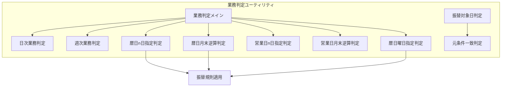

## デバッグ・テストユーティリティ

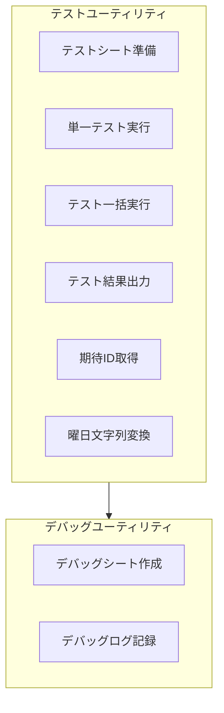

## データフロー概要

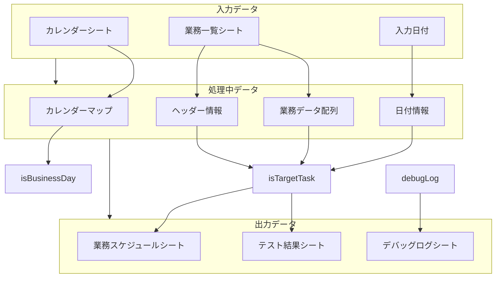

## 業務種別と判定条件の関係

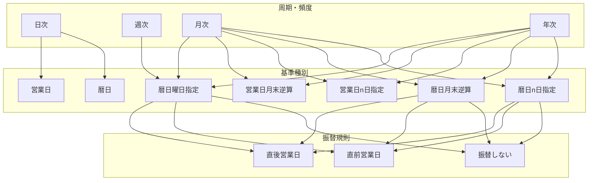