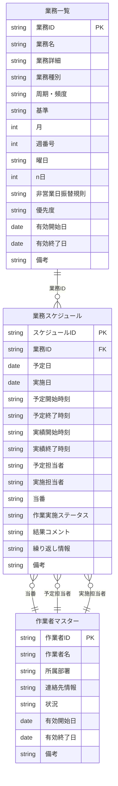

# Excel・Power BIによる業務スケジュール管理システム提案（初心者向け・詳細解説）

---

## 1. はじめに
本提案は、ExcelとPower BIを活用して、運用保守業務のスケジュール管理を効率化・標準化するための設計・運用手順を、初心者でも分かるように丁寧にまとめたものです。

---

## 2. テーブル設計

### 2-1. 業務一覧テーブル
**目的：** 各業務（タスク）の定義・ルール・スケジュール条件を一元管理し、予定日自動算出や履歴管理、分析の基礎データとする。

| カラム名             | 入力例・説明                                                                                   |
|----------------------|-----------------------------------------------------------------------------------------------|
| 業務ID               | 1, 2, 3 ...（自動採番。Power Queryで追加可能）                                                |
| 業務名               | 「ログ確認」「バックアップ」など                                                               |
| 業務詳細             | 作業手順や注意点など                                                                          |
| 業務種別             | 「定常」または「依頼」                                                                        |
| 周期・頻度           | 「日次」「週次」「月次」「年次」「不定期」など                                                 |
| 基準                 | 「暦日(n日指定)」「暦日(月末逆算)」「暦日(曜日)」「営業日(n日指定)」「営業日(月末逆算)」    |
| 月                   | 1～12（該当月のみ。四半期・半期・年次は複数レコードで対応）                                   |
| 週番号               | 1～5（第n週指定。空欄可）                                                                     |
| 曜日                 | 月～日（曜日指定。空欄可）                                                                     |
| n日                 | 0～31（基準によって意味が異なる。下記「n日の使い方」参照）                                   |
| 非営業日振替規則     | 「直前営業日」「直後営業日」「振替しない」「手動指定」                                         |
| 優先度               | 「高」「通常」「低」など                                                                       |
| 有効開始日           | レコードの有効開始日                                                                          |
| 有効終了日           | レコードの終了日（現行は空欄）                                                                |
| 備考                 | 補足情報                                                                                      |

**【n日カラムの使い方】**
- 基準が「暦日(n日指定)」「営業日(n日指定)」の場合：1=1日、2=2日、…31=31日
- 基準が「暦日(月末逆算)」「営業日(月末逆算)」の場合：0=末日/最終営業日、1=1日前、2=2日前、…（逆算n日前）

**【複数条件の業務（例：第1・第3金曜など）】**
- 1レコード1条件とし、複数該当する場合はレコードを分割して作成

---

### 2-2. 作業者マスターテーブル
**目的：** 担当者の基本情報・履歴を管理
担当者については業務スケジュールテーブル作成後に手入力で割当を行う

| カラム名         | 入力例・説明                         |
|------------------|--------------------------------------|
| 作業者ID         | 1, 2, 3 ...（自動採番）              |
| 作業者名         | 氏名                                 |
| 所属部署         | 部署やグループ名                     |
| 連絡先情報       | Eメール、内線番号、電話番号等        |
| 状況             | 「通常稼働」「休暇中」「当番中」など  |
| 有効開始日       | 登録開始日                           |
| 有効終了日       | 変更時の終了日（現行は空欄）         |
| 備考             | その他補足情報                       |

---

### 2-3. 業務スケジュールテーブル
**目的：** 業務一覧の条件に基づき、予定日・実施日・担当者・進捗などを記録

| カラム名               | 入力例・説明                                 |
|------------------------|----------------------------------------------|
| スケジュールID         | 1, 2, 3 ...（自動採番）                      |
| 業務ID                 | 業務一覧との連動用キー                       |
| 予定日                 | 作業実施予定日                               |
| 実施日                 | 実際に作業が行われた日（未実施は空欄）       |
| 予定開始時刻           | 予定開始時刻                                 |
| 予定終了時刻           | 予定終了時刻                                 |
| 実績開始時刻           | 実際の作業開始時刻                           |
| 実績終了時刻           | 実績終了時刻                                 |
| 予定担当者             | 担当者ID（作業者マスター参照）               |
| 実施担当者             | 実際に作業を実施した担当者ID                 |
| 当番                   | 当番担当者ID（複数可）                       |
| 作業実施ステータス     | 「未実施」「進行中」「完了」「遅延」など      |
| 結果／コメント         | 作業完了後のフィードバック                   |
| 繰り返し情報           | 年次・月次等の識別（業務一覧と連動）         |
| 備考                   | その他補足事項                               |

---

## 3. テーブルの関係図（Mermaid）

---

## 4. Excel・Power Query・Power BIでの運用手順（初心者向けステップバイステップ）

### Step 1: Excelでテーブルを作成し、データを入力する
1. Excelを開き、「業務一覧」「作業者マスター」「業務スケジュール」の3つのシートを作成します。
2. それぞれのシートに、上記の表にあるカラム名を1行目に入力します。
3. 2行目以降に、実際の業務データを入力します。
4. 入力規則（リスト）を使いたいカラム（例：業務種別、周期・頻度など）は、Excelの「データ」タブ→「データの入力規則」→「リスト」で、選択肢を設定します。
5. 入力が終わったら、各シートのデータ範囲を選択し、「挿入」タブ→「テーブル」をクリックしてテーブル化します。テーブル名は「業務一覧」「作業者マスター」「業務スケジュール」と分かりやすく設定してください。

#### 【初心者向けポイント】
- 「テーブル」とは、Excelでデータを管理しやすくするための機能です。1行目がカラム名（見出し）です。
- 入力規則（リスト）は、入力ミスを防ぐためのプルダウン選択肢です。

---

### Step 2: Power BIでExcelファイルを読み込む
1. Power BI Desktopを起動します。
2. 「ホーム」タブ→「データの取得」→「Excel」を選択し、作成したExcelファイル（業務.xlsxなど）を開きます。
3. 「ナビゲーター」画面で、「業務一覧」「作業者マスター」「業務スケジュール」の各テーブルにチェックを入れて「読み込み」をクリックします。

#### 【初心者向けポイント】
- 「テーブル」としてExcelで作成した範囲が、Power BIでそのまま「テーブル」として認識されます。
- どのテーブルがどれか分からない場合は、Excelでテーブル名を確認できます（テーブル範囲を選択→「テーブルデザイン」タブ→「テーブル名」）。

---

### Step 3: Power Queryエディターでデータを加工する
1. Power BIの「ホーム」タブ→「データの変換」をクリックすると、Power Queryエディターが開きます。
2. 左側に「業務一覧」「作業者マスター」「業務スケジュール」など、読み込んだテーブルが一覧で表示されます。

#### 【よくある操作例】
- **インデックス列（ID自動採番）の追加方法**
  1. 追加したいテーブルを選択
  2. 「追加列」タブ→「インデックス列の追加」→「0から」または「1から」を選択
- **日付型変換の方法**
  1. 日付にしたいカラムの列見出しをクリック
  2. 「変換」タブ→「データ型」→「日付」を選択
- **Null補正（空欄の補完）**
  1. 空欄を特定の値で埋めたい場合は、「変換」タブ→「値の置換」や「条件付き列」を使う
- **有効期間フィルタ**
  1. 「有効開始日」<=今日 かつ （「有効終了日」が空欄 または >=今日）という条件でフィルタ
  2. 「ホーム」タブ→「行のフィルター」→「カスタムフィルター」で条件を設定

#### 【初心者向けポイント】
- Power Queryエディターは、Excelの「クエリと接続」機能に似ていますが、より強力です。
- 画面左のテーブル名をクリックすると、そのテーブルのデータが中央に表示されます。

---

### Step 4: 予定日自動算出ロジックの組み込み
1. 予定日を自動で計算したい場合は、「業務一覧」の条件（周期・基準・月・週番号・曜日・n日など）と、カレンダーテーブル（全日付・営業日情報を持つテーブル）を組み合わせます。
2. 例えば「毎月末日から2日前」なら、カレンダーテーブルで各月の末日を特定し、2日前の日付を計算します。
3. Power Queryで「マージ（結合）」機能を使い、「業務一覧」と「カレンダーテーブル」を条件で結合します。

#### 【具体的な操作例】
- 「ホーム」タブ→「クエリのマージ」
- 「業務一覧」と「カレンダーテーブル」を選択し、結合条件（例：月・年・基準・n日など）を指定
- 必要に応じて「カスタム列」や「条件付き列」で日付計算ロジックを追加

#### 【関数やロジック例】
- Power Queryの「カスタム列」では、M言語という関数が使えます
- 例：`Date.AddDays([末日], -[n日])` で末日からn日前を計算

---

### Step 5: テーブルのマージ（結合）のやり方
1. Power Queryエディターで「ホーム」タブ→「クエリのマージ」をクリック
2. 例：「業務スケジュール」と「業務一覧」を「業務ID」でマージしたい場合
   - 両方のテーブルで「業務ID」列をクリックして選択
   - 「内部結合」や「左外部結合」など、結合方法を選択
   - 「OK」をクリック
3. マージ後、展開ボタン（列名の右にある「→」マーク）をクリックし、必要なカラムを選択して展開

#### 【初心者向けポイント】
- 「マージ」はExcelのVLOOKUPやXLOOKUPのようなものですが、複数条件や複数列も簡単に扱えます。

---

### Step 6: Power BIでの可視化
1. Power Queryで「閉じて読み込む」をクリックし、Power BIの画面に戻ります。
2. 「モデル」ビューで、テーブル同士のリレーション（線）が自動で引かれているか確認します。
3. 「レポート」ビューで、グラフやカード、ガントチャート、スライサーなどをドラッグ＆ドロップで作成します。
4. 進捗率や遅延件数などの集計は、「新しいメジャー」や「新しい列」でDAX式を使って計算します。

---

### Step 7: レポートの公開・運用
1. 完成したレポートは「ホーム」タブ→「Power BIサービスに発行」でWeb上に公開できます。
2. 「データの更新」や「アクセス権限」もWeb画面から設定できます。

---

#### 【全体の補足・アドバイス】
- 分からない用語や操作は、Power BIの公式ヘルプやYouTubeの初心者向け動画も参考にしてください。
- 1つ1つの操作を丁寧に進めれば、初心者でも必ず実現できます。
- どうしても分からない場合は、画面のスクリーンショットを添えて質問すると、周囲のサポートも受けやすいです。

---

## 5. 運用上の注意・よくある質問
- n日=0の意味（逆算系）は必ず現場マニュアルに明記してください。
- 祝日・独自休日はカレンダーテーブルで管理してください。
- 複雑な条件はレコード分割で対応してください。
- 新たなパターンが発生した場合も、現行設計をベースに拡張可能です。

---

## 6. まとめ
- シンプルな1テーブル運用で現場スタッフも迷わず管理可能です。
- 全パターン網羅・拡張性・保守性も高い設計です。
- 詳細な検証・運用例は「検証.md」も参照してください。

---

ご不明点や追加要望があれば、いつでもご相談ください。
この提案が現場の業務効率化・標準化に役立つことを願っています。