# 業務スケジュール生成システム 設計ドキュメント

## 目次

1. [概要](#概要)
2. [システム構成](#システム構成)
   1. [データ構造](#データ構造)
   2. [ファイル構成](#ファイル構成)
3. [機能仕様](#機能仕様)
   1. [業務スケジュール生成機能](#業務スケジュール生成機能)
   2. [日付処理機能](#日付処理機能)
   3. [営業日判定機能](#営業日判定機能)
   4. [業務条件判定機能](#業務条件判定機能)
   5. [振替規則処理機能](#振替規則処理機能)
   6. [デバッグ機能](#デバッグ機能)
4. [処理フロー](#処理フロー)
   1. [メイン処理フロー](#メイン処理フロー)
   2. [業務条件判定フロー](#業務条件判定フロー)
   3. [振替規則処理フロー](#振替規則処理フロー)
5. [型定義](#型定義)
6. [関数仕様](#関数仕様)
7. [エラー処理](#エラー処理)
8. [拡張性と制限事項](#拡張性と制限事項)
9. [運用方法](#運用方法)

## 概要

本システムは、Office Scripts for Excelを利用して、企業や組織における日常的な業務スケジュールを自動生成するためのツールです。業務一覧テーブルに定義された様々な条件に基づいて、特定の日付に実行すべき業務を判定し、スケジュールとして出力します。

システムの背景には、以下のような課題があります：
- 日次・週次・月次・年次など様々な周期で実行される業務の管理が煩雑
- 手動での業務スケジュール作成に時間と労力がかかる
- 実行条件の複雑さ（営業日基準、暦日基準、曜日指定など）による漏れや誤りのリスク
- 祝日や休業日に当たる場合の振替処理の対応

これらの課題を解決するために、本システムでは以下の特徴を持つスケジュール生成機能を実現しています：

1. 多様な業務パターンへの対応（日次、週次、月次、年次、特定日付、特定曜日など）
2. 営業日・非営業日を考慮した業務スケジュール生成
3. 非営業日の場合の振替ルール（直前営業日、直後営業日、振替なし）
4. 詳細なデバッグ機能によるトラブルシューティングのサポート
5. Excelテーブルとの連携による使いやすいインターフェース

本システムの利用により、業務スケジュールの作成時間の大幅な削減、業務漏れの防止、業務実行の標準化と効率化を実現し、組織の業務品質向上に貢献します。

## システム構成

### データ構造

システムは以下の3つの主要なデータテーブルを使用します：

#### 1. カレンダーテーブル
- 日付ごとの営業日情報を格納
- 列構成：
  - 年月日（YYYY-MM-DD形式）：カレンダーの基準日
  - 営業日フラグ（TRUE/FALSE）：営業日かどうかを示すフラグ
  - 備考（祝日名など）：休日理由や特記事項
  - 曜日：月、火、水、木、金、土、日
  - 営業日：月内での営業日番号（1始まり）
  - 逆算営業日：月末からの営業日カウント（最終営業日=0）

#### 2. 業務一覧テーブル
- 業務の基本情報と実行条件を格納
- 列構成：
  - 業務ID（一意の識別子）：各業務を識別する一意のID
  - 業務名：業務の名称
  - 業務詳細：業務内容の詳細説明
  - 業務種別：「定常」「依頼」など業務の種類
  - 周期・頻度（日次/週次/月次/年次）：業務の実行周期
  - 基準：業務実行の基準日の決定方法
    - 暦日：暦上の日付による指定
    - 営業日：営業日カウントによる指定
    - 暦日(n日指定)：毎月特定の日（例：毎月15日）
    - 営業日(n日指定)：特定の営業日（例：第3営業日）
    - 暦日(月末逆算)：月末からの逆算（例：月末3日前）
    - 営業日(月末逆算)：月末からの営業日カウント（例：最終営業日から2営業日前）
    - 暦日(曜日)：特定の曜日（例：毎週月曜）
  - 月（特定月を指定、年次業務の場合）：1～12の月指定
  - 週番号（第何週か、1-5）：第何週かを指定
  - 曜日（月-日）：曜日指定
  - n日（日にちや営業日番号）：何日目かを指定
  - 非営業日振替規則：非営業日だった場合の振替方法
    - 直前営業日：非営業日なら直前の営業日に振替
    - 直後営業日：非営業日なら直後の営業日に振替
    - 振替しない：非営業日でも日付変更しない
  - 優先度：業務の優先順位（高/通常/低など）
  - 有効開始日：業務の有効期間開始日
  - 有効終了日：業務の有効期間終了日（空欄は無期限）
  - 備考：その他補足情報

#### 3. スケジュールテーブル
- 生成された業務スケジュールを格納
- 列構成：
  - スケジュールID（一意の識別子）：各スケジュールの一意のID
  - 業務ID（業務一覧の業務を参照）：業務一覧テーブルの業務ID
  - 予定日：業務の予定実施日
  - 作業者：担当者名（手動入力項目）
  - 開始予定時刻：予定開始時間（手動入力項目）
  - 実開始時刻：実際の開始時刻（手動入力項目）
  - 実終了時刻：実際の終了時刻（手動入力項目）
  - ステータス：「未実施」「進行中」「完了」など（手動入力項目）
  - メモ：作業メモや結果（手動入力項目）

#### テーブルの関係図

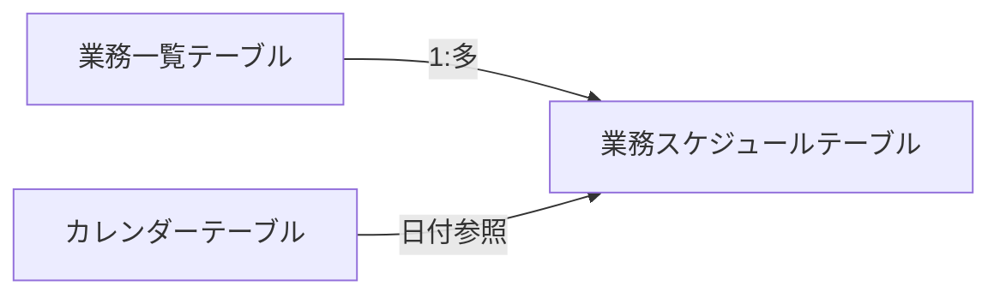

### ファイル構成

- `scheduler.osts`: Office Scripts for Excelのメインスクリプトファイル
- Excelファイル: 上記3つのテーブルを含むExcelファイル

### システム全体構成図

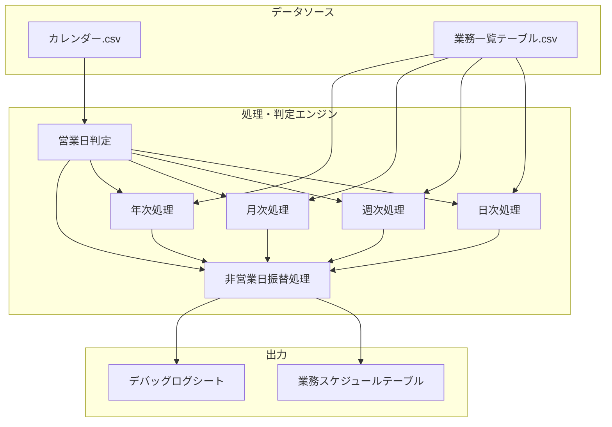

### データフロー概要

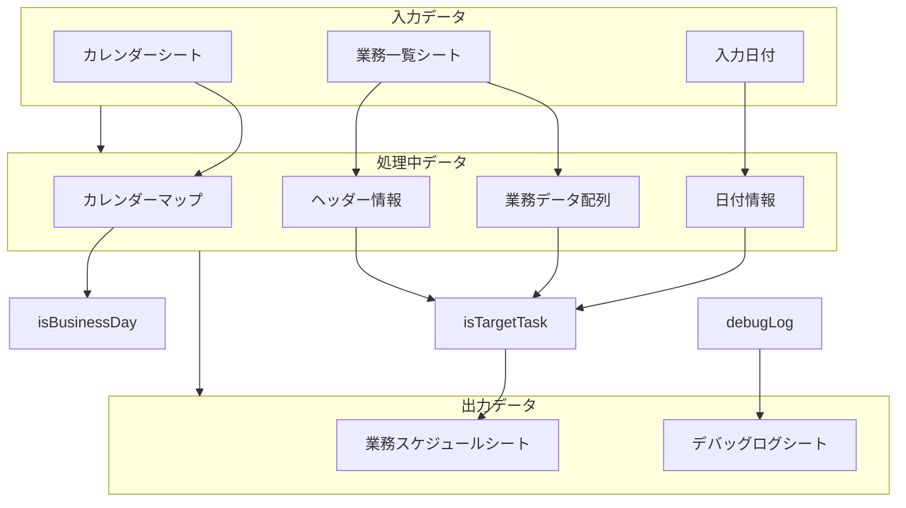

## 機能仕様

### 業務スケジュール生成機能

- **機能概要**: 指定された日付に実行すべき業務を判定し、スケジュールを生成
- **入力**: 対象日付（YYYY-MM-DD形式、YYYY/MM/DD形式、またはM/D/YYYY形式）
- **出力**: スケジュールテーブルへの業務登録
- **処理内容**:
  1. 入力日付の正規化（複数の日付形式に対応）
  2. カレンダー情報の読み込み
  3. 業務一覧データの取得
  4. 既存スケジュールの確認（同日のスケジュールが存在する場合は処理中断）
  5. 業務条件判定（通常判定）
  6. 振替判定（他の日付からの振替対象かどうか）
  7. 対象業務のスケジュールテーブルへの登録
  8. 処理結果のログ記録

### 日付処理機能

- **機能概要**: 様々な形式の日付を扱うためのユーティリティ関数群
- **主要機能**:
  - 日付形式変換（Excel日付⇔文字列）
  - 特定の日付の情報取得（年、月、日、曜日など）
  - 月末日の取得
  - 月の第n曜日の取得
  - 月のn営業日目の取得
  - 月末からn営業日前の日付取得

### 営業日判定機能

- **機能概要**: カレンダーデータに基づく営業日関連の処理
- **主要機能**:
  - 指定日が営業日かどうかの判定
  - 特定日の直前/直後の営業日の取得
  - 月内での営業日情報（何営業日目か、月末から何営業日前か）の取得

### 業務条件判定機能

- **機能概要**: 業務データの実行条件に基づく判定
- **対応条件**:
  1. **日次業務**
     - 暦日指定（毎日）
     - 営業日指定（営業日のみ）

  2. **週次業務**
     - 暦日(曜日)指定（特定の曜日）

  3. **月次業務**
     - 暦日(n日指定)（例：毎月10日）
     - 暦日(月末逆算)（例：月末、月末から3日前）
     - 営業日(n日指定)（例：毎月第3営業日）
     - 営業日(月末逆算)（例：毎月最終営業日）
     - 暦日(曜日)（例：毎月第2火曜日）

  4. **年次業務**
     - 特定月 + 上記の月次条件（例：3月の第2営業日）

- **追加条件判定**:
  - **有効期間**: 有効開始日～有効終了日の範囲内であることを確認
  - **オリジナル条件判定**: 振替先を判定するため、基本条件のみに基づいた判定も実施
  - **複合条件**: 複数の条件を組み合わせて（例：特定月の特定曜日）業務対象日を判定

### 振替規則処理機能

- **機能概要**: 非営業日に当たる業務の振替処理
- **振替規則**:
  - 直前営業日: 非営業日の場合、直前の営業日に振替
  - 直後営業日: 非営業日の場合、直後の営業日に振替
  - 振替しない: 非営業日でも振替を行わない
- **振替処理の方向**:
  1. 本来の実行日から振替日を算出（通常の条件判定）
  2. 振替先の日付から元の日付を検証（振替対象日判定）
     - これにより、もとの日付が検索対象外の場合でも振替が適切に処理される

### デバッグ機能

- **機能概要**: 処理中のログを記録
- **処理内容**:
  - デバッグシートの作成・管理
  - ログレベル（info/warning/error）に応じたログ記録
  - 処理の各ステップでの状態記録

## 処理フロー

### メイン処理フロー

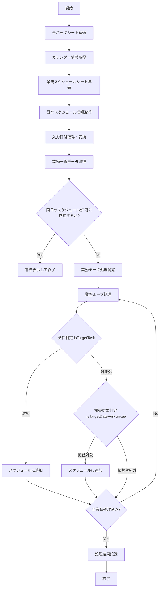

### 業務条件判定フロー

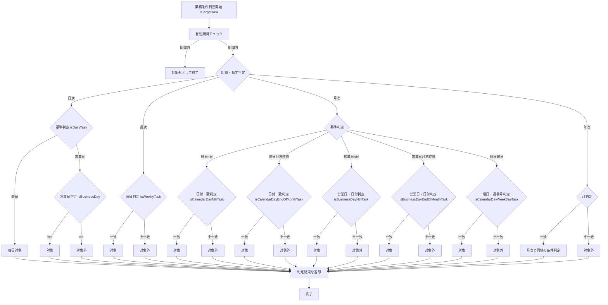

### 振替規則処理フロー

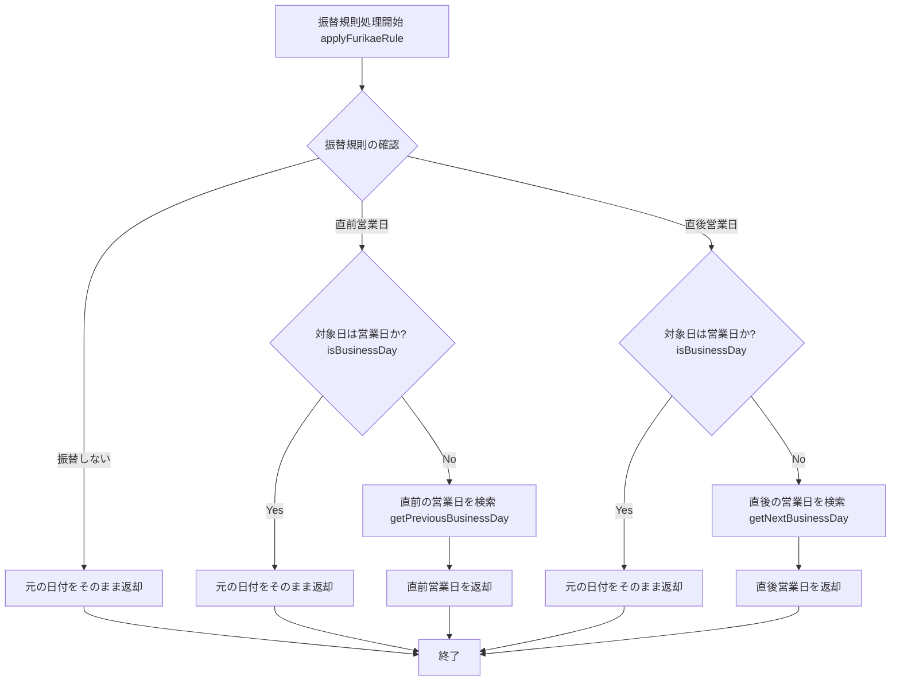

### 振替先の日付を検証するフロー

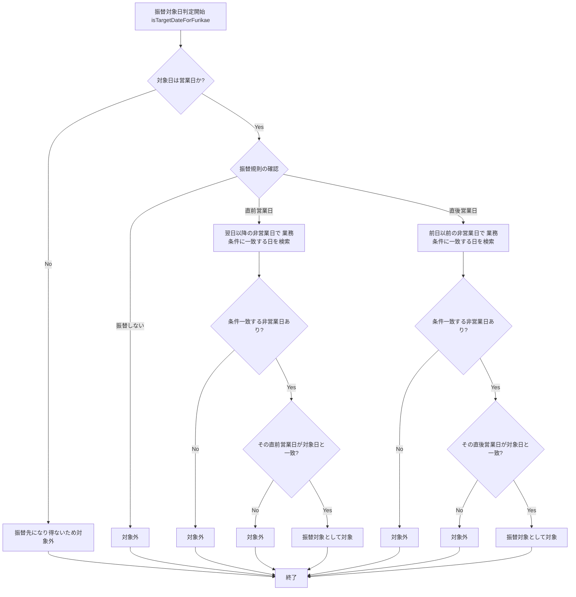

## 型定義

システムで使用される主要な型定義：

```typescript
/**
 * カレンダー情報を保持する型
 * 日付文字列をキー、営業日フラグを値とするマップ
 */
type CalendarInfo = { [date: string]: boolean };

/**
 * 営業日情報を表す型
 */
type BusinessDayInfo = {
  nth: number;      // 月内での営業日番号（1始まり）
  total: number;    // 月内の営業日総数
  reverse: number;  // 月末から数えた営業日番号（最終営業日=0）
};

/**
 * 日付情報を表す型
 */
type DateInfo = {
  year: number;     // 年
  month: number;    // 月（1-12）
  day: number;      // 日
  dayOfWeek: number; // 曜日（0:日, 1:月, ..., 6:土）
  isBusinessDay: boolean; // 営業日かどうか
};
```

## 関数仕様

システムの主要関数は以下の通りです（抜粋）：

### メイン関数

- `main(workbook: ExcelScript.Workbook, targetDate: string = "")`: スクリプトのエントリーポイント。業務スケジュールの生成を実行します。

### 日付処理関数

- `excelDateToString(excelDate: string | number | Date | boolean): string`: Excel形式の日付を標準的な日付文字列（YYYY-MM-DD形式）に変換します。
- `formatDate(date: Date): string`: 日付オブジェクトをYYYY-MM-DD形式の文字列に変換します。
- `formatDateBySlash(date: Date): string`: 日付オブジェクトをYYYY/MM/DD形式の文字列に変換します。
- `getDateInfo(dateStr: string, calendar: CalendarInfo): DateInfo`: 日付文字列から日付の詳細情報を取得します。

### 営業日判定関数

- `isBusinessDay(inputDate: string, calendar: CalendarInfo): boolean`: 指定日が営業日かどうかを判定します。
- `getBusinessDayInfo(inputDate: string, calendar: CalendarInfo): BusinessDayInfo`: 指定日の営業日情報を取得します。
- `getPreviousBusinessDay(inputDate: string, calendar: CalendarInfo, workbook: ExcelScript.Workbook): string`: 指定日の直前営業日を取得します。
- `getNextBusinessDay(inputDate: string, calendar: CalendarInfo, workbook: ExcelScript.Workbook): string`: 指定日の直後営業日を取得します。
- `getNthBusinessDayOfMonth(year: number, month: number, n: number, calendar: CalendarInfo, workbook: ExcelScript.Workbook): string`: 指定月のn営業日目の日付を取得します。
- `getReverseNthBusinessDayOfMonth(year: number, month: number, n: number, calendar: CalendarInfo, workbook: ExcelScript.Workbook): string`: 指定月の末日からn営業日前の日付を取得します。

### 業務条件判定関数

- `isTargetTask(inputDate: string, taskData: (string | number | boolean)[], headers: string[], calendar: CalendarInfo, workbook: ExcelScript.Workbook): boolean`: 指定された業務が対象日に実行すべきかを判定します。
- `isDailyTask(inputDate: string, base: string, calendar: CalendarInfo): boolean`: 日次業務の判定を行います。
- `isWeeklyTask(inputDate: string, base: string, youbi: string): boolean`: 週次業務の判定を行います。
- `isCalendarDayNthTask(inputDate: string, n: number, furikae: string, calendar: CalendarInfo, workbook: ExcelScript.Workbook): boolean`: 暦日(n日指定)の判定を行います。
- `isCalendarDayEndOfMonthTask(inputDate: string, n: number, furikae: string, calendar: CalendarInfo, workbook: ExcelScript.Workbook): boolean`: 暦日(月末逆算)の判定を行います。
- `isBusinessDayNthTask(inputDate: string, n: number, calendar: CalendarInfo, workbook: ExcelScript.Workbook): boolean`: 営業日(n日指定)の判定を行います。
- `isBusinessDayEndOfMonthTask(inputDate: string, n: number, calendar: CalendarInfo, workbook: ExcelScript.Workbook): boolean`: 営業日(月末逆算)の判定を行います。
- `isCalendarDayWeekDayTask(inputDate: string, youbi: string, weekNum: number, furikae: string, calendar: CalendarInfo, workbook: ExcelScript.Workbook): boolean`: 暦日(曜日)の判定を行います。

### 振替規則処理関数

- `applyFurikaeRule(inputDate: string, rule: string, calendar: CalendarInfo, workbook: ExcelScript.Workbook): string`: 振替規則を適用して日付を計算します。
- `isTargetDateForFurikae(inputDate: string, taskData: (string | number | boolean)[], headers: string[], calendar: CalendarInfo, workbook: ExcelScript.Workbook): boolean`: 指定日が他の日付の振替先になっているかを判定します。

### ユーティリティ関数

- `prepareCalendarMap(workbook: ExcelScript.Workbook): CalendarInfo`: カレンダーデータを準備します。
- `getScheduleSheet(workbook: ExcelScript.Workbook)`: 業務スケジュールシートを準備します。
- `getExistingScheduleInfo(scheduleSheet: ExcelScript.Worksheet): { lastRowIndex: number, maxScheduleId: number }`: 既存のスケジュールデータの最終行と最大スケジュールIDを取得します。
- `debugLog(workbook: ExcelScript.Workbook, message: string, level: "info" | "warning" | "error" = "info"): void`: デバッグログを記録します。
- `create_debug_sheet(workbook: ExcelScript.Workbook, isClear = false)`: デバッグシートを作成します。

### エラー処理

システムは以下のエラー処理を実装しています：

1. **例外捕捉**: 主要な関数では例外をtry-catch文で捕捉し、エラー情報をデバッグログに記録
2. **エラーメッセージ**: 重要なエラーはエラーメッセージとして表示
3. **回復処理**: 一部のエラー（テーブル取得エラーなど）では代替手段での処理を試行
   - テーブルからのデータ取得失敗時にシートから直接取得を試行
   - 日付変換に複数の形式対応
4. **入力検証**: 日付の形式検証や有効性確認を実施
5. **デフォルト値**: エラー時には安全なデフォルト値を使用
6. **デバッグログ**: すべての主要な処理ステップとエラーを詳細にログに記録

## 拡張性と制限事項

### 拡張性

- **新しい業務条件**: 周期・頻度や基準の種類を追加することで、新しい業務条件への対応が可能
- **追加フィールド**: 業務一覧やスケジュールテーブルに新しいフィールドを追加可能
- **処理カスタマイズ**: 各種判定ロジックはモジュール化されており、カスタマイズが容易
- **将来の拡張可能性**:
  - **作業者マスター**: 担当者情報を管理するテーブルを追加して作業者の割り当て機能
  - **Power BI連携**: 生成されたスケジュールデータをPower BIで可視化
  - **複数条件対応**: 「第1と第3金曜日」のような複合条件への対応
  - **繰り返し情報**: 年次・月次等の識別情報をスケジュールに追加
  - **パフォーマンス指標**: 作業時間や遅延率などのKPI測定

### 制限事項

- **日付範囲**: カレンダーテーブルに登録されている日付範囲内でのみ正確に動作
- **テーブル構造**: 想定されるテーブル構造（列名など）に依存
- **処理速度**: 大量の業務データや長期間のスケジュール生成では処理時間が増加する可能性
- **非営業日判定**: カレンダーテーブルの営業日フラグに依存
- **既知の制限**:
  - 複数の条件を組み合わせた業務（例: 第1と第3金曜日）は別々のレコードとして登録が必要
  - 非定型的な業務（特定の日付のみ、不規則なパターンなど）への対応には個別レコードが必要
  - 依存関係のある業務（Aの完了後にBを実行など）のスケジューリングには非対応

## 運用方法

### 前提条件

- Excelファイルには、カレンダー、業務一覧、スケジュールの3つのシートが必要
- カレンダーデータは最新の休日情報で更新されていること
- 業務一覧には有効な業務データが登録されていること

### 使用手順

1. **準備**:
   - Excelファイルを開く
   - 必要に応じてカレンダーデータや業務データを更新

2. **スケジュール生成**:
   - 「業務スケジュール」シートのB1セルに対象日付を入力
   - スクリプトを実行

3. **結果確認**:
   - 生成されたスケジュールを確認
   - 必要に応じてデバッグログを確認

4. **カスタマイズ**:
   - 業務一覧を編集して対象業務を追加・変更
   - 振替規則や条件を調整

### 使用例

#### 例1: 月初の業務スケジュール生成
```
// B1セルに「2025-05-01」を入力
// スクリプトを実行
// → 月初に実行すべき業務（毎日業務、営業日業務、月初業務、第1営業日業務など）が抽出される
```

#### 例2: 月末の業務スケジュール生成
```
// B1セルに「2025-05-31」を入力
// スクリプトを実行
// → 月末に実行すべき業務（毎日業務、営業日業務、月末業務、最終営業日業務など）が抽出される
```

#### 例3: 連休前の一括スケジュール生成
```
// 連休期間の各日付を順に入力し、それぞれに対してスクリプトを実行
// → 連休期間中の全ての業務が抽出され、必要に応じて営業日に振り替えられる
```

# 業務スケジュール管理システム - スケジュールパターン解説

## はじめに

このドキュメントでは、業務スケジュール管理システムで使用される様々なスケジュールパターンについて詳しく説明します。システムは、業務の発生日を柔軟に定義するために、複数のパラメータを組み合わせた「パターン」を使用します。このパターンがどのように機能し、どのような業務スケジュールが表現できるかを理解することで、効率的に業務計画を立てることができます。

## 基本パラメータ

業務スケジュールを定義するための基本パラメータは以下の通りです：

| パラメータ | 説明 | 例 |
|----------|------|------|
| **業務種別** | 業務の種類を示す | 定常、特別、緊急など |
| **周期・頻度** | 業務の実行頻度 | 日次、週次、月次、年次 |
| **基準** | 日付の基準となる考え方 | 暦日、営業日、暦日(曜日)など |
| **月** | 年次業務で指定する対象月 | 1～12の数値 |
| **週番号** | 月内の第何週かを指定 | 1～5の数値 |
| **曜日** | 対象となる曜日 | 月、火、水、木、金、土、日 |
| **n日** | 日付や営業日の指定 | 1～31の数値、または0（末日） |
| **非営業日振替規則** | 非営業日の場合の処理方法 | 直前営業日、直後営業日、振替しない |

これらのパラメータを組み合わせることで、あらゆる業務パターンを表現できます。

## 周期・頻度の種類

業務の周期・頻度は、スケジュールの基本的な繰り返しパターンを定義します：

### 1. 日次業務

毎日または営業日ごとに発生する業務です。

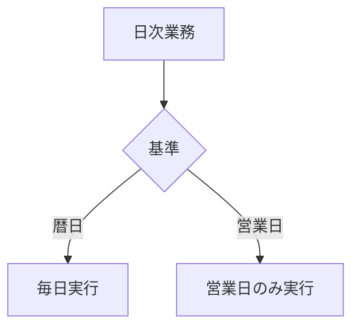

#### 例：
- **毎日業務**: 365日毎日実行される業務（基準=暦日）
- **毎営業日業務**: 営業日のみ実行される業務（基準=営業日）

### 2. 週次業務

特定の曜日に発生する業務です。

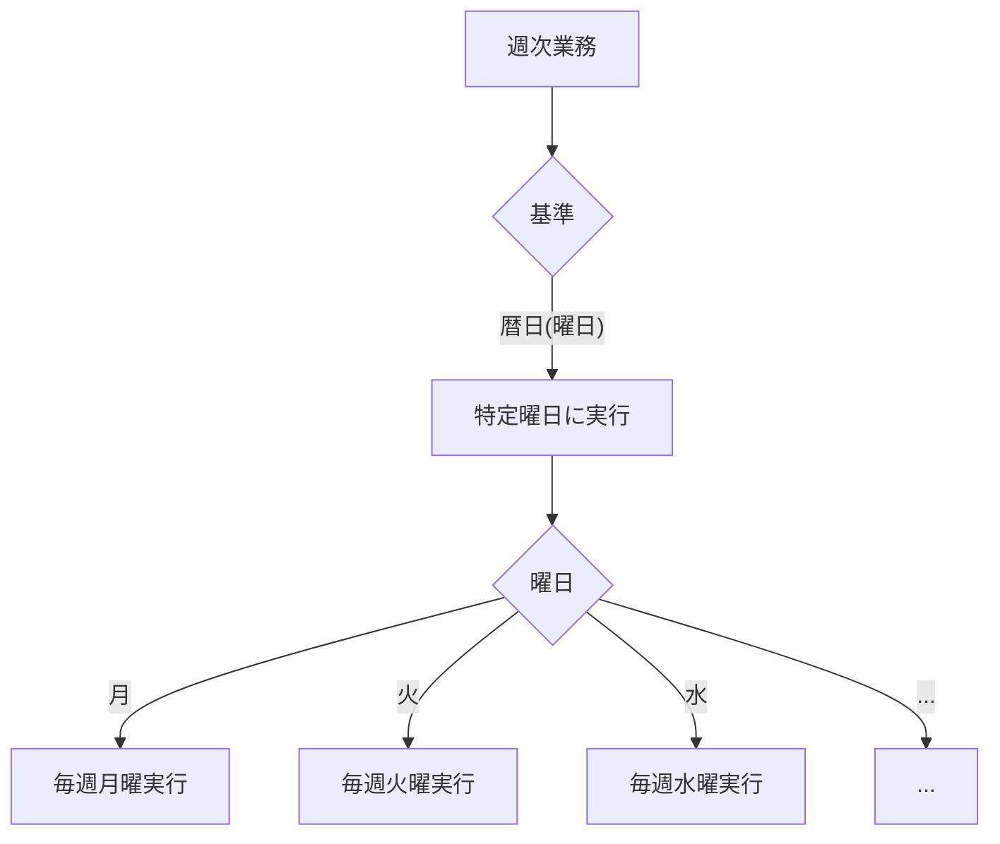

#### 例：
- **毎週月曜業務**: 毎週月曜日に実行される業務
- **毎週金曜業務**: 毎週金曜日に実行される業務

### 3. 月次業務

毎月特定の日または条件で発生する業務です。

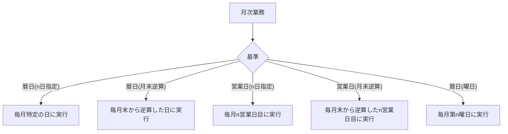

#### 例：
- **毎月1日業務**: 毎月1日に実行される業務（基準=暦日(n日指定), n日=1）
- **毎月末日業務**: 毎月末日に実行される業務（基準=暦日(月末逆算), n日=0）
- **毎月第1営業日業務**: 毎月1営業日目に実行される業務（基準=営業日(n日指定), n日=1）
- **毎月最終営業日業務**: 毎月最終営業日に実行される業務（基準=営業日(月末逆算), n日=0）
- **毎月第2月曜業務**: 毎月第2月曜日に実行される業務（基準=暦日(曜日), 週番号=2, 曜日=月）

### 4. 年次業務

年に1回、特定の月日または条件で発生する業務です。

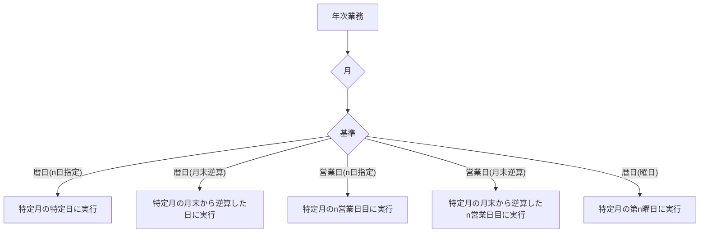

#### 例：
- **1月1日業務**: 毎年1月1日に実行される業務（月=1, 基準=暦日(n日指定), n日=1）
- **3月最終営業日業務**: 毎年3月の最終営業日に実行される業務（月=3, 基準=営業日(月末逆算), n日=0）
- **12月第3金曜業務**: 毎年12月の第3金曜日に実行される業務（月=12, 基準=暦日(曜日), 週番号=3, 曜日=金）
- **2月29日業務**: 閏年の2月29日に実行される業務（月=2, 基準=暦日(n日指定), n日=29）

## 基準の種類とその適用方法

### 1. 暦日（カレンダー日）

カレンダー上の日付に基づいて業務を実行します。営業日・非営業日を区別しません。

#### バリエーション：
- **暦日**: 単純に毎日（日次業務の場合）
- **暦日(n日指定)**: 毎月n日（例：毎月15日）
- **暦日(月末逆算)**: 月末から逆算したn日目（例：月末から3日前）
- **暦日(曜日)**: 特定の曜日または第n週の特定曜日（例：毎週水曜日、毎月第2火曜日）

### 2. 営業日

営業日（カレンダーで営業日として定義された日）のみに業務を実行します。

#### バリエーション：
- **営業日**: 単純に営業日のみ（日次業務の場合）
- **営業日(n日指定)**: 月内のn営業日目（例：毎月3営業日目）
- **営業日(月末逆算)**: 月末から逆算したn営業日目（例：毎月最終営業日から2営業日前）

### 営業日と暦日の組み合わせ例

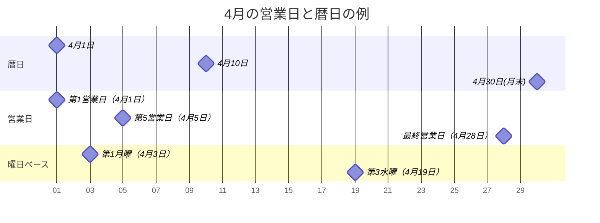

## 非営業日振替規則

非営業日（休日・祝日など）に業務が該当した場合の処理方法を定義します：

### 1. 直前営業日

対象日が非営業日の場合、その直前の営業日に業務を振り替えます。

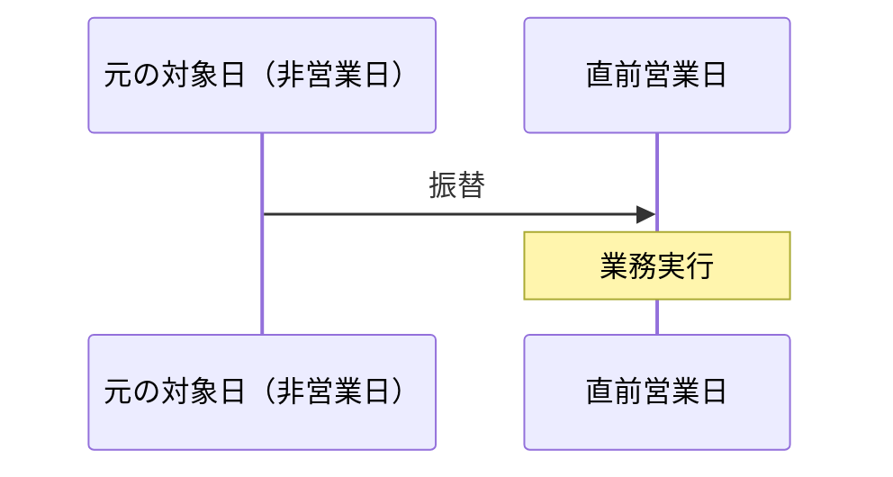

#### 例：
- 5月3日（祝日）の業務が5月2日（営業日）に振り替えられる

### 2. 直後営業日

対象日が非営業日の場合、その直後の営業日に業務を振り替えます。


#### 例：
- 1月1日（祝日）の業務が1月4日（営業日、1月2-3日が休日の場合）に振り替えられる

### 3. 振替しない

対象日が非営業日でも振り替えを行わず、そのまま該当日に業務を設定します。

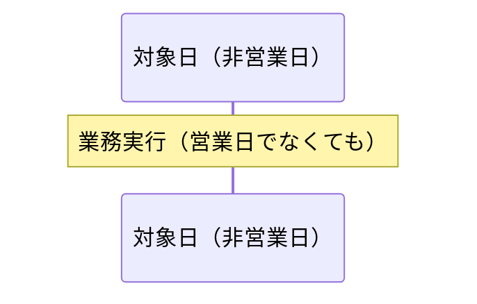

#### 例：
- 日曜日のバッチ処理など、非営業日に実施すべき業務

## 複雑なパターン例

### 1. 四半期決算業務

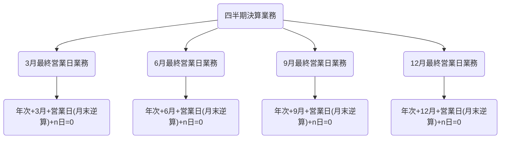

### 2. 月初および月末のレポート作成

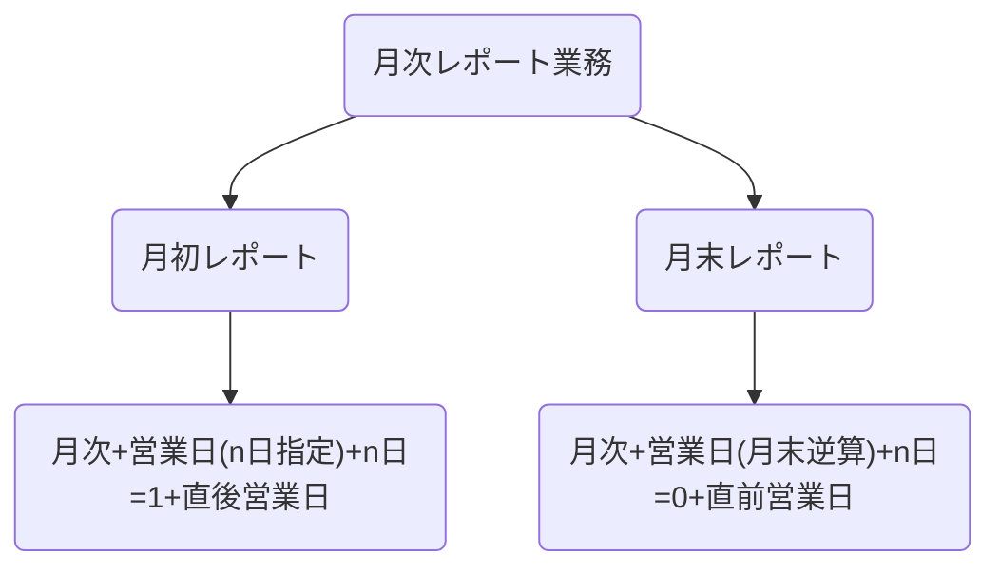

### 3. 給与計算関連業務

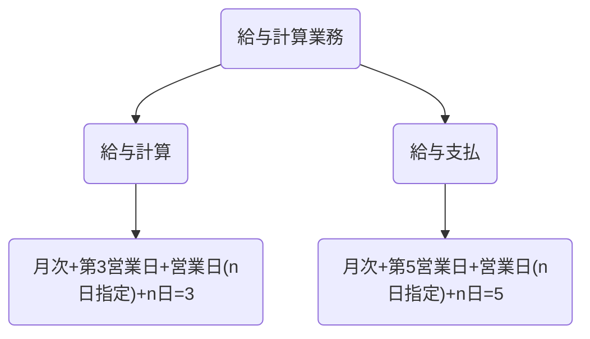

## パターンの網羅性証明

このスケジュールシステムは、ビジネスで必要となる全ての定期的なスケジュールパターンを表現できるように設計されています。以下に、その網羅性を示します：

### 1. 時間軸の網羅性

- **日次**: 毎日または毎営業日
- **週次**: 毎週特定曜日
- **月次**: 毎月特定条件
- **年次**: 毎年特定月の特定条件

これにより、あらゆる周期性のある業務をカバーできます。

### 2. 日付指定方法の網羅性

- **絶対日付**: n日指定（例：毎月10日）
- **相対日付**: 月末から逆算（例：月末から3日前）
- **曜日ベース**: 第n曜日（例：第2水曜日）
- **営業日ベース**: n営業日目（例：第3営業日）
- **営業日相対**: 月末から逆算したn営業日目（例：最終営業日から2営業日前）

これらの組み合わせにより、ビジネスで必要となるあらゆる日付パターンを表現できます。

### 3. 非営業日対応の網羅性

- **直前営業日**: 非営業日の場合、前営業日に実施
- **直後営業日**: 非営業日の場合、次営業日に実施
- **振替なし**: 非営業日でも予定通り実施

これにより、非営業日への対応についてもあらゆるケースをカバーできます。

## 特殊ケースの処理

### 1. 第5週の処理

月によっては第5週の特定曜日が存在しない場合があります。このシステムでは、該当する日付が月内に存在しない場合、その業務は対象外となります。

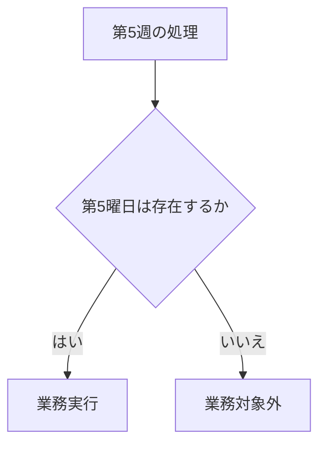

### 2. 閏年（2月29日）の処理

閏年の2月29日に指定された業務は、閏年の場合のみ実行されます。非閏年の場合、その業務は対象外となります。

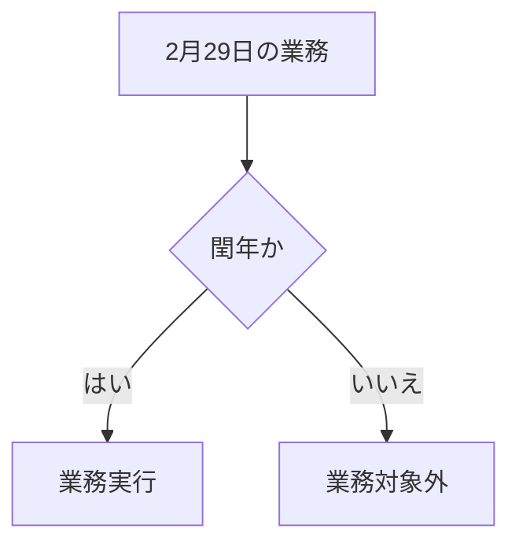

### 3. 連続した非営業日の処理

連休などの連続した非営業日の場合、振替規則は以下のように適用されます：

- **直前営業日**: 連休前の最終営業日に複数の業務が集中する可能性がある
- **直後営業日**: 連休後の最初の営業日に複数の業務が集中する可能性がある
- **振替なし**: 連休中の業務は各日に予定通り設定される

## 実装例

以下は、様々な業務パターンの実装例です：

### 日次業務の例

| 業務ID | 業務名 | 業務詳細 | 業務種別 | 周期・頻度 | 基準 | 月 | 週番号 | 曜日 | n日 | 非営業日振替規則 | 優先度 | 有効開始日 | 有効終了日 | 備考 |
|--------|--------|----------|----------|------------|------|-----|--------|------|-----|------------------|--------|------------|------------|------|
| 1 | 毎日業務 | | 定常 | 日次 | 暦日 | | | | | 振替しない | 通常 | 2024/1/1 | | |
| 2 | 毎営業日業務 | | 定常 | 日次 | 営業日 | | | | | | 通常 | 2024/1/1 | | |

### 週次業務の例

| 業務ID | 業務名 | 業務詳細 | 業務種別 | 周期・頻度 | 基準 | 月 | 週番号 | 曜日 | n日 | 非営業日振替規則 | 優先度 | 有効開始日 | 有効終了日 | 備考 |
|--------|--------|----------|----------|------------|------|-----|--------|------|-----|------------------|--------|------------|------------|------|
| 3 | 毎週月曜業務 | | 定常 | 週次 | 暦日(曜日) | | | 月 | | 振替しない | 通常 | 2024/1/1 | | |
| 6 | 毎週木曜業務 | | 定常 | 週次 | 暦日(曜日) | | | 木 | | 振替しない | 通常 | 2024/1/1 | | |
| 52 | 毎週水曜日業務 | | 定常 | 週次 | 暦日(曜日) | | | 水 | | 直前営業日 | 通常 | 2024/1/1 | | |

### 月次業務の例

| 業務ID | 業務名 | 業務詳細 | 業務種別 | 周期・頻度 | 基準 | 月 | 週番号 | 曜日 | n日 | 非営業日振替規則 | 優先度 | 有効開始日 | 有効終了日 | 備考 |
|--------|--------|----------|----------|------------|------|-----|--------|------|-----|------------------|--------|------------|------------|------|
| 10 | 毎月1日業務 | | 定常 | 月次 | 暦日(n日指定) | | | | 1 | 直後営業日 | 通常 | 2024/1/1 | | |
| 19 | 毎月末日業務 | | 定常 | 月次 | 暦日(月末逆算) | | | | 0 | 直前営業日 | 通常 | 2024/1/1 | | |
| 24 | 毎月最終営業日業務 | | 定常 | 月次 | 営業日(月末逆算) | | | | 0 | | 通常 | 2024/1/1 | | |
| 32 | 毎月第4月曜業務 | | 定常 | 月次 | 暦日(曜日) | | 4 | 月 | | 直後営業日 | 通常 | 2024/1/1 | | |

### 年次業務の例

| 業務ID | 業務名 | 業務詳細 | 業務種別 | 周期・頻度 | 基準 | 月 | 週番号 | 曜日 | n日 | 非営業日振替規則 | 優先度 | 有効開始日 | 有効終了日 | 備考 |
|--------|--------|----------|----------|------------|------|-----|--------|------|-----|------------------|--------|------------|------------|------|
| 56 | 1月1日業務 | | 定常 | 年次 | 暦日(n日指定) | 1 | | | 1 | 振替しない | 通常 | 2024/1/1 | | |
| 72 | 3月最終営業日業務 | | 定常 | 年次 | 営業日(月末逆算) | 3 | | | 0 | | 通常 | 2024/1/1 | | |
| 78 | 3月第5金曜業務 | | 定常 | 年次 | 暦日(曜日) | 3 | 5 | 金 | | | 通常 | 2024/1/1 | | |

## 結論

この業務スケジュール管理システムのパターン設計は、以下の特徴を持っています：

1. **柔軟性**: 様々なパラメータの組み合わせにより、あらゆるビジネスシーンに対応
2. **網羅性**: 日次・週次・月次・年次の全ての周期をカバー
3. **正確性**: 営業日・非営業日を適切に考慮した日付計算
4. **対応力**: 非営業日の振替規則により、様々な業務ポリシーに対応
5. **拡張性**: 必要に応じて新しいパラメータや規則を追加可能

これらの特徴により、当スケジュール管理システムは効率的かつ正確な業務計画立案をサポートします。

---

## 付録: 実際の使用例

### ケース1: 経理部門の月次決算業務

```
業務名: 月次決算処理
周期・頻度: 月次
基準: 営業日(月末逆算)
n日: 3
非営業日振替規則: 直前営業日
```

この設定により、毎月最終営業日から3営業日前に月次決算処理が実行されます。

### ケース2: 四半期報告書の作成

```
業務名: 四半期報告書作成
周期・頻度: 年次
月: 3, 6, 9, 12
基準: 暦日(n日指定)
n日: 15
非営業日振替規則: 直後営業日
```

この設定により、3月15日、6月15日、9月15日、12月15日に四半期報告書の作成業務が設定されます。これらの日が非営業日の場合は、直後の営業日に振り替えられます。

### ケース3: 週次進捗報告会

```
業務名: 週次進捗報告会
周期・頻度: 週次
基準: 暦日(曜日)
曜日: 金
非営業日振替規則: 直前営業日
```

この設定により、毎週金曜日に進捗報告会が設定されます。金曜日が祝日などの非営業日の場合は、その前の営業日に振り替えられます。
